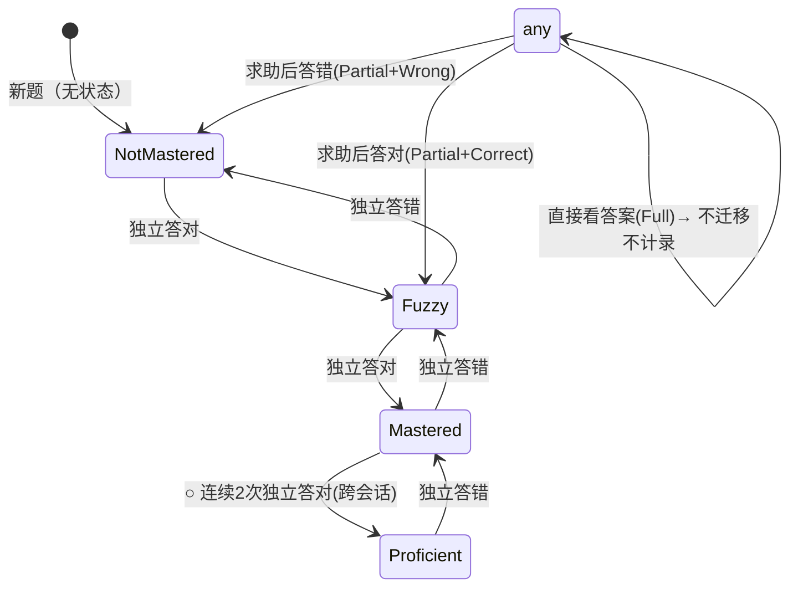
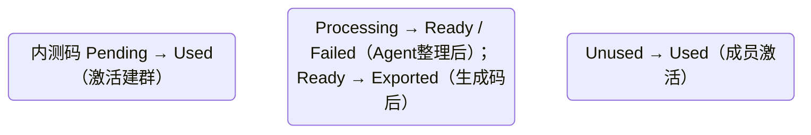
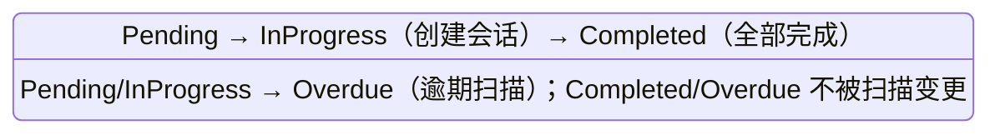
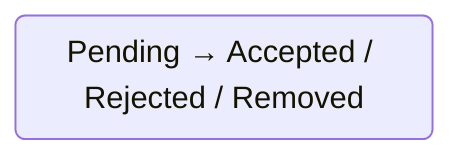
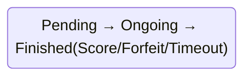
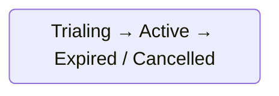

[//]: # ( <auto-generated> [xCodeGen.Hash: 5db713362706ea832f4329682133f39726c696751225906971d7b6cd77e16630] </auto-generated> )

# 业务全景与规则 (Domain Business)
> **手写文件** — 描述系统做什么、涉及哪些业务对象、有什么跨实体约束。
> 这些信息无法从代码中自动提取，需要设计者维护。更新频率低，但内容不可替代。
> **维护方式**：由 `tkwf-business` skill 物化与增量更新，不手动直接编辑。

> **最后更新**：2026-09-11
> **版本**：v3 | **变更**：任务域补 BR-24（周报口径）/ BR-25（周报 CSV 合规）
> **BR 编号当前上限**：见各域末尾（群组-31 / 学习-50 / 任务-25 / 题库-39 / 激励-18 / 搭子-32 / Pk-27 / 家长-28 / 平台-04）

---

## 一、业务全景

小书童（XiaoShuTong）是 AI 学习助手：基于 **AI 导师引导 + 艾宾浩斯记忆原理**的私域背记工具（背书搭子）。核心闭环为「老师/家长建**群组**与**题库**（内容权威 JSON + 查询索引，DRM 防爬）→ 学生进入**学习会话**答题（四阶记忆状态机 ✕→△→○→★ 驱动复习间隔）→ 判题引擎三分 → 派生**每日统计/错题本/掌握度** → 可视化激励（热力图/连击/报告）→ 教师**任务闭环**（布置/执行/薄弱点看板）→ **排行榜 + 搭子 PK**（合规不暴露正确率）→ 家长**订阅报告**（授权链 + 订阅门控）」。

参与角色：学生（学习主体）、群主/老师（群组/题库/任务管理）、家长（订阅报告）、平台运营（内测开关）。

核心流程（跨域编排）：群组内测激活 → 题库创建导入（AI 预处理须人工校验）→ 学习会话作答（状态迁移 + 五表派生同步）→ 统计激励（纯读）→ 任务进度推进 → 每日快照冻结榜单 → 家长报告聚合（订阅门控）。

---

## 二、业务规则（按领域分组）

> **编号约定**：本项目 8 切片域共享单份 Business.md，BR 采用**域前缀编号**（`群组-BR-01`、`学习-BR-01`…），与原 U01 编号语义对齐、保持 U01 追溯链路；域间编号独立递增互不影响。

### 2.1 群组管理域（Groups）

| 规则 | 说明 | 涉及实体 | 关联 UC |
|------|------|---------|:---:|
| 群组-BR-01 | 内测码必须有效（Pending/未过期）；已使用或过期 → 5201 | BetaInviteCodes | UC-6.1 |
| 群组-BR-02 | 一个内测码只能激活一个群组 | BetaInviteCodes | UC-6.1 |
| 群组-BR-03 | 群组名称必填 ≤64；学科必填 | Groups | UC-6.1 |
| 群组-BR-04 | 群主可创建多个群组 | Groups | UC-6.1 |
| 群组-BR-05 | 内测未开放（平台开关）→ 5205 | 平台配置 | UC-6.1 |
| 群组-BR-06 | 仅返回当前群主的群组 | Groups | UC-6.2 |
| 群组-BR-07 | 群组不存在 → 1003 | Groups | UC-6.2/6.3/6.4/6.5/6.7 |
| 群组-BR-08 | 仅群主可管理本群组 | Groups | UC-6.3/6.4 |
| 群组-BR-09 | 非群组成员/无权限 → 5003 | GroupMembers | UC-6.3 |
| 群组-BR-10 | 移除成员不删学习数据 | GroupMembers, Attempts | UC-6.3 |
| 群组-BR-11 | 同一群组同一用户同一角色唯一 | GroupMembers | UC-6.3 |
| 群组-BR-12 | 排名开关默认 true；关闭后战绩榜入口隐藏、榜单不展示 | Groups.RankEnabled | UC-6.4 |
| 群组-BR-13 | 战力榜不受 RankEnabled 影响 | Groups.RankEnabled | UC-6.4 |
| 群组-BR-14 | 名单为空不可提交 | RosterImports | UC-6.5 |
| 群组-BR-15 | 导入后异步 Agent 整理（去重/格式校验/非法剔除） | RosterImports | UC-6.5 |
| 群组-BR-16 | 全部非法 → Status=Failed | RosterImports | UC-6.6 |
| 群组-BR-17 | 批次处理幂等（同一批次不重复处理） | RosterImports | UC-6.6 |
| 群组-BR-18 | 批次未就绪（Processing）不可生成一次性码 → 5204 | RosterImports | UC-6.7/6.8 |
| 群组-BR-19 | 手机号脱敏展示（前缀+后四位） | RosterImports | UC-6.7 |
| 群组-BR-20 | 每个有效手机号生成一个码，码↔后四位同一名单内唯一 | OneTimeInviteCodes | UC-6.8 |
| 群组-BR-21 | 码 8 位唯一（全局 UNQ） | OneTimeInviteCodes | UC-6.8 |
| 群组-BR-22 | 一次性码默认 30 天有效 | OneTimeInviteCodes | UC-6.8 |
| 群组-BR-23 | 已生成批次不可重复生成 | RosterImports | UC-6.8/6.9 |
| 群组-BR-24 | CSV 仅含后四位+码（不含 openid/完整手机号/学习数据）— **隐私红线** | RosterImports, OneTimeInviteCodes | UC-6.9 |
| 群组-BR-25 | CSV 存 OSS 7 天过期 | RosterImports | UC-6.9 |
| 群组-BR-26 | 码必须未使用、未过期，否则 5202 | OneTimeInviteCodes | UC-6.10 |
| 群组-BR-27 | 同一码重复激活幂等（返回原结果） | OneTimeInviteCodes | UC-6.10 |
| 群组-BR-28 | 码过期 → 5202 | OneTimeInviteCodes | UC-6.10 |
| 群组-BR-29 | 后四位与名单 PhoneLast4 一致，否则 5203 | OneTimeInviteCodes | UC-6.10 |
| 群组-BR-30 | 激活绑定微信 ID；账户级手机号补绑留内测后 | GroupMembers, Users | UC-6.10 |
| 群组-BR-31 | 同一群组同一用户同一角色唯一（激活入口） | GroupMembers | UC-6.10 |

### 2.2 学习Session域（Learning）

| 规则 | 说明 | 涉及实体 | 关联 UC |
|------|------|---------|:---:|
| 学习-BR-01 | Scenario/SessionType 必须为合法枚举值 | StudySessions | UC-4.1 |
| 学习-BR-02 | 任务会话的 taskId 必须指向存在且未截止的任务 | StudySessions, TaskAssignments | UC-4.1 |
| 学习-BR-03 | 题库必须存在（bankId 校验，跨模块） | StudySessions, Banks | UC-4.1 |
| 学习-BR-04 | 题量可选 10/20/30/50，默认 20；混合比 30% 新题 + 70% 复习 | StudySessions, MemoryStates | UC-4.1 |
| 学习-BR-05 | 同一任务续做幂等：已存在进行中会话则复用，不重复建 | StudySessions | UC-4.1 |
| 学习-BR-06 | 会话必须存在且属于当前用户 | StudySessions | UC-4.2 |
| 学习-BR-07 | 答案文本必须合法（非空、格式正确） | Attempts | UC-4.2 |
| 学习-BR-08 | 每题提交间隔 ≥2s（防刷） | Attempts | UC-4.2 |
| 学习-BR-09 | 判题 LLM 超时(>3s)/失败 → 降级本地规则引擎，作答仍完成 | Attempts | UC-4.2 |
| 学习-BR-10 | 判题三分：关键词 ≥85%→Correct；60-85%→Partial；<60%→LLM；confidence ≥0.85→Correct / 0.5-0.85→Partial / <0.5→Wrong | Attempts | UC-4.2 |
| 学习-BR-11 | 独立答对（None+Correct）：✕→△、△→○、○→○；ConsecutiveCorrect +1 | MemoryStates | UC-4.2 |
| 学习-BR-12 | 熟练升级：○ 连续 2 次独立答对（跨会话累计）→ ★ | MemoryStates | UC-4.2 |
| 学习-BR-13 | 求助后答对（Partial+Correct）：→ △（Fuzzy）；ConsecutiveCorrect 清零 | MemoryStates | UC-4.2 |
| 学习-BR-14 | 独立答错（None+Wrong）：○→△、★→○、△→✕；ConsecutiveCorrect 清零 | MemoryStates | UC-4.2 |
| 学习-BR-15 | 求助后答错（Partial+Wrong）：→ ✕（或停留 △）；ConsecutiveCorrect 清零 | MemoryStates | UC-4.2 |
| 学习-BR-16 | 直接看答案（Full）：不迁移状态、不计入作答记录 | MemoryStates, Attempts | UC-4.2 |
| 学习-BR-17 | 间隔 = 状态基础间隔 × HistoryAccuracy 系数（0.5~1.5）；基础 ✕30min/△12h/○3d/★7d | MemoryStates | UC-4.2 |
| 学习-BR-18 | 首次背诵新题答错 → 30 分钟复习（非 12h） | MemoryStates | UC-4.2 |
| 学习-BR-19 | ★ 熟练停留：间隔递增至 30 天；★ 不强制复习（队列过滤） | MemoryStates | UC-4.2 |
| 学习-BR-20 | Assess 场景（feedback_only）：答错降级、答对不升级 | MemoryStates | UC-4.2 |
| 学习-BR-21 | Play 场景（isolated）：不影响 MemoryStates（PK 答题入 PkAttempts，非本域） | MemoryStates, PkAttempts | UC-4.2 |
| 学习-BR-22 | 同步派生：DailyStats 当日累加（LearnedCount/StarredCount/ReviewCount/Accuracy/StudySeconds） | DailyStats | UC-4.2 |
| 学习-BR-23 | 同步派生：WrongQuestions 归集（Result=Wrong/Partial）；连续 2 次 Correct（跨会话）→ Mastered=true | WrongQuestions | UC-4.2 |
| 学习-BR-24 | 同步派生：TaskAssignments.Progress 更新；全部完成 → Status=Completed | TaskAssignments | UC-4.2 |
| 学习-BR-25 | 作答后必须返回状态迁移结果（PreState/PostState/NextReviewAt），供前端渲染状态变化 | MemoryStates | UC-4.2 |
| 学习-BR-26 | 题目必须存在且属于会话题库 | Questions, StudySessions | UC-4.2 |
| 学习-BR-27 | 幂等：同一 SessionUid + QuestionId 已记录则返回已有结果，不重复写 | Attempts | UC-4.2 |
| 学习-BR-28 | 题目必须存在 → 1502 | Questions | UC-4.3 |
| 学习-BR-29 | 提示 ≤20 字，仅首字/意象/逻辑线索，严禁直接给答案 | Questions | UC-4.3 |
| 学习-BR-30 | 难度档可空时按题目记忆状态路由（状态越低提示越深） | MemoryStates, Questions | UC-4.3 |
| 学习-BR-31 | 空队列正常返回（非错误）；前端隐藏复习区块 | MemoryStates | UC-4.4 |
| 学习-BR-32 | 队列 = NextReviewAt ≤ 查询日期 且 State ≠ Proficient | MemoryStates | UC-4.4 |
| 学习-BR-33 | 逾期（NextReviewAt < 今日）置顶，△ 优先于 ○ 排序 | MemoryStates | UC-4.4 |
| 学习-BR-34 | 复习队列响应不含答案正文（防渗透） | MemoryStates | UC-4.4 |
| 学习-BR-35 | 参数校验：date 必填且格式合法、PageSize 1~100 | — | UC-4.4 |
| 学习-BR-36 | 仅返回当前用户的状态（RLS） | MemoryStates | UC-4.5 |
| 学习-BR-37 | 过滤条件组合（bankId/state）可空 | MemoryStates | UC-4.5 |
| 学习-BR-38 | 分页参数校验：page≥1、size 1~100 | — | UC-4.5 |
| 学习-BR-39 | 会话必须存在且属于当前用户 → 3001 | StudySessions | UC-4.6 |
| 学习-BR-40 | 未作答退出（空会话）不产生结果页 | StudySessions, Attempts | UC-4.6 |
| 学习-BR-41 | NewStarCount = 本次会话中 PostState=Proficient 且 PreState<Proficient 的次数 | Attempts | UC-4.6 |
| 学习-BR-42 | BlockedPoints = 会话内 State ∈ {NotMastered, Fuzzy} 的题目 + 知识点 | MemoryStates, Questions | UC-4.6 |
| 学习-BR-43 | 空错题本正常返回空列表（非错误，前端展示正面空态） | WrongQuestions | UC-4.7 |
| 学习-BR-44 | 仅返回当前用户错题（RLS） | WrongQuestions | UC-4.7 |
| 学习-BR-45 | Mastered 分组过滤 + 学科过滤可空 | WrongQuestions | UC-4.7 |
| 学习-BR-46 | 参数校验：mastered 必须为布尔、subject 必须合法 | — | UC-4.7 |
| 学习-BR-47 | 掌握度聚合无增量作答则跳过（幂等） | KnowledgeMastery | UC-4.8 |
| 学习-BR-48 | 单用户失败不影响整批（Optional） | KnowledgeMastery | UC-4.8 |
| 学习-BR-49 | 聚合口径：State 取中位/最差、Accuracy 均值、AttemptCount 增量累加 | KnowledgeMastery | UC-4.8 |
| 学习-BR-50 | 按需触发：家长报告打开时触发掌握度刷新 | KnowledgeMastery | UC-4.8 |

### 2.3 家校任务闭环域（Tasks）

| 规则 | 说明 | 涉及实体 | 关联 UC |
|------|------|---------|:---:|
| 任务-BR-01 | 群组必须存在且当前群主为 Owner | Tasks, Groups | UC-2.1 |
| 任务-BR-02 | 关联题库必须存在（选题源=官方/资料库时） | Tasks, Banks | UC-2.1 |
| 任务-BR-03 | 群组须有学生成员，否则提示先导入名单 | Groups, GroupMembers | UC-2.1 |
| 任务-BR-04 | 题目必须属于题库（QuestionIds ⊆ 题库） | Tasks, Questions | UC-2.1 |
| 任务-BR-05 | 发布后自动为全组学生建分配（每任务每学生唯一） | TaskAssignments | UC-2.1 |
| 任务-BR-06 | 已发布任务变更（截止/题目）需二次确认"将影响 N 名成员" | Tasks | UC-2.1 |
| 任务-BR-07 | 任务不存在 → 5101 | Tasks | UC-2.2 |
| 任务-BR-08 | 学生仅见本人分配的任务（RLS） | TaskAssignments | UC-2.2 |
| 任务-BR-09 | 群主仅见自己布置的任务 | Tasks | UC-2.2 |
| 任务-BR-10 | 详情不按正确率排名 — **合规红线** | TaskAssignments | UC-2.2 |
| 任务-BR-11 | 无任务正常返回空（前端引导卡） | TaskAssignments | UC-2.3 |
| 任务-BR-12 | 已截止任务红标且不可进入新会话 | Tasks, TaskAssignments | UC-2.3 |
| 任务-BR-13 | 仅返回当前学生分配的任务（RLS） | TaskAssignments | UC-2.3 |
| 任务-BR-14 | 无任务正常返回空态数据 | Tasks | UC-2.4 |
| 任务-BR-15 | 无学生正常返回（引导导入） | Groups, GroupMembers | UC-2.4 |
| 任务-BR-16 | 群组不存在/非 Owner → 5001/1004 | Groups | UC-2.4 |
| 任务-BR-17 | 执行率 = completed / total（分母含全部逾期分配） | TaskAssignments | UC-2.4 |
| 任务-BR-18 | 学生执行表按完成度/坚持天数展示，不按正确率排名 | TaskAssignments | UC-2.4 |
| 任务-BR-19 | 薄弱点 Top5 按掌握度正确率升序（最薄弱在前） | KnowledgeMastery | UC-2.4 |
| 任务-BR-20 | 无到期任务则跳过（幂等） | Tasks | UC-2.5 |
| 任务-BR-21 | 单任务失败不中断整批 | Tasks, TaskAssignments | UC-2.5 |
| 任务-BR-22 | 到期未完成分配置 Overdue；已完成不变 | TaskAssignments | UC-2.5 |
| 任务-BR-23 | 允许重做的逾期任务仍可进入复习（不改变 Overdue） | TaskAssignments | UC-2.5 |
| 任务-BR-24 | 周报口径：执行率 = 周窗口内 Completed / 全部分配（分母含 Overdue，同 BR-17）；平均进度 = 周内分配 Progress 均值；学习量 = 周内 DailyStats.LearnedCount 求和 | Tasks, TaskAssignments, DailyStats | UC-2.4/F9 |
| 任务-BR-25 | 周报导出 CSV 仅含成员汇总指标（昵称/执行率/平均进度/学习量），不含答题明细与正确率排名 — 合规 | TaskAssignments, DailyStats | F9 |

### 2.4 题库判题域（Bank + Judging）

| 规则 | 说明 | 涉及实体 | 关联 UC |
|------|------|---------|:---:|
| 题库-BR-01 | 空列表正常返回（前端三步式空态） | Banks | B.1 |
| 题库-BR-02 | Subject 必须合法枚举；分页参数合法 | Banks | B.1 |
| 题库-BR-03 | 学生仅可见可访问题库（官方 + 已加入群组公有；私域仅 Owner） | Banks | B.1 |
| 题库-BR-04 | 题库不存在 → 1501 | Banks | B.2 |
| 题库-BR-05 | 私域题库仅 Owner 可访问详情 | Banks | B.2 |
| 题库-BR-06 | 预览题目不含答案（防剧透） | Questions | B.2 |
| 题库-BR-07 | 名称必填 ≤128；学科必填合法 | Banks | B.3 |
| 题库-BR-08 | Privacy=Group 必须指定群组且群主在该组 | Banks, Groups | B.3 |
| 题库-BR-09 | 群主可创建多个题库 | Banks | B.3 |
| 题库-BR-10 | 官方题库只读（不可被创建者触碰） | Banks | B.3 |
| 题库-BR-11 | 题库必须存在且为 Owner | Banks | B.4 |
| 题库-BR-12 | 单文件 ≤10M；支持 txt/json 格式 | — | B.4 |
| 题库-BR-13 | 仅 Owner 可导入 | Banks | B.4 |
| 题库-BR-14 | 部分失败返回行号明细 | Questions | B.4 |
| 题库-BR-15 | 导入成功需写入内容权威文件 + 索引 upsert 原子 | Banks, Questions | B.4 |
| 题库-BR-16 | 导入时自动提取判题关键词（同义词组/权重/必中要点） | Questions | B.4 |
| 题库-BR-17 | 取题：题库存在且有访问权 | Banks | B.5 |
| 题库-BR-18 | 无可用题目正常返回空（会话结束信号） | Questions | B.5 |
| 题库-BR-19 | 取题响应不含答案与关键词 — **防爬 DRM 核心** | Questions | B.5 |
| 题库-BR-20 | 出题按状态机排序（到期复习→未掌握→新题） | Questions, MemoryStates | B.5 |
| 题库-BR-21 | 知识卡片：题目必须存在 → 1502 | Questions | B.6 |
| 题库-BR-22 | 无关联卡片返回空（不报错） | Questions | B.6 |
| 题库-BR-23 | 知识卡片按题库模板渲染 | Questions | B.6 |
| 题库-BR-24 | 资料格式（PDF/Word/txt）+ 大小预检 | — | B.7 |
| 题库-BR-25 | AI 预处理幂等（同批次不重复处理） | ContentFile | B.7 |
| 题库-BR-26 | AI 生成背诵点必须人工校验后才能入库 — 内容准确性人工把关 | Questions | B.7 |
| 题库-BR-27 | 预处理为后台任务，页面间保留状态 + 完成后通知 | ContentFile | B.7 |
| 题库-BR-28 | 存在未校验条目时需显式确认跳过 | Questions | B.8 |
| 题库-BR-29 | AI 草稿不可静默直接入库（人工校验为硬门槛） | Questions | B.8 |
| 题库-BR-30 | 入库写权威文件 + 索引 upsert 原子 | Banks, Questions | B.8 |
| 题库-BR-31 | 校验批次必须存在且属于当前题库 | Banks | B.8 |
| 题库-BR-32 | required 必中要点未命中 → 强制 partial | Questions | J.1 |
| 题库-BR-33 | 关键词组判：aliases 组内任一命中即该组命中 | Questions | J.1 |
| 题库-BR-34 | LLM 超时(>3s)/失败 → 降级本地规则 + 提示 | — | J.1 |
| 题库-BR-35 | 阈值：关键词/置信度 ≥0.85→Correct，0.5-0.85→Partial，<0.5→Wrong | — | J.1 |
| 题库-BR-36 | 判题统一五键契约输出 | — | J.1 |
| 题库-BR-37 | 判错反馈：作答记录必须存在（跨模块校验）→ 9001 | Attempts | J.2 |
| 题库-BR-38 | 同一作答同一用户同一类型仅一条有效反馈 | JudgmentFeedback | J.2 |
| 题库-BR-39 | 反馈计入判题质量统计（目标准确率 ≥95%） | JudgmentFeedback | J.2 |

### 2.5 可视化激励域（Stats）

| 规则 | 说明 | 涉及实体 | 关联 UC |
|------|------|---------|:---:|
| 激励-BR-01 | 热力图无数据正常返回空数组（前端空数据态） | DailyStats | 6.1 |
| 激励-BR-02 | start ≤ end，格式 YYYY-MM-DD | — | 6.1 |
| 激励-BR-03 | 仅返回当前学生数据（RLS） | DailyStats | 6.1 |
| 激励-BR-04 | 聚合粒度按日（StarredCount/LearnedCount） | DailyStats | 6.1 |
| 激励-BR-05 | 无记录当前连击 0 | DailyStats | 6.2 |
| 激励-BR-06 | 连击 = StatDate 连续（当日/昨日有记录即延续） | DailyStats | 6.2 |
| 激励-BR-07 | 断更清零，历史最长保留 | DailyStats | 6.2 |
| 激励-BR-08 | 学习报告无数据返回占位（前端不渲染空坐标轴） | DailyStats | 6.3 |
| 激励-BR-09 | Period 合法（Week/Month） | — | 6.3 |
| 激励-BR-10 | 报告不显示群组正确率排名 — **合规红线** | — | 6.3 |
| 激励-BR-11 | 正确率为个人正确率（非群组聚合） | DailyStats | 6.3 |
| 激励-BR-12 | 错题本空列表正常返回（三步式空态） | WrongQuestions | 6.4 |
| 激励-BR-13 | Mastered 布尔校验 + Subject 合法 | WrongQuestions | 6.4 |
| 激励-BR-14 | 仅返回当前学生错题（RLS） | WrongQuestions | 6.4 |
| 激励-BR-15 | Mastered 置位在学习域（本域只读） | WrongQuestions | 6.4 |
| 激励-BR-16 | 分享失败 Toast + 重试 | — | 6.5 |
| 激励-BR-17 | 战报合规：不出现群组正确率排名；文案允许相对进步 | — | 6.5 |
| 激励-BR-18 | 分享 4 风格切换（简约/活力/清新/优雅） | — | 6.5 |

### 2.6 排行榜搭子域（Rank + Buddy）

| 规则 | 说明 | 涉及实体 | 关联 UC |
|------|------|---------|:---:|
| 搭子-BR-01 | 无排名数据正常返回空（前端空态文案） | RankSnapshots | 7.1 |
| 搭子-BR-02 | 战绩榜校验 Groups.RankEnabled；false → 7001 + rankEnabled=false | RankSnapshots, Groups | 7.1 |
| 搭子-BR-03 | ScopeType/ScopeId/Metric 必填合法 | — | 7.1 |
| 搭子-BR-04 | 战力榜不受 RankEnabled 影响 | RankSnapshots | 7.1 |
| 搭子-BR-05 | 趋势箭头 = 今日 vs 昨日快照（持平=flat） | RankSnapshots | 7.1 |
| 搭子-BR-06 | 我的排名无快照正常返回（前端空态） | RankSnapshots | 7.2 |
| 搭子-BR-07 | RankChange = 今日 rank − 昨日 rank | RankSnapshots | 7.2 |
| 搭子-BR-08 | 仅展示个人排名（RLS） | RankSnapshots | 7.2 |
| 搭子-BR-09 | 快照冻结无指标数据跳过（幂等） | RankSnapshots | 7.3 |
| 搭子-BR-10 | 单范围失败不中断整批 | RankSnapshots | 7.3 |
| 搭子-BR-11 | 战力榜指标 = streak + volume + pk_wins（简单求和） | RankSnapshots | 7.3 |
| 搭子-BR-12 | 战绩榜指标 = accuracy + mastery（简单求和） | RankSnapshots | 7.3 |
| 搭子-BR-13 | 同一 (User,Scope,Subject,Metric,Date) 幂等 upsert | RankSnapshots | 7.3 |
| 搭子-BR-14 | 发起邀请：accepted 搭子数 ≥5 → 6003 | StudyBuddies | 8.1 |
| 搭子-BR-15 | 当日邀请 >10 → 6005（Redis TTL 24h） | StudyBuddies | 8.1 |
| 搭子-BR-16 | 非同群组/同年级 → 6006（OR 语义） | StudyBuddies, GroupMembers | 8.1 |
| 搭子-BR-17 | 重复邀请（存在 pending/accepted）→ 6001/6002 | StudyBuddies | 8.1 |
| 搭子-BR-18 | 邀请 ExpiresAt = InvitedAt + 7 天 | StudyBuddies | 8.1 |
| 搭子-BR-19 | 同意邀请：邀请不存在 → 6001 | StudyBuddies | 8.2 |
| 搭子-BR-20 | 邀请过期/已处理 → 6002 | StudyBuddies | 8.2 |
| 搭子-BR-21 | 双方 accepted 数 ≤5（FOR UPDATE 防并发） | StudyBuddies | 8.2 |
| 搭子-BR-22 | 拒绝邀请：邀请不存在 → 6001 | StudyBuddies | 8.3 |
| 搭子-BR-23 | 邀请过期/已处理 → 6002 | StudyBuddies | 8.3 |
| 搭子-BR-24 | 无搭子正常返回空（前端空态） | StudyBuddies | 8.4 |
| 搭子-BR-25 | 仅返回 accepted 搭子（UNION 双向查询） | StudyBuddies | 8.4 |
| 搭子-BR-26 | rank 字段 = 对方最新快照（仅排名与数值） | StudyBuddies, RankSnapshots | 8.4 |
| 搭子-BR-27 | 仅互看排名不暴露答题明细 | StudyBuddies, RankSnapshots | 8.4 |
| 搭子-BR-28 | 查看搭子排名：非 accepted 搭子 → 6004 | StudyBuddies | 8.5 |
| 搭子-BR-29 | 仅返回排名与数值（不暴露答题明细） | RankSnapshots | 8.5 |
| 搭子-BR-30 | 解除搭子：关系不存在/非当事人 → 6001/1004 | StudyBuddies | 8.6 |
| 搭子-BR-31 | 解除后历史 PK/答题保留 | StudyBuddies | 8.6 |
| 搭子-BR-32 | 重复解除（已 removed）幂等 → 6001 | StudyBuddies | 8.6 |

### 2.7 搭子PK竞技域（Pk）

| 规则 | 说明 | 涉及实体 | 关联 UC |
|------|------|---------|:---:|
| Pk-BR-01 | 与对手必须互为 accepted 搭子 → 6004/2005 | PkMatches, StudyBuddies | 9.1 |
| Pk-BR-02 | 题库存在 + 参数合法 → 1501/1002 | Banks | 9.1 |
| Pk-BR-03 | 题量可选 5/10/20，默认 10 | PkMatches | 9.1 |
| Pk-BR-04 | 创建对局即生成 InviteCode（4 位） | PkMatches | 9.1 |
| Pk-BR-05 | 对局 Pending + 发起方 PkPlayers 原子创建 → 对局与参赛记录同生共死 | PkMatches, PkPlayers | 9.1 |
| Pk-BR-06 | 加入对局：对局不存在 → 2001 | PkMatches | 9.2 |
| Pk-BR-07 | 对局已结束/不可加入 → 2002 | PkMatches | 9.2 |
| Pk-BR-08 | 参赛人数已满 → 2003 | PkMatches, PkPlayers | 9.2 |
| Pk-BR-09 | 与发起者互为 accepted 搭子 → 2005 | StudyBuddies | 9.2 |
| Pk-BR-10 | InviteCode 匹配校验 | PkMatches | 9.2 |
| Pk-BR-11 | 非参赛者 → 2004 | PkPlayers | 9.3 |
| Pk-BR-12 | 答对 +10；答错/超时 0 分 | PkPlayers, PkAttempts | 9.3 |
| Pk-BR-13 | Partial 计 0 分（IsCorrect=false） | PkAttempts | 9.3 |
| Pk-BR-14 | 判题失败降级规则判定 + 提示 | PkAttempts | 9.3 |
| Pk-BR-15 | 同题防重复（UNQ Match+Player+Question） | PkAttempts | 9.3 |
| Pk-BR-16 | timeCostMs 客户端上送（不与主判题服务端计时混淆） | PkAttempts, PkPlayers | 9.3 |
| Pk-BR-17 | 结果：对局不存在 → 2001 | PkMatches | 9.4 |
| Pk-BR-18 | AI 点评失败 → AiComment 留空 + 兜底文案 | PkPlayers | 9.4 |
| Pk-BR-19 | 结果只展示★数/用时，不出现正确率对比榜 — **合规** | PkMatches, PkPlayers | 9.4 |
| Pk-BR-20 | 胜负由 WinnerId 判定（NULL=平局） | PkMatches | 9.4 |
| Pk-BR-21 | 30s 内重连 → 取消弃权计时，进度保留 | PkMatches | 9.5 |
| Pk-BR-22 | 掉线检测单对局失败不中断整批（幂等） | PkMatches, PkPlayers | 9.5 |
| Pk-BR-23 | 30s 未重连 → FinishReason=Forfeit，对方胜 | PkMatches, PkPlayers | 9.5 |
| Pk-BR-24 | 战绩无记录正常返回零值 | PkPlayerStats | 9.6 |
| Pk-BR-25 | 仅当前用户（RLS） | PkPlayerStats | 9.6 |
| Pk-BR-26 | 胜率 API 层计算（视图无该列） | PkPlayerStats | 9.6 |
| Pk-BR-27 | 战绩不展示正确率对比榜（合规） | PkPlayerStats | 9.6 |

### 2.8 家长报告订阅域（Parent）

| 规则 | 说明 | 涉及实体 | 关联 UC |
|------|------|---------|:---:|
| 家长-BR-01 | 关联的孩子角色必须为学生 | ParentStudentRelations, Users | 10.1 |
| 家长-BR-02 | 同一 (家长,孩子) 幂等（UNIQUE） | ParentStudentRelations | 10.1 |
| 家长-BR-03 | 无关联孩子正常返回空 | ParentStudentRelations | 10.2 |
| 家长-BR-04 | 仅返回当前家长的孩子（RLS） | ParentStudentRelations | 10.2 |
| 家长-BR-05 | StudentId 须在 ParentStudentRelations 有授权 → 8002 | ParentStudentRelations, Subscriptions | 10.3 |
| 家长-BR-06 | 已试用/已订阅幂等（UNIQUE(ParentId,StudentId)） | Subscriptions | 10.3 |
| 家长-BR-07 | 试用期 7 天（TrialEndAt = now + 7 天） | Subscriptions | 10.3 |
| 家长-BR-08 | StudentId 授权校验 → 8002 | ParentStudentRelations, Subscriptions | 10.4 |
| 家长-BR-09 | 支付回调重复幂等 | Subscriptions | 10.4 |
| 家长-BR-10 | Plan=Month 周期 +1 月；Year +1 年 | Subscriptions | 10.4 |
| 家长-BR-11 | 无订阅正常返回空 | Subscriptions | 10.5 |
| 家长-BR-12 | 仅当前家长的订阅（RLS） | Subscriptions | 10.5 |
| 家长-BR-13 | 取消订阅：不存在/非本人 → 1003/1004 | Subscriptions | 10.6 |
| 家长-BR-14 | 取消后权益保留至周期末（PeriodEndAt 不变） | Subscriptions | 10.6 |
| 家长-BR-15 | 未订阅：报告仅前 2 项 + locked=true → 完整需 8001 | Subscriptions | 10.7 |
| 家长-BR-16 | 家长无数据返回引导空态（Trend 数据） | DailyStats | 10.7 |
| 家长-BR-17 | 试用过期 → 8003 | Subscriptions | 10.7 |
| 家长-BR-18 | 报告不显示群组正确率排名 — **合规红线** | KnowledgeMastery | 10.7 |
| 家长-BR-19 | 数据源链式聚合（MemoryStates/DailyStats/KnowledgeMastery） | MemoryStates, DailyStats, KnowledgeMastery | 10.7 |
| 家长-BR-20 | 进度趋势：未订阅 → 8001 | Subscriptions | 10.8 |
| 家长-BR-21 | Period 合法（Week/Month） | — | 10.8 |
| 家长-BR-22 | 无周期数据占位（不渲染空坐标轴） | DailyStats | 10.8 |
| 家长-BR-23 | 只呈现相对进步，不显示群组正确率排名 — **合规** | DailyStats | 10.8 |
| 家长-BR-24 | vsLastWeek = 本周 vs 上周（仅与自己比） | DailyStats, KnowledgeMastery | 10.8 |
| 家长-BR-25 | 薄弱点：未订阅 → 8001 | Subscriptions | 10.9 |
| 家长-BR-26 | 数据未聚合时按需触发（KnowledgeMastery 聚合 Job） | KnowledgeMastery | 10.9 |
| 家长-BR-27 | State 映射（0=✕/1=△/2=○/3=★）家长端文案 | KnowledgeMastery | 10.9 |
| 家长-BR-28 | 重复取消（已 Cancelled）幂等 | Subscriptions | 10.6 |

### 2.9 平台运营域（Platform，AI 网关）

| 规则 | 说明 | 涉及实体 | 关联 UC |
|------|------|---------|:---:|
| 平台-BR-01 | AI 模型配置由平台运营维护，ApiKey 为敏感字段：不下发前端、不入日志（`[DtoFieldIgnore][JsonIgnore]`） | AiModelConfig | M04 |
| 平台-BR-02 | 多模型轮询：按启用模型 SortOrder 升序逐一尝试，单模型失败（超时/5xx）自动切换下一模型 | AiModelConfig | M04 |
| 平台-BR-03 | 全部模型失败 → 返回降级信号，调用方走本地兜底（判题降级本地规则 / AI 点评兜底文案），不抛错给用户 | AiModelConfig | M04 |
| 平台-BR-04 | 无启用模型或网关未配置 → 直接本地兜底，不阻塞业务调用 | AiModelConfig | M04 |

---

## 三、状态流转

### 3.1 学习域：MemoryState 四阶记忆状态机（核心，§2.2 学习-BR-11~21）

- **基础间隔**：✕=30min / △=12h / ○=3d / ★=7d；`NextReviewAt = 基础间隔 × HistoryAccuracy 系数(0.5~1.5)`（学习-BR-17）
- **特例**：首次新题答错 → 30min（非 12h，学习-BR-18）；★ 间隔递增至 30 天且不强制复习（学习-BR-19）
- **场景隔离**：Assess=feedback_only（答错降级、答对不升级）；Play=isolated（不影响 MemoryStates，学习-BR-20/21）

### 3.2 群组域状态机

- Groups.RankEnabled：布尔开关，默认 true；false 时战绩榜隐藏（群组-BR-12/13）

### 3.3 任务域状态机

- 逾期扫描：Hangfire 每日 0:00(UTC+8) + 发布时触发；条件 DeadlineAt<now 且 Status=Active；任务保持 Active（任务-BR-20~23）

### 3.4 搭子域状态机

- 邀请 ExpiresAt = InvitedAt + 7 天（搭子-BR-18）；排名快照每日 0:00 冻结（SnapshotDate=当日）

### 3.5 PK 域状态机

- 掉线弃权：断线 → 30s 倒计时 → 重连取消(BR-21) / 超时 FinishReason=Forfeit 对方胜(BR-23)
- InviteCode 仅 Pending 期有效，对局结束失效（缺口决策 #4）；WinnerId=NULL=平局（Pk-BR-20）

### 3.6 家长域状态机

- Trialing：TrialEndAt=+7 天；Active：支付回调，PeriodEndAt 按 Plan 推进；Cancelled：权益保留至周期末（家长-BR-14）
- 订阅门控：未订阅→报告前 2 项 + locked=true，完整需 8001（家长-BR-15/20/25）

### 3.7 题库域状态流转

- 判错反馈：`pending → reviewed → resolved`（计入判题质量统计，题库-BR-37~39）
- 背诵点草稿：AI 预处理 → 待校验 → 人工通过 → 入库（写权威文件 + 索引 upsert 原子）
- 出题排优先级：到期复习 → 未掌握 → 新题（题库-BR-20）

---

## 四、枚举值业务含义

| 枚举 | 值 | 业务含义 | 影响范围 |
|------|----|---------|---------|
| MemoryState | NotMastered(✕) | 未掌握（答错→复习 30min） | 学习域（§3.1 状态机） |
| MemoryState | Fuzzy(△) | 模糊（答错→复习 12h） | 学习域 |
| MemoryState | Mastered(○) | 已掌握（答错→复习 3d） | 学习域 |
| MemoryState | Proficient(★) | 熟练（不强制复习，间隔至 30d） | 学习域 |
| Scenario | Memorize | 背诵（默认） | 学习域/PK |
| Scenario | Assess | 测评（feedback_only：答错降级、答对不升级） | 学习域 |
| Scenario | PlayPk / PlayDaily | PK 对战 / 每日 PK（isolated：不影响 MemoryStates） | 学习域/PK |
| SessionType | Progressive / Free / Assembled / Level / Pk | 会话类型（渐进/自由/组装/关卡/PK） | 学习域/任务 |
| Result | Correct / Partial / Wrong | 判题三分结果（关键词/置信度阈值，学习-BR-10） | 判题/学习/PK |
| HintLevel | None / Partial / Full | 无提示/求助/直接看答案（Full 不迁移状态） | 判题/学习 |
| DifficultySlot | S1 / S2 / S3 | 首字/意象/逻辑提示档 | 学习域 |
| TaskAssignments.Status | Pending / InProgress / Completed / Overdue | 任务分配四态（§3.3） | 任务/学习 |
| Tasks.Status | Active / Closed | 任务状态（创建即 Active，历史保留） | 任务域 |
| BetaInviteCodes.Status | Pending / Used | 内测码状态 | 群组域 |
| RosterImports.Status | Processing / Ready / Failed / Exported | 名单批次状态 | 群组域 |
| OneTimeInviteCodes.Status | Unused / Used | 一次性码状态 | 群组域 |
| GroupMembers.Role | owner / student / parent | 群内角色 | 群组/任务 |
| BankStatus | Active / Hidden / Archived | 题库状态 | 题库域 |
| BankPrivacy | Private / Public / Group | 题库隐私（私域仅 Owner） | 题库域 |
| BankPurpose | Memorize / Assess / Play | 题库用途 | 题库域 |
| QuestionStatus | Active / Superseded / Hidden | 题目状态（改版走 SupersededBy） | 题库域 |
| QuestionType | R1 等 | 题型（决定判题链） | 题库域 |
| CardType | authorCard / wordCard / eventCard | 知识卡片类型 | 题库域 |
| FeedbackStatus | Pending / Reviewed / Resolved | 判错反馈处理态 | 判题域 |
| ReportPeriod | Week / Month | 学习/家长报告周期 | 统计/家长 |
| StudyBuddies.Status | Pending / Accepted / Rejected / Removed | 搭子关系状态（§3.4） | 搭子域 |
| RankScopeType | Group / Grade | 榜单范围（群组/年级） | 搭子域 |
| RankBoardType | Combat / Performance | 榜单类型（战力/战绩）；RankEnabled 仅约束战绩榜 | 搭子域 |
| RankMetricType | Streak / Volume / PkWins / Accuracy / Mastery / Stars | 排名指标（战力=streak+volume+pk_wins；战绩=accuracy+mastery） | 搭子域 |
| PkMatchStatus | Pending / Ongoing / Finished | PK 对局状态（§3.5） | PK 域 |
| PkFinishReason | Score / Forfeit / Timeout | 对局结束原因 | PK 域 |
| PkMode | Sync / Async | PK 模式 | PK 域 |
| SubscriptionStatus | Trialing / Active / Expired / Cancelled | 订阅状态（§3.6） | 家长域 |
| SubscriptionPlan | Month / Year | 订阅方案（周期 +1 月/年） | 家长域 |
| Relation | Parent / Guardian / Grandparent | 家长角色类型 | 家长域 |
| MemoryState(家长端) | 0=✕ / 1=△ / 2=○ / 3=★ | 薄弱点状态家长文案映射 | 家长域 |

---

## 五、跨实体约束

| 约束 | 说明 | 涉及实体 | 来源 |
|------|------|---------|------|
| C-01 | 隐私红线：名单数据脱敏，CSV 仅含后四位+码，不含 openid/完整手机号/学习数据 | RosterImports, OneTimeInviteCodes | 群组-BR-19/24 |
| C-02 | DRM 防爬：取题/预览/复习响应均不含答案与判题关键词 | Questions, MemoryStates | 题库-BR-06/19、学习-BR-34 |
| C-03 | 合规红线：任何报告/榜单/详情/战报不显示群组正确率排名（只允许个人相对进步） | Groups, Tasks, Stats, Rank, Pk, Parent | 任务-BR-10/18、激励-BR-10/17、搭子-BR-27/29、Pk-BR-19/27、家长-BR-18/23 |
| C-04 | RLS 数据权限：所有查询仅返回当前用户/授权的子实体 | 各域主实体 | 群组-BR-06、学习-BR-36/44、任务-BR-08、激励-BR-03/14、Pk-BR-25、家长-BR-04/12 |
| C-05 | 事务原子性：学习作答五表同生共死（Attempts+MemoryStates+DailyStats+WrongQuestions+TaskAssignments.Progress） | Attempts, MemoryStates, DailyStats, WrongQuestions, TaskAssignments | 学习-BR-22~24 |
| C-06 | 事务原子性：群组创建与内测码标记同生共死；名单批量生成码与批次状态更新原子；成员激活与码状态原子 | Groups, BetaInviteCodes, RosterImports, OneTimeInviteCodes | 群组 UC-6.1/6.8/6.10 |
| C-07 | 事务原子性：任务与全组分配同生共死（任务已建但分配缺失 → 学生端看不到任务） | Tasks, TaskAssignments | 任务-BR-05 |
| C-08 | 事务原子性：PK 对局与发起方参赛记录原子创建 | PkMatches, PkPlayers | Pk-BR-05 |
| C-09 | 事务原子性：题库导入/入库写内容权威文件 + 索引 upsert 原子（防止文件与索引断层） | Banks, Questions | 题库-BR-15/30 |
| C-10 | 订阅门控：家长报告（总览/趋势/薄弱点）未订阅仅前 2 项 + locked，完整需订阅 | Subscriptions, ParentStudentRelations | 家长-BR-15/20/25 |
| C-11 | 授权链门控：家长-孩子须先建立 ParentStudentRelations 授权关系，否则 8002 | ParentStudentRelations, Subscriptions | 家长-BR-05/08 |
| C-12 | 搭子资格门控：PK/排名互看仅限互为 accepted 搭子 | StudyBuddies, PkMatches | Pk-BR-01/09、搭子-BR-28 |
| C-13 | 搭子上限 5 / 当日邀请上限 10（accepted 计数全局、TTL 24h） | StudyBuddies | 搭子-BR-14/15/21 |
| C-14 | 战绩榜受 Groups.RankEnabled 控制，战力榜不受影响 | Groups, RankSnapshots | 搭子-BR-02/04 |
| C-15 | 快照唯一约束：UNQ(UserId, ScopeType, ScopeId, Subject, MetricType, SnapshotDate) 幂等 upsert | RankSnapshots | 搭子-BR-13 |
| C-16 | 移除成员/解除搭子不删历史学习数据与 PK 记录 | GroupMembers, Attempts, StudyBuddies | 群组-BR-10、搭子-BR-31 |
| C-17 | 幂等全局约束：作答唯一、任务分配 UNIQUE、逾期扫描幂等、支付回调幂等、取消/激活幂等 | Attempts, TaskAssignments, Subscriptions | 学习-BR-27、任务-BR-20、家长-BR-09/28 |
| C-18 | 跨模块消费边界：判题引擎不写库（纯计算，落库由学习/PK 域编排）；错题本/排行榜/看板等只读消费方不反向写源 | Judging, Learning, Stats, Rank | 题库-BR-36、激励-BR-15 |
| C-19 | 内容准确性人工门槛：AI 生成的背诵点/判题草稿必须人工校验后才能入库，禁止静默入库 | Questions | 题库-BR-26/29 |
| C-20 | 派生单一事实源：DailyStats/WrongQuestions/KnowledgeMastery/RankSnapshots 全部由源事件驱动派生，派生数据与源一致 | DailyStats, WrongQuestions, KnowledgeMastery, RankSnapshots | 学习-BR-22~24、搭子-BR-09~13 |

---

> **修改记录**：参见 [LOG.md](./LOG.md)。