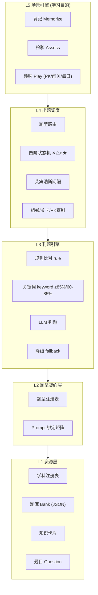
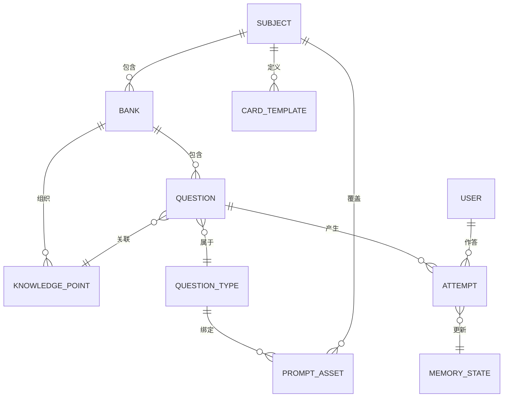
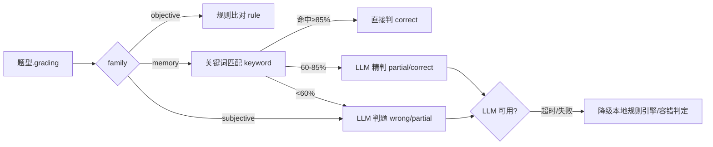
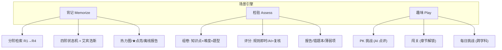
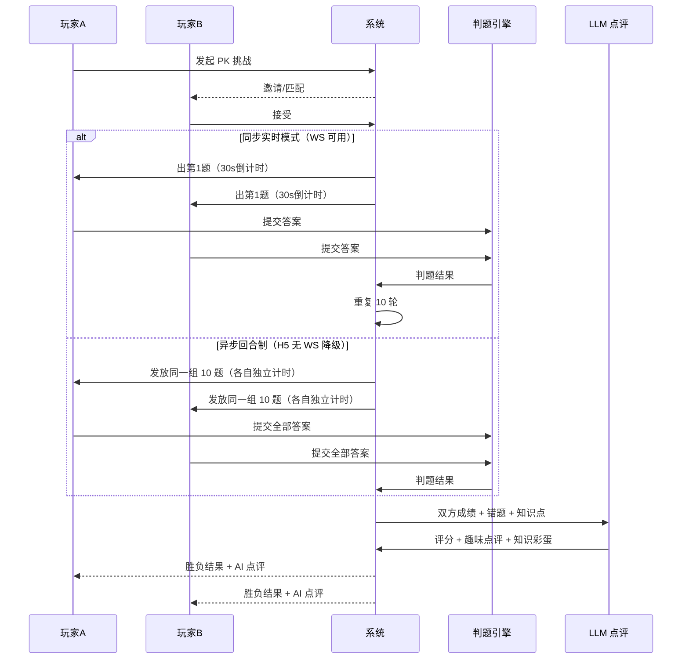

# 统一题库与多学科学习平台设计（D01）

> 本文档统筹设计小书童的**学科、题型、题库**体系及其关联系统（判题引擎、Prompt 管理、记忆状态机、学习场景），作为平台层架构基线。
> 关联文档：`docs/草稿/统一题库框架设计-V1-草稿.md`（前身）、`docs/1-需求分析/V1/“小书童（背书搭子）”产品需求分析和设计-V3.md`（需求）、`docs/目录结构与版本管理规则.md`（版本规范）

---

## 一、背景与目标

### 1.1 背景

小书童当前已实现**语文古诗文**完整链路（原始题库 1241 题 + 分阶训练题库 2463 题 + 背景钩子 + 判题 Prompt 库 + 四阶记忆状态机），验证了"背记 + AI 判题 + 引导容错"的可行性。下一步需将体系扩展到**英语、历史、地理、生物、化学**等学科（数学/物理以少量背记为主），并支持**背记、检验、趣味学习**（PK 挑战/闯关）等不同学习目的。

### 1.2 目标

1. **统一数据模型**：学科、题型、题库、题目有统一 Schema，跨学科复用。
2. **正交解耦**：学科 × 题型 × 学习目的三维独立演进，组合即查表，零重复代码。
3. **判题统一**：规则/关键词/LLM 三层判题路由 + Prompt 绑定矩阵，容错度按学科配置。
4. **记忆复用**：四阶状态机与艾宾浩斯调度跨学科通用。
5. **零废弃迁移**：现有语文资产无损映射进框架。

---

## 二、设计原则

| # | 原则 | 说明 |
|---|------|------|
| 1 | **正交解耦** | 学科/题型/题库/场景互不感知，通过注册表关联 |
| 2 | **注册表驱动** | 新增学科或题型 = 注册表加一行 + 可选 Prompt 覆盖，框架代码零改动 |
| 3 | **数据驱动** | 判题策略、容错度、Prompt 绑定全部由元数据声明，不进硬编码 |
| 4 | **兼容渐进** | 现有 `问题###答案` .txt 无损解析为统一 JSON，先兼容后重构 |
| 5 | **私域优先** | 题库与作答记录默认私有（V3 私域核心需求），跨学科一致 |
| 6 | **场景可插拔** | 学习场景（背记/检验/PK）为独立引擎，通过调度接口接入，不侵入数据层 |

---

## 三、全局架构（Mermaid）



---

## 四、全局概念模型（元模型）

### 4.1 核心实体关系



### 4.2 实体定义

| 实体 | 说明 | 关键字段 |
|------|------|---------|
| Subject 学科 | 内容域 + 判题容错度 + 卡片模板 | id, gradingPreference, cardTemplate |
| QuestionType 题型 | 数据结构 + 判题策略 + 交互方式 | key, family, grading, prompt |
| Bank 题库 | 题目容器 + 元数据 + 版本 + 权限 | id, subject, version, privacy |
| Question 题目 | 统一 Schema 数据单元 | id, bank_id, type, content |
| KnowledgePoint 知识点 | 跨题库的课程组织单元 | id, name, topic |
| Scenario 学习场景 | 学习目的驱动的调度策略 | key, scheduler, feedback |

> **Scenario 枚举（V1.2.1 明确）**：顶层三值 `memorize` / `assess` / `play`（与 `purpose_tags` 一致，是"学习目的"的实例化）。其中 `play` 在数据层可细分为业务子场景：`play_pk`（PK 对战）、`play_daily`（每日闯关/趣味练习）——二者共享 `play` 的状态隔离策略（`state_coupling=isolated`，见 10.3），仅在 attempts.scenario 列区分来源以支撑场景隔离统计。
| PromptAsset Prompt | LLM 判题/提示生成资产 | id, layer, subject, type |
| MemoryState 记忆状态 | 四阶状态机节点 | state, consecutive_correct, history_accuracy, ease_factor, next_review_at, last_hint_level |
| Attempt 作答记录 | 一次答题的完整轨迹 | id, qid, pre_state, post_state, result, confidence, hint_level |

---

## 五、学科设计（Subject）

### 5.1 学科注册表结构

```json
{
  "subject": "english",
  "name": "英语",
  "supportedTypes": ["R1", "R2", "R3a", "R3b", "O1", "O2", "O3", "O5"],
  "gradingPreference": "spelling_tolerant",
  "knowledgeCardTemplate": "word_card",
  "promptOverrides": {
    "R1": "学科-english-R1R2-翻译判题",
    "R2": "学科-english-R1R2-翻译判题",
    "R3a": "学科-english-R3aR3b-拼写判题",
    "R3b": "学科-english-R3aR3b-拼写判题"
  },
  "defaultPurpose": ["memorize", "assess"]
}
```

### 5.2 判题容错度（gradingPreference）

| 容错模式 | 说明 | 适用学科 |
|---------|------|---------|
| `semantic_tolerant` | 语义宽容：同义表述/通假字/标点差异放行 | 语文 |
| `spelling_tolerant` | 拼写宽容：时态/单复数/大小写差异放行 | 英语 |
| `exact` | 精确：术语/年代/符号必须准确 | 历史、地理、生物、化学、数学/物理 |

### 5.3 知识卡片模板（knowledgeCardTemplate）

| 模板 | 字段 | 适用学科 |
|------|------|---------|
| `author_card` | 作者定位/谁送谁/创作背景/记忆钩子/关联作品 | 语文（已实现 7 维核对法） |
| `word_card` | 词义/词性/词源/用法/例句/搭配 | 英语 |
| `event_card` | 时间/地点/人物/起因/经过/结果/影响 | 历史 |
| `region_card` | 位置/地形/气候/物产/人文/趣闻 | 地理 |
| `concept_card` | 定义/功能/分类/易混点/记忆口诀 | 生物、化学 |
| `theorem_card` | 公式/适用条件/推导/常见错误 | 数学、物理 |

### 5.4 学科适配器接口（伪代码）

```python
class SubjectAdapter:
    def __init__(self, config): pass
    def grade(self, question, user_answer, context):  # 按容错度包装判题链
        pass
    def build_card(self, question) -> Card:  # 生成知识卡片
        pass
    def resolve_prompt(self, question_type) -> PromptAsset:  # Prompt 矩阵查表
        pass
```

---

## 六、题型设计（Question Type）

### 6.1 题型注册表结构

```json
{
  "key": "R1",
  "name": "补全记忆",
  "family": "memory",
  "contentSchema": {
    "question": "string",
    "answer": "string",
    "keywords": "KeywordGroup[]"
  },
  "grading": "hybrid",
  "prompt": "题型-R1-补全记忆",
  "interaction": "text_input",
  "purpose_support": ["memorize", "play"]
}
```

### 6.2 题型族定义

#### 记忆型（Memory Family）—— 强化检索练习

| 键 | 名称 | 判题 | 交互 | 跨学科示例 |
|----|------|------|------|-----------|
| R1 | 补全记忆 | 关键词+LLM | 文本框 | 语文"上句→下句"、英语"英→中"、历史"事件→年代" |
| R2 | 逆向补全 | 关键词+LLM | 文本框 | 语文"下句→上句"、英语"中→英"、历史"年代→事件" |
| R3a | 段落默写 | 关键词+LLM | 文本框 | 语文重点段落、英语句子默写（R3 子型 a） |
| R3b | 整篇默写 | 关键词+LLM | 文本框 | 语文整篇、化学方程式（R3 子型 b） |
| R4 | 知识卡片 | 非判题（展示） | 卡片 | 背景钩子/历史典故/地理趣闻/生物概念 |

> **子型说明（V1.2 修复）**：R3 按判题粒度分为 R3a（段落，判完整性+顺序+关键词）与 R3b（整篇，判整篇完整性），二者判题策略不同，各有独立 Prompt（`题型-R3a-段落默写.md` / `题型-R3b-整篇默写.md`），避免"同键不同判题策略"坍缩。

#### 客观型（Objective Family）—— 规则比对即判

| 键 | 名称 | 判题 | 交互 | 说明 |
|----|------|------|------|------|
| O1 | 单选 | 规则比对 | 点选 | 四选一 |
| O2 | 多选 | 规则比对 | 点选 | 全对才得分（可配部分得分） |
| O3 | 判断 | 规则比对 | 点选 | 对/错 |
| O4 | 连线 | 规则比对 | 拖拽/点选 | 匹配两列（历史人物-朝代、省-简称） |
| O5 | 填空 | 规则+LLM | 文本框 | 生物名词、化学用语 |

#### 主观型（Subjective Family）—— LLM 判题

| 键 | 名称 | 判题 | 交互 | 说明 |
|----|------|------|------|------|
| X1 | 简答 | LLM | 文本框 | 语文简答、历史分析 |
| X2 | 论述 | LLM+人工复核 | 文本框 | 作文、小论文 |
| X3 | 计算 | 规则/步骤比对 | 文本框 | 数学/物理（少量背记场景） |

### 6.3 题型判题链路由



> **阈值对齐（V1.2 修复）**：关键词命中率与 V3 置信度阈值对齐——≥85% 判 correct；60-85% 判 partial（保留"部分正确"独立结果，不吞并）；<60% 走 LLM 精判。客观型（O）规则比对直接判；主观型（X）直接 LLM。R4 知识卡片非判题（展示）。

---

## 七、题库设计（Question Bank）

### 7.1 题库组织目录

```
题库/
├── {subject}/                    # 学科顶层目录
│   ├── {bank}/                   # 题库（如：七-九年级-统编教材 / 中考真题 / 官方基础库）
│   │   ├── bank.json             # 题库元数据
│   │   ├── 七上-古诗文.json       # 题目数据（统一 Schema）
│   │   ├── 七上-背景钩子.json     # 知识卡片数据
│   │   └── 七上-背诵训练.json
│   └── ...
├── schema/                       # 版本化正式 Schema（P1 已落地）
│   ├── question.v1.json
│   └── bank.v1.json
└── 判题Prompt/                   # Prompt 资产（跨学科）
    ├── 通用判题-Prompt.md
    ├── 题型-R1-补全记忆.md
    └── 学科-english-R3aR3b-拼写判题.md
```

**迁移映射**（现有 → 目标）：

| 现有 | 目标 |
|------|------|
| `题库/七年级/七上-古诗文.txt` | `题库/chinese/七-九年级-统编教材/七上-古诗文.json` |
| `题库/背诵训练/chinese/统编-2024修订版/...` | `题库/chinese/七-九年级-统编教材/七上-背诵训练.json` |
| `题库/背景钩子/chinese/统编-2024修订版/...` | `题库/chinese/七-九年级-统编教材/七上-背景钩子.json` |

### 7.2 题库元数据（bank.json）

```json
{
  "bank_id": "chinese-7to9-pep",
  "subject": "chinese",
  "name": "七-九年级-统编教材",
  "version": "V1.0",
  "source": "人教社统编版 2024/2026 修订",
  "purpose_tags": ["memorize", "assess", "play"],
  "default_prompt": "通用判题",
  "type_overrides": { "R1": "题型-R1-补全记忆" },
  "privacy": "private",
  "owner": "system"
}
```

**版本管理**：题库本身遵循 MinVer（`V1.0 → V1.1` 增补题目，`V2.0` 教材改版），与 docs 版本链同构。题目用稳定 `id`（如 `Q-ch-7a-0001`），改版不删除旧题、以 `superseded_by` 标记。

### 7.3 题目统一 JSON Schema

```json
{
  "id": "Q-ch-7a-0001",
  "bank_id": "chinese-7to9-pep",
  "subject": "chinese",
  "topic": "七上-古诗文",
  "knowledge_points": ["观沧海"],
  "type": "R1",
  "purpose_tags": ["memorize", "play"],
  "content": {
    "question": "日月之行",
    "answer": "若出其中",
    "keywords": [
      { "aliases": ["若出其中"], "weight": 2, "required": true },
      { "aliases": ["唐太宗", "李世民"], "weight": 1, "required": false }
    ],
    "tolerance": "semantic_tolerant",
    "audio_url": "",
    "image_url": ""
  },
  "meta": {
    "difficulty": 1,
    "source": "2024修订版七上第4课",
    "knowledge_card_id": "KC-ch-观沧海",
    "version": "V1.0",
    "created_at": "2026-09-04T00:00:00Z",
    "updated_at": "2026-09-04T00:00:00Z",
    "superseded_by": ""
  }
}
```

> **keywords 升级（V1.2）**：支持同义词组（`aliases` 数组，组内任一命中即该组命中，如"唐太宗"=“李世民"）+ 权重（weight）+ 必中要点（required=true 未命中 → 强制 partial）。本地关键词引擎按组判，才能真正拦截 60-70% 请求（V3 成本模型前提）。
> **正式 Schema 文件**：`题库/schema/question.v1.json`（V1.1，已修复 R4 兼容/子型化/容错度/审计字段）。

### 7.4 导入导出与兼容

- **导入**：`.txt`（`问题###答案`，注释 `#`）→ 解析器按目录/注释推断 subject/type → 生成 JSON
- **导出**：JSON → 任意格式（PDF 离线报告、教师讲义）
- **批量校验**：Schema 校验 + 重复题检测 + 内容安全扫描

### 7.5 私域与权限（V3 核心）

- 默认 `privacy: private`，仅题库创建者可见
- 群组内题库：仅群主可改，组员只读（"引用而非复制"）
- 防爬：接口"背一题取一题"，不返回明文列表

---

## 八、学习场景设计（Scenario）

### 8.1 场景总览



### 8.2 背记（Memorize）—— 已实现，跨学科复用

```
分阶检索：✕ 跟读 → △ R1 → ○ R2/R3a/R3b → ★ R4整篇
调度：四阶状态机 ✕△○★ + 艾宾浩斯间隔（首次30min → 12h → 1d → 3d → 7d → 30d）
反馈：判题 + 背景钩子提示（S1首字/S2意象/S3逻辑）
激励：记忆热力图 / ★ 点亮 / 离线报告
```

### 8.3 检验（Assess）

```
组卷：按 知识点 × 难度 × 题型比例 随机抽取
评分：规则题即时判，主观题 AI 判 + 人工复核
报告：正确率 / 知识点薄弱项 / 错题本（自动归集）
复用：检验结果反哺四阶状态机（答错题目降级）
```

### 8.4 趣味（Play）—— PK 挑战（重点）

#### 8.4.1 PK 模式规则（V1.2 定稿）

> **决策记录**：原"互考模式"（A 出题 B 作答）操作性复杂（依赖双方题库权限、出题质量不可控），**改为 PK 模式**：系统统一出题，双方公平作答。

**PK 赛制**：
- **题目来源**：系统从指定题库按知识点/难度自动出题
- **题量**：连续 10 题（可配置 5/10/20）
- **作答方式**：双方同题同序作答，每题有独立倒计时（如 30s）
- **计分规则**：
  - 每题答对 +10 分，答错/超时 0 分
  - **胜负判定**：总分高者胜；**总分相同 → 总用时短者胜**；仍相同 → 平局
- **总时间限制**：全程有总时长上限（如 10 题 × 30s + 缓冲 = 5 分钟），超时未答完按已答计分

**实现模式（V1.2 修复：应对 H5 实时性限制）**：

| 模式 | 机制 | 适用 | 说明 |
|------|------|------|------|
| **同步实时模式** | 双方在线同时作答（WebSocket/SignalR 实时同步） | 原生 App / 小程序 / 支持 WS 的 H5 环境 | 强实时，需做 P1 阶段技术 PoC 验证微信 X5 内核 WebSocket 支持 |
| **异步回合制模式**（备选） | 双方各自独立完成同一组题，提交后合并计分 | 微信 H5（WebSocket 不可用时） | 每方限时 10 题 × 30s + 缓冲，各自倒计时互不阻塞，提交后系统合并对比成绩 | 

> **降级策略**：若 P1 PoC 验证微信 H5 内 WebSocket 不可用，PK 自动降级为异步回合制（同一组题、各自计时、合并计分），胜负规则不变（总分 → 用时 → 平局）。同步/异步对用户透明。

#### 8.4.2 AI 评分与趣味点评（增强）

- **判题契约（统一五键）**：所有判题引擎（规则/相似度/AI）输出统一 JSON 契约，上层代码只写一份解析逻辑：

```json
{
  "result": "correct | partial | wrong",
  "confidence": 0.92,
  "matched_keywords": ["日月之行", "若出其中"],
  "missing_keywords": ["星汉灿烂", "若出其里"],
  "hint": "提示：下句与'星汉'有关"
}
```

| 键 | 取值 | 说明 |
|----|------|------|
| `result` | `correct` / `partial` / `wrong` | 判题三元结果（`partial` 是核心创新，避免二元判题挫败感） |
| `confidence` | 0-1 | 判定置信度。≥0.85 判 correct，0.5-0.85 判 partial，<0.5 判 wrong |
| `matched_keywords` | 字符串数组 | 命中的关键词（本地匹配/AI 提取，可为空） |
| `missing_keywords` | 字符串数组 | 缺失的关键词（用于引导反馈"哪里漏了"，可为空） |
| `hint` | 字符串 | 引导线索（≤20 字，仅给首字/意象/逻辑，**严禁给出答案**） |

> 该契约是 D07 §3.1、D03 §判题接口、`rule_grader.py` 输出结构的权威定义源（详见 D07 3.1 判题契约详表）。

- **AI 评分**：客观题（O 系列）规则即时判；主观/记忆题（R/X）走判题引擎，输出上述五键契约（`result + confidence` 为旧两键形态，已升级为五键中前三项的超集）
- **趣味点评**：PK 结束后，LLM 生成个性化点评：
  - **对每位玩家**：表现亮点、薄弱知识点（如"你对唐朝历史很熟，但宋朝人物容易混"）
  - **知识彩蛋**：对双方都答错的题，给出趣味知识讲解（结合知识卡片，如"这道题考的是'灞桥折柳'的典故，柳与'留'谐音……"）
  - **胜负祝词**：轻松幽默风格（如"险胜！下次再战""你俩半斤八两，正好组队"）
- **点评 Prompt**：独立资产 `趣味点评-Prompt.md`（角色：幽默知识型主持）

#### 8.4.3 PK 流程（Mermaid）



#### 8.4.4 闯关与每日挑战

| 模式 | 机制 | 数据来源 |
|------|------|---------|
| 闯关 | 章节/知识点关卡顺序解锁，完成解锁下一关 | 题库 topic 层级 |
| 每日挑战 | 固定 5-10 题，跨学科混合推送 | 跨题库聚合 |

---

## 九、判题引擎与 Prompt 体系

### 9.1 判题路由

```
题型注册表.grading 决定判题链
├── rule      → 规则引擎（O1-O4 直接比对，零成本）
├── keyword   → 本地关键词匹配（≥85% 判 correct，60-85% partial，<60% 走 LLM）
├── llm       → LLM 判题（走 Prompt 绑定矩阵）
└── hybrid    → keyword 前置 + llm 兜底（记忆型 R1/R2/R3a/R3b 默认）
降级：LLM 超时(>3s)/失败 → 本地规则引擎 + 提示用户
```

### 9.2 Prompt 绑定矩阵（五层覆盖）

```
绑定优先级：单题级 > 学科×题型级 > 题型级 > 学科级 > 全局基线
```

| 层 | 示例 | 文件 |
|----|------|------|
| 全局基线 | 所有题兜底 | `判题Prompt/通用判题-Prompt.md` |
| 学科级 | 语文语义宽容 / 英语拼写宽容 | `判题Prompt/学科-english-R1R2-翻译判题.md` / `判题Prompt/学科-english-R3aR3b-拼写判题.md` |
| 题型级 | R1 补全 / R2 逆向 / R3a 段落 / R3b 整篇 / O4 连线 | `判题Prompt/题型-R1-补全记忆.md`、`题型-R2-逆向补全.md`、`题型-R3a-段落默写.md`、`题型-R3b-整篇默写.md` |
| 学科×题型 | 英语 R3b 拼写专用（R3a/R3b 共用） | `判题Prompt/学科-english-R3aR3b-拼写判题.md` |
| 单题级 | 特殊题单独绑定 | 题目 meta.prompt_override |
| 场景级 | PK 趣味点评 / 背景钩子提示 | `判题Prompt/趣味点评-Prompt.md`、`背景钩子-提示生成-Prompt.md` |

### 9.3 hint_level 状态机信号（V3 对齐）

| hint_level | 交互 | 判题后状态 |
|-----------|------|-----------|
| `none` | 独立作答 | 答对 → ○/★，答错 → ✕/△ |
| `partial` | 点击"请提示我"后作答 | 答对 → △（求助后答对） |
| `full` | 直接看答案 | 不计入记录 |

提示生成走独立 Prompt（`背景钩子-提示生成-Prompt.md`），从知识卡片提取线索（S1首字/S2意象/S3逻辑），**不从答案提取**。

---

## 十、记忆状态机（跨学科复用）

```
状态：✕ 未掌握 / △ 模糊 / ○ 掌握 / ★ 熟练
迁移（对任意记忆型题目）：
  独立答对：✕→△→○（连续2次→★）；★ 停留（间隔递增至30天）
  求助后答对：→ △
  答错：○→△，★→○（降一级），△→✕
间隔 = 状态基础间隔 × 历史正确率系数(0.5~1.5)
```

### 10.1 状态机核心字段（V1.2 修复补齐）

| 字段 | 类型 | 说明 |
|------|------|------|
| `state` | enum | ✕/△/○/★ 当前状态 |
| `consecutive_correct` | int | 连续独立答对次数（"连续2次→★"的实现基础） |
| `history_accuracy` | float | 近 20 次答题正确率（间隔系数计算依据） |
| `ease_factor` | float | 预留（Phase 2 SM-2 动态间隔） |
| `next_review_at` | timestamp | 下次复习时间（独立索引） |
| `last_hint_level` | enum | 最近一次作答的 hint_level（联动审计） |

### 10.2 hint_level × result × 状态迁移矩阵（V1.2 修复）

| hint_level | 判题结果 | 状态迁移 | 对 consecutive_correct 影响 |
|-----------|---------|---------|---------------------------|
| none | correct | ✕→△→○（连续2次→★） | +1 |
| none | wrong | ○→△，★→○，△→✕ | 清零 |
| partial | correct | → △（求助后答对） | 清零 |
| partial | wrong | → ✕（或停留 △） | 清零 |
| full | 直接看答案 | 不迁移（不计入记录） | 不变 |

### 10.3 场景-状态机耦合策略（V1.2 新增）

每个学习场景声明与记忆状态机的耦合方式：

| 场景 | state_coupling | 说明 |
|------|---------------|------|
| 背记 memorize | `full` | 正常迁移状态机（✕△○★ 演进） |
| 检验 assess | `feedback_only` | 答错降级、答对不升级（评估不奖励） |
| 趣味 play（PK） | `isolated` | 不影响记忆状态（娱乐与严肃解耦） |

状态机与学科无关——英语单词、历史年代、化学方程式统一使用，仅数据内容不同。耦合策略由场景配置决定（数据驱动，非硬编码）。

---

## 十一、现有资产映射（零废弃迁移）

| 现有实现 | 框架层 | 迁移动作 |
|---------|--------|---------|
| `题库/<年级>/*.txt`（1241 题） | L1 资源层 | 解析为统一 JSON（已迁移 3704 题至 chinese/） |
| `题库/背诵训练/*`（2463 题） | L2 题型注册表 | 标记为 R1/R2/R3a/R3b 实例（已迁移） |
| `题库/背景钩子/*`（7 维核对法） | L1 知识卡片 | 转 author_card JSON（已迁移 222 张） |
| `题库/判题Prompt/*`（9 个，含趣味点评） | L3/L2 | 纳入 Prompt 绑定矩阵 |
| 四阶状态机（✕△○★） | L4 调度 | 原样复用（补字段后） |

**结论**：语文是第一个完整落地的学科适配器；新增学科 = 新适配器 + 新题库 + 学科 Prompt 覆盖，框架代码零改动。

---

## 十二、落地路线图

| 阶段 | 内容 | 产出 | 状态 |
|------|------|------|------|
| P0 | 语文适配器（现状） | 完整链路 | ✅ 已实现 |
| P1 | 统一 JSON Schema + .txt 解析器 | `题库/schema/` + 解析工具 | ✅ 已完成：`txt2json.py` 迁移 3704 题 + 222 知识卡片（初中 1713 + 小学 1991），schema 回归 100% 通过 |
| P1a | PK 技术 PoC（同步/异步可行性验证） | WebSocket 可行性报告 | 待开发（Oracle 建议，避免 P5 才暴露实时性风险） |
| P2 | 客观型 O1-O5 题型注册（规则判题） | 题型注册表扩展 | ✅ 已完成：`题型注册表.json`（13 型全量）+ `rule_grader.py`（O1-O5 规则判题，测试矩阵 15/15）+ 客观题示例 10 题 |
| P3 | 英语适配器（R1/R2/R3a + O1-O5 + word_card） | 英语题库 + Prompt | ✅ 已完成：`学科注册表.json`（9 学科）+ 英语题库示例 10 题 + `学科-english-R1R2-翻译判题.md`/`R3aR3b-拼写判题.md`，规则判题 10/10 通过 |
| P4 | 历史/地理适配器（R1/R2 + O4 连线） | 历史地理题库 + Prompt | ✅ 已完成：history 12 题 + geography 12 题 + 知识卡片（10+9 张）+ `verify_history_geo.py` 全量校验通过（问题 0，判题 16/16） |
| P5 | 趣味场景引擎（PK 挑战 + 闯关 + 每日） | 场景引擎 + AI 点评 | 待开发 |
| P6 | 检验场景引擎（组卷/评分/错题本） | 检验引擎 + 报告 | 待开发 |

---

## 十三、决策记录与待决事项

### 13.1 已决策（2026-09-04）

| # | 事项 | 决策 |
|---|------|------|
| 1 | 统一 JSON Schema | **立即落地**为版本化正式 Schema（`题库/schema/question.v1.json`） |
| 2 | 互考模式 | **废弃**（操作性复杂），**改为 PK 模式**：系统出题、双方作答、AI 评分 + 趣味点评 |
| 3 | PK 胜负规则 | 连续 10 题（可配 5/10/20），总分高者胜；同分比总用时短；全程总时长限制 |
| 4 | AI 点评 | 独立 `趣味点评-Prompt.md`：个人亮点 + 薄弱点 + 错题知识彩蛋 + 胜负祝词 |
| 5 | Oracle 评审修复（V1.2） | R3 拆分子型 R3a/R3b；keyword 阈值对齐三元判题（85%/60-85%/60%）；memory_states 补 consecutive_correct/history_accuracy/last_hint_level；keywords 升级同义词组+权重；场景-状态机耦合策略（full/feedback_only/isolated）；PK 加异步回合制备选方案 |

### 13.2 待决事项

| # | 事项 | 建议 |
|---|------|------|
| 1 | 数学/物理是否纳入框架（仅 X3 + R3 少量背记） | 建议低优先级，P6 后评估 |
| 2 | 跨学科每日挑战的数据聚合规则 | 建议按知识点标签聚合 |
| 3 | PK 匹配机制（好友邀请 vs 随机匹配） | 建议先好友邀请，P5 后评估随机 |

---

## 变更记录

| 日期 | 版本 | 变更内容 | 关联ADR |
|------|------|---------|---------|
| 2026-09-04 | V1.0 | 初始正式版：统筹学科/题型/题库/场景/判题/Prompt/状态机 | - |
| 2026-09-04 | V1.1 | 章节粒度细化；新增 Mermaid 架构图/ER 图/判题路由/PK 时序图；JSON Schema 落地；互考改 PK 模式（AI 评分+趣味点评） | - |
| 2026-09-04 | V1.2 | **Oracle 架构评审后对齐补丁**：①R3 拆 R3a/R3b 子型（Prompt 文件重命名同步）②keyword 阈值对齐 V3 三元判题（≥85%/60-85%/<60%）③memory_states 补 consecutive_correct/history_accuracy/last_hint_level + hint×result×state 迁移矩阵 ④keywords 升级同义词组+权重 ⑤场景-状态机耦合策略（full/feedback_only/isolated）⑥PK 加异步回合制备选方案（H5 兼容）⑦question.v1.json 修复 R4 兼容/容错度/审计字段 ⑧bank.v1.json 补 supported_types/knowledge_card_template | - |
| 2026-09-04 | V1.2.1 | 四文档自审一致性补丁：全局架构图阈值同步 ≥85%（行64）；6.1 contentSchema keywords 升级为 KeywordGroup[] | - |
