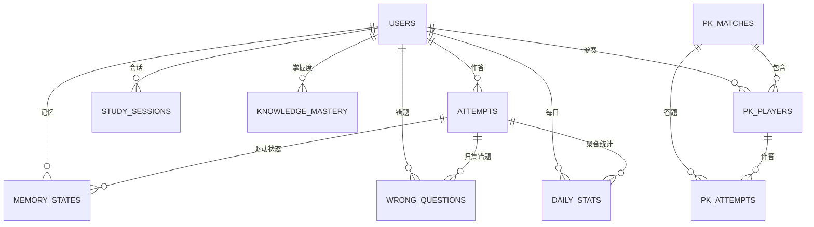

# 学习数据与记忆跟踪设计（D02）

> 本文档设计小书童的**学习数据跟踪体系**：背诵数据、记忆巩固（艾宾浩斯复习）、PK 分数、统计聚合（热力图/连续天数/错题本）等各类数据的存储结构。
> 关联文档：`docs/D01-统一题库与多学科学习平台设计.md`（框架 V1.2.1）、`docs/1-需求分析/V1/“小书童（背书搭子）”产品需求分析和设计-V3.md`（需求）、`docs/目录结构与版本管理规则.md`（版本规范）

---

## 一、背景与目标

### 1.1 背景

D01 框架已定义题型判题、记忆状态机、场景引擎的抽象设计。本设计补充其**数据层**——跟踪用户在学习过程中的全部数据轨迹，支撑背记调度、记忆巩固、PK 竞技、统计激励四类核心功能。

### 1.2 目标

1. **单一数据源**：作答记录（Attempt）为唯一事实源，记忆状态/错题本/统计均由它派生，杜绝数据冗余冲突。
2. **用户标识统一**：所有表通过 `user_id uuid` 外键关联**已有用户体系**（不做用户表设计，只引用扩展）。
3. **状态机可复现**：每次作答记录 `pre_state/post_state`，状态迁移可审计、可回溯。
4. **场景隔离**：背记/检验/PK 三类场景的数据可分离统计，互不污染。
5. **可扩展**：表结构对齐 D01 题型族（R1-R4/O1-O5/X1-X3），新增题型不改表结构。

---

## 二、设计原则

| # | 原则 | 说明 |
|---|------|------|
| 1 | **UUID 主键** | 全部表主键 `uuid DEFAULT gen_random_uuid()`（PostgreSQL 13+ 内置），业务 ID（question_id 等）用 varchar 业务键 |
| 2 | **user_id 外键引用** | `user_id uuid NOT NULL` 引用已有用户表（仅扩展，不新建用户表） |
| 3 | **事实源单一** | `attempts` 是唯一写入入口；`memory_states`/`daily_stats`/`wrong_questions` 由 attempts 派生（应用层事务内同步） |
| 4 | **时间戳统一** | 一律 `timestamptz`，默认 `now()`；业务日期统计用 `date`（UTC+8） |
| 5 | **软删除 + superseded** | 题目改版用 `superseded_by`，作答历史不删不改 |
| 6 | **隐私对齐 V3** | 数据归用户所有，可导出、可注销删除（30 天内全清）；PK 数据脱敏 |

---

## 三、数据模型总览（ER 图）



> `USERS` 为已有用户体系（外部扩展），本设计仅以 `user_id uuid` 引用，不包含其表结构。

---

## 四、核心表设计（DDL）

> 以下为 PostgreSQL DDL 设计。`users` 表属已有扩展，仅说明关联方式。

### 4.1 attempts（作答记录）—— 唯一事实源

```sql
CREATE TABLE attempts (
    id             uuid PRIMARY KEY DEFAULT gen_random_uuid(),
    user_id        uuid NOT NULL REFERENCES users(id),   -- 已有用户体系外键
    session_id     uuid REFERENCES study_sessions(id),  -- 学习会话归属
    question_id    varchar(64) NOT NULL,                 -- 题目业务键（Q-ch-7a-0001）
    bank_id        varchar(64) NOT NULL,                 -- 题库业务键
    scenario       varchar(16) NOT NULL,                 -- memorize/assess/play_pk/play_daily
    qtype          varchar(8)  NOT NULL,                 -- R1/R2/R3a/R3b/O1...（D01 题型键）
    pre_state      smallint    NOT NULL,                 -- 0=✕ 1=△ 2=○ 3=★
    post_state     smallint    NOT NULL,
    result         varchar(8)  NOT NULL,                 -- correct/partial/wrong
    confidence     real,
    hint_level     varchar(8)  NOT NULL DEFAULT 'none',  -- none/partial/full
    time_cost_ms   integer,
    answered_at    timestamptz NOT NULL DEFAULT now()
);

CREATE INDEX idx_attempts_user_time ON attempts(user_id, answered_at DESC);
CREATE INDEX idx_attempts_user_qid  ON attempts(user_id, question_id);
CREATE INDEX idx_attempts_user_result ON attempts(user_id, result);
CREATE INDEX idx_attempts_session ON attempts(session_id);
-- 分区建议：按月分区（answered_at），历史 >2 年归档冷表
```

**字段说明**：
- `scenario`：来源场景（背记/检验/PK/每日），支撑场景隔离统计
- `pre_state/post_state`：状态迁移审计（D01 10.2 迁移矩阵落库）
- `hint_level`：none/partial/full，与 V3 记忆状态机信号对齐

### 4.2 memory_states（记忆状态）—— 状态机运行表

```sql
CREATE TABLE memory_states (
    id                  uuid PRIMARY KEY DEFAULT gen_random_uuid(),
    user_id             uuid NOT NULL REFERENCES users(id),
    question_id         varchar(64) NOT NULL,
    bank_id             varchar(64) NOT NULL,
    state               smallint NOT NULL,               -- ✕△○★
    consecutive_correct int     NOT NULL DEFAULT 0,      -- 连续独立答对（2次→★）
    history_accuracy    real    NOT NULL DEFAULT 0,      -- 近20次正确率（间隔系数）
    ease_factor         real    NOT NULL DEFAULT 2.5,    -- 预留（Phase2 SM-2）
    next_review_at      timestamptz NOT NULL,            -- 下次复习（驱动队列）
    last_attempt_id     uuid REFERENCES attempts(id),    -- 最近一次作答
    last_hint_level     varchar(8) DEFAULT 'none',
    updated_at          timestamptz NOT NULL DEFAULT now(),
    UNIQUE(user_id, question_id)                          -- 一人一题一行
);

CREATE INDEX idx_ms_user_review ON memory_states(user_id, next_review_at);
CREATE INDEX idx_ms_user_state  ON memory_states(user_id, state);
```

**复习队列**（视图，无需单独表）：

```sql
CREATE VIEW review_queue AS
SELECT user_id, question_id, state, next_review_at
FROM memory_states
WHERE next_review_at <= now() AND state < 3;  -- ★ 熟练不强制复习
```

### 4.3 study_sessions（学习会话）—— 单次学习批次

```sql
CREATE TABLE study_sessions (
    id               uuid PRIMARY KEY DEFAULT gen_random_uuid(),
    user_id          uuid NOT NULL REFERENCES users(id),
    scenario         varchar(16) NOT NULL,
    bank_id          varchar(64),
    session_type     varchar(16) NOT NULL,   -- 分阶/自由/组卷/关卡/PK
    question_count   int NOT NULL DEFAULT 0,
    correct_count    int NOT NULL DEFAULT 0,
    total_time_ms    int NOT NULL DEFAULT 0,
    started_at       timestamptz NOT NULL DEFAULT now(),
    ended_at         timestamptz
);

CREATE INDEX idx_session_user ON study_sessions(user_id, started_at DESC);
```

> 会话表记录"一次进入学习到退出"的批次（对应 V3 答题 Session 定义），attempts 通过 `session_id` 归属（可在 attempts 增加 `session_id uuid` 引用）。

### 4.4 daily_stats（每日统计）—— 热力图/连续天数数据源

```sql
CREATE TABLE daily_stats (
    id             uuid PRIMARY KEY DEFAULT gen_random_uuid(),
    user_id        uuid NOT NULL REFERENCES users(id),
    stat_date      date NOT NULL,                        -- UTC+8 业务日期
    learned_count  int NOT NULL DEFAULT 0,               -- 学习题数
    starred_count  int NOT NULL DEFAULT 0,               -- 点亮★数（热力图）
    review_count   int NOT NULL DEFAULT 0,
    accuracy       real,
    study_seconds  int NOT NULL DEFAULT 0,
    UNIQUE(user_id, stat_date)
);

CREATE INDEX idx_daily_user ON daily_stats(user_id, stat_date DESC);
```

**连续天数（streak）计算**：由 `daily_stats` 的 `stat_date` 连续性 SQL 派生（当日/昨日有记录即延续），不单独建表。

### 4.5 knowledge_mastery（知识点掌握度）—— 聚合视图落库

```sql
CREATE TABLE knowledge_mastery (
    id               uuid PRIMARY KEY DEFAULT gen_random_uuid(),
    user_id          uuid NOT NULL REFERENCES users(id),
    subject          varchar(16) NOT NULL,
    knowledge_point  varchar(64) NOT NULL,
    state            smallint NOT NULL,                 -- 聚合状态（取题目中位/最差）
    accuracy         real NOT NULL DEFAULT 0,
    attempt_count    int NOT NULL DEFAULT 0,
    last_reviewed_at timestamptz,
    UNIQUE(user_id, subject, knowledge_point)
);

CREATE INDEX idx_km_user ON knowledge_mastery(user_id, subject);
```

> 由 attempts + questions.knowledge_points 聚合生成（应用层定时或即时更新），支撑"薄弱知识点"报表与 PK 点评输入。

### 4.6 wrong_questions（错题本）—— 物化派生表

```sql
CREATE TABLE wrong_questions (
    id             uuid PRIMARY KEY DEFAULT gen_random_uuid(),
    user_id        uuid NOT NULL REFERENCES users(id),
    question_id    varchar(64) NOT NULL,
    bank_id        varchar(64) NOT NULL,
    subject        varchar(16) NOT NULL,                 -- 冗余学科字段（跨学科错题查询无需 join banks）
    wrong_count    int NOT NULL DEFAULT 1,
    last_wrong_at  timestamptz NOT NULL DEFAULT now(),
    mastered       boolean NOT NULL DEFAULT false,      -- 连续2次答对 → true
    UNIQUE(user_id, question_id)
);

CREATE INDEX idx_wq_user ON wrong_questions(user_id, mastered, last_wrong_at DESC);
CREATE INDEX idx_wq_subject ON wrong_questions(user_id, subject);
```

> 由 attempts（result=wrong/partial）归集；`mastered` 在连续 2 次 correct 后置 true（保留记录供复习回看）。

---

## 五、PK 竞技数据（PK 分数跟踪）

### 5.1 pk_matches（比赛主表）

```sql
CREATE TABLE pk_matches (
    id                uuid PRIMARY KEY DEFAULT gen_random_uuid(),
    subject           varchar(16) NOT NULL,
    bank_id           varchar(64) NOT NULL,
    topic             varchar(64),
    question_count    int NOT NULL DEFAULT 10,          -- 5/10/20
    per_question_time_s int NOT NULL DEFAULT 30,
    total_time_limit_s int NOT NULL DEFAULT 300,
    mode              varchar(8) NOT NULL DEFAULT 'sync',  -- sync/async（D01 8.4.1 双模式）
    status            varchar(16) NOT NULL DEFAULT 'pending', -- pending/ongoing/finished/cancelled
    winner_id         uuid,                             -- NULL=平局
    created_at        timestamptz NOT NULL DEFAULT now(),
    finished_at       timestamptz
);

CREATE INDEX idx_pk_status ON pk_matches(status, created_at DESC);
CREATE INDEX idx_pk_winner ON pk_matches(winner_id);
```

### 5.2 pk_players（参赛者成绩）

```sql
CREATE TABLE pk_players (
    id             uuid PRIMARY KEY DEFAULT gen_random_uuid(),
    match_id       uuid NOT NULL REFERENCES pk_matches(id),
    user_id        uuid NOT NULL REFERENCES users(id),
    score          int NOT NULL DEFAULT 0,              -- 总分（每题+10）
    correct_count  int NOT NULL DEFAULT 0,
    total_time_ms  int NOT NULL DEFAULT 0,              -- 同分比用时
    ai_comment     text,                                -- AI 趣味点评（D01 8.4.2）
    UNIQUE(match_id, user_id)
);

CREATE INDEX idx_pk_players_user ON pk_players(user_id, match_id DESC);
```

### 5.3 pk_attempts（PK 答题明细）

```sql
CREATE TABLE pk_attempts (
    id          uuid PRIMARY KEY DEFAULT gen_random_uuid(),
    match_id    uuid NOT NULL REFERENCES pk_matches(id),
    player_id   uuid NOT NULL REFERENCES pk_players(id),
    user_id     uuid NOT NULL REFERENCES users(id),
    question_id varchar(64) NOT NULL,
    answer      text,
    result      varchar(8),
    is_correct  boolean,
    time_cost_ms int
);

CREATE INDEX idx_pka_match ON pk_attempts(match_id);
```

### 5.4 PK 分数统计（聚合视图）

```sql
-- 玩家历史战绩：胜/负/平、累计得分、平均用时
CREATE VIEW pk_player_stats AS
SELECT
    p.user_id,
    COUNT(DISTINCT p.match_id) AS total_matches,
    COUNT(DISTINCT CASE WHEN m.winner_id = p.user_id THEN p.match_id END) AS wins,
    COUNT(DISTINCT CASE WHEN m.winner_id IS NULL THEN p.match_id END) AS draws,
    SUM(p.score) AS total_score,
    AVG(p.total_time_ms) AS avg_time_ms
FROM pk_players p
JOIN pk_matches m ON m.id = p.match_id
WHERE m.status = 'finished'
GROUP BY p.user_id;
```

---

## 六、数据流（场景 → 落库）

```
背记场景:
  用户作答 → attempts 写入（pre/post_state 由状态机算出）
         → memory_states upsert（状态/间隔/consecutive）
         → daily_stats 聚合（learned/starred）
         → (若 wrong) wrong_questions upsert

检验场景:
  组卷作答 → attempts 写入（scenario=assess, 不升级状态机）
         → 结果报告（正确率/薄弱点 ← knowledge_mastery）
         → 答错题目降级 memory_states（feedback_only）

PK 场景:
  双方作答 → pk_attempts 写入（scenario=play_pk）
         → pk_players 计分（score/time）
         → 胜负判定 → pk_matches 更新 winner
         → AI 点评 → pk_players.ai_comment
         → 不入 attempts / 不动 memory_states（isolated 耦合）
```

---

## 七、统计与激励数据（V3 可视化体系）

| 激励功能 | 数据来源 | 计算方式 |
|---------|---------|---------|
| 记忆热力图 | `daily_stats.starred_count` | 按日期聚合当日点亮 ★ 数（GitHub 风格） |
| 连续天数 | `daily_stats.stat_date` | 日期连续性 SQL 派生（断更清零） |
| 离线报告 | `attempts + memory_states` | 当日复习任务（next_review_at ≤ 当日）+ 完成情况 |
| 周报/月报 | `daily_stats + knowledge_mastery` | 时间窗聚合正确率/薄弱知识点 |
| 非分数排名 | `daily_stats` + `pk_player_stats` | 仅展示坚持天数 + ★ 增长数（V3 非分数原则） |
| PK 战绩 | `pk_player_stats` 视图 | 胜率/累计分/平均用时 |

---

## 八、索引与性能

| 表 | 核心索引 | 用途 |
|----|---------|------|
| attempts | (user_id, answered_at DESC) | 历史查询/错题时间线 |
| memory_states | (user_id, next_review_at) | 复习队列扫描（高频） |
| daily_stats | UNIQUE(user_id, stat_date) | 热力图 upsert |
| pk_players | (user_id, match_id DESC) | 个人战绩 |
| wrong_questions | (user_id, mastered, last_wrong_at) | 错题列表 |

**容量预估**（500 日活 × 30 题/日）：attempts 约 15k 行/日、5.5M 行/年 → 按月分区 + 热数据 Redis 缓存（当前记忆状态、复习队列）。

---

## 九、隐私与合规（V3 对齐）

1. **数据所有权**：所有学习数据归用户本人，支持一键导出（JSON）。
2. **注销删除**：账号注销后 30 天内删除全部关联数据（级联删除 attempts/memory_states/daily_stats/pk_*）。
3. **未成年人**：不满 14 周岁用户数据最小化收集（个保法第 28-31 条），PK 数据脱敏展示。
4. **RLS 行级安全**：`user_id` 列启用 PostgreSQL RLS，防止跨用户数据访问（D01 私域原则）。

```sql
-- RLS 示例（每表启用）
ALTER TABLE attempts ENABLE ROW LEVEL SECURITY;
CREATE POLICY attempts_owner ON attempts
    USING (user_id = current_setting('app.current_user_id')::uuid);
```

---

## 十、与 D01/V3 衔接

| 本设计 | D01 实体 | V3 表 | 关系 |
|--------|---------|-------|------|
| attempts | Attempt（补 pre/post_state） | answer_records | D01 V1.2.1 已补字段，本设计落 DDL |
| memory_states | MemoryState（补 3 字段） | memory_states | D01 V1.2.1 修复落地 |
| study_sessions | - | - | 新增（V3 Session 定义的落库） |
| pk_matches/pk_players/pk_attempts | 趣味场景引擎 | - | 新增（D01 8.4 的 PK 数据层） |
| wrong_questions/knowledge_mastery | - | - | 新增（统计派生） |

**user_id 设计确认**：全部表 `user_id uuid NOT NULL REFERENCES users(id)`——用户表属已有扩展（微信 openid → 内部 uuid 映射），本设计不涉及用户表结构。

---

## 十一、落地路线

| 阶段 | 内容 | 依赖 |
|------|------|------|
| D2-P1 | attempts/memory_states/study_sessions DDL + 写入事务 | D01 V1.2.1 |
| D2-P2 | daily_stats + 热力图/连续天数 SQL | D2-P1 |
| D2-P3 | wrong_questions/knowledge_mastery 派生 | D2-P1 |
| D2-P4 | pk_matches/pk_players/pk_attempts + 战绩视图 | P5 PK 场景引擎 |
| D2-P5 | RLS 启用 + 数据导出/注销流程 | 全部 |

---

## 变更记录

| 日期 | 版本 | 变更内容 | 关联ADR |
|------|------|---------|---------|
| 2026-09-04 | V1.0 | 初始版：学习数据跟踪体系（作答/记忆/会话/统计/PK/错题） | - |
| 2026-09-04 | V1.1 | 四文档自审修复：attempts 补 session_id 字段+索引；wrong_questions 补 subject 冗余字段+索引 | - |
