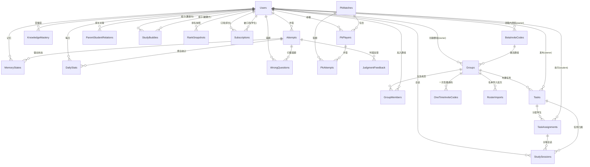

# 学习数据与记忆跟踪设计（D02）

> 本文档设计小书童的**学习数据跟踪体系**：背诵数据、记忆巩固（艾宾浩斯复习）、PK 分数、统计聚合（热力图/连续天数/错题本）、群组社交、排名快照、家长订阅、内测邀请等各类数据的存储结构。
> 关联文档：`docs/D01-统一题库与多学科学习平台设计.md`（框架 V1.2.1）、`docs/1-需求分析/V1/“小书童（背书搭子）”产品需求分析和设计-V3.md`（需求 V3.1.3）、`docs/目录结构与版本管理规则.md`（版本规范）

---

## 一、背景与目标

### 1.1 背景

D01 框架已定义题型判题、记忆状态机、场景引擎的抽象设计。本设计补充其**数据层**——跟踪用户在学习过程中的全部数据轨迹，支撑背记调度、记忆巩固、PK 竞技、统计激励、群组社交、家长报告、内测邀请八类核心功能。

### 1.2 目标

1. **单一数据源**：作答记录（Attempt）为唯一事实源，记忆状态/错题本/统计均由它派生，杜绝数据冗余冲突。
2. **用户标识统一**：所有表通过 `UserId uuid` 外键关联 `Users` 表（§4.0，微信 OpenId → 内部 uuid）。
3. **状态机可复现**：每次作答记录 `PreState/PostState`，状态迁移可审计、可回溯。
4. **场景隔离**：背记/检验/PK 三类场景的数据可分离统计，互不污染。
5. **可扩展**：表结构对齐 D01 题型族（R1-R4/O1-O5/X1-X3），新增题型不改表结构。

---

## 二、设计原则

| # | 原则 | 说明 |
|---|------|------|
| 1 | **UUID 主键** | 全部表主键 `uuid DEFAULT gen_random_uuid()`（PostgreSQL 13+ 内置），业务 ID（QuestionId 等）用 varchar 业务键 |
| 2 | **UserId 外键引用** | `UserId uuid NOT NULL REFERENCES Users(Id)`——Users 表见 §4.0（微信 OpenId 一对一映射内部 uuid） |
| 3 | **事实源单一** | `Attempts` 是唯一写入入口；`MemoryStates`/`DailyStats`/`WrongQuestions` 由 Attempts 派生（应用层事务内同步） |
| 4 | **时间戳统一** | 一律 `timestamptz`，默认 `now()`；业务日期统计用 `date`（UTC+8） |
| 5 | **软删除 + superseded** | 题目改版用 `SupersededBy`，作答历史不删不改 |
| 6 | **隐私对齐 V3** | 数据归用户所有，可导出、可注销删除（30 天内全清）；PK 数据脱敏；名单手机号最小化（导入即脱敏，仅存后四位） |
| 7 | **命名规范（.NET 对齐）** | 表名/列名/索引一律**大写驼峰 PascalCase**（如 `Groups.OwnerId`、`IX_Groups_OwnerId_Status`），与 EF Core Entity 类名一致；Entity/DTO 类名同源大写驼峰；API endpoint 路径与 JSON 序列化由 ASP.NET Core 框架自动转为小写/小写驼峰（camelCase）以兼容 H5/TS 前端——**文档只写 PascalCase，不写蛇形命名** |
| 8 | **同步派生（写时更新）** | 热数据（DailyStats/WrongQuestions/TaskAssignments.Progress）在 Attempts 写入事务内同步更新；冷聚合（KnowledgeMastery/RankSnapshots）由 Hangfire 批量计算 |
| 9 | **群组化（V1.4 对齐）** | 产品以**群组**为组织单位（淡化"班"），群主（原老师/班主任）为群组 Owner；`Groups`/`GroupMembers` 承接原 `Classes`/`ClassMembers` 职责 |

---

## 三、数据模型总览（ER 图）



> `Users` 为外部用户体系，本设计 §4.0 仅定义其**扩展所需最小字段**（微信 OpenId 映射 + 角色 + 手机号脱敏），其余用户属性（头像/资料）由外部用户体系承载。

---

## 四、核心表设计（DDL）

> 以下为 PostgreSQL DDL 设计。表名/列名大写驼峰（.NET 规范）。

### 4.0 Users（用户最小扩展表）—— 微信 ID 与角色

```sql
CREATE TABLE Users (
    Id           uuid PRIMARY KEY DEFAULT gen_random_uuid(),
    OpenId       varchar(64) UNIQUE NOT NULL,   -- 微信 OpenId（微信 ID），激活即绑定
    Nickname     varchar(64),
    AvatarUrl    varchar(256),
    Role         varchar(16) NOT NULL,          -- owner(群主) / student / parent
    Phone        varchar(16),                   -- 脱敏存储（138****1234）；内测期 NULL，后续补绑定
    CreatedAt    timestamptz NOT NULL DEFAULT now()
);

CREATE INDEX IX_Users_OpenId ON Users(OpenId);
CREATE INDEX IX_Users_Role    ON Users(Role);
```

> **内测期绑定策略**（对齐 PRD 决策）：成员激活时**仅绑定 OpenId（微信 ID）**写入 Users；手机号仅在一次性邀请码名单中作定向标识（见 §4.17），**账户级手机号绑定推迟到内测后**（届时启用 bind-phone 流程，Phone 落库）。
> 其余用户属性（头像/性别/出生日期等）属外部用户体系，本表仅承载权限与绑定所需最小字段。

### 4.1 Attempts（作答记录）—— 唯一事实源

```sql
CREATE TABLE Attempts (
    Id             uuid PRIMARY KEY DEFAULT gen_random_uuid(),
    UserId         uuid NOT NULL REFERENCES Users(Id),   -- 用户外键
    SessionId      uuid REFERENCES StudySessions(Id),   -- 学习会话归属
    QuestionId     varchar(64) NOT NULL,                 -- 题目业务键（Q-ch-7a-0001）
    BankId         varchar(64) NOT NULL,                 -- 题库业务键
    Scenario       varchar(16) NOT NULL,                 -- memorize/assess/play_pk/play_daily
    QType          varchar(8)  NOT NULL,                 -- R1/R2/R3a/R3b/O1...（D01 题型键）
    PreState       smallint    NOT NULL,                 -- 0=✕ 1=△ 2=○ 3=★
    PostState      smallint    NOT NULL,
    Result         varchar(8)  NOT NULL,                 -- correct/partial/wrong
    Confidence     real,
    HintLevel      varchar(8)  NOT NULL DEFAULT 'none',  -- none/partial/full
    TimeCostMs     integer,
    AnsweredAt     timestamptz NOT NULL DEFAULT now()
);

CREATE INDEX IX_Attempts_UserId_AnsweredAt ON Attempts(UserId, AnsweredAt DESC);
CREATE INDEX IX_Attempts_UserId_QuestionId ON Attempts(UserId, QuestionId);
CREATE INDEX IX_Attempts_UserId_Result     ON Attempts(UserId, Result);
CREATE INDEX IX_Attempts_SessionId         ON Attempts(SessionId);
-- 分区建议：按月分区（AnsweredAt），历史 >2 年归档冷表
```

**字段说明**：
- `Scenario`：来源场景（背记/检验/PK/每日），支撑场景隔离统计
- `PreState/PostState`：状态迁移审计（D01 10.2 迁移矩阵落库）
- `HintLevel`：none/partial/full，与 V3 记忆状态机信号对齐（S1/S2/S3 为提示难度档位，作为 hint 请求参数，不入此表）

### 4.2 MemoryStates（记忆状态）—— 状态机运行表

```sql
CREATE TABLE MemoryStates (
    Id                  uuid PRIMARY KEY DEFAULT gen_random_uuid(),
    UserId              uuid NOT NULL REFERENCES Users(Id),
    QuestionId          varchar(64) NOT NULL,
    BankId              varchar(64) NOT NULL,
    State               smallint NOT NULL,               -- ✕△○★
    ConsecutiveCorrect  int     NOT NULL DEFAULT 0,      -- 连续独立答对（2次→★）
    HistoryAccuracy     real    NOT NULL DEFAULT 0,      -- 近20次正确率（间隔系数）
    EaseFactor          real    NOT NULL DEFAULT 2.5,    -- 预留（Phase2 SM-2）
    NextReviewAt        timestamptz NOT NULL,            -- 下次复习（驱动队列）
    LastAttemptId       uuid REFERENCES Attempts(Id),    -- 最近一次作答
    LastHintLevel       varchar(8) DEFAULT 'none',
    UpdatedAt           timestamptz NOT NULL DEFAULT now(),
    UNIQUE(UserId, QuestionId)                          -- 一人一题一行
);

CREATE INDEX IX_MemoryStates_UserId_NextReviewAt ON MemoryStates(UserId, NextReviewAt);
CREATE INDEX IX_MemoryStates_UserId_State       ON MemoryStates(UserId, State);
```

**复习间隔序列（权威定义，对齐 D01 §10.1 调度）**：

| 阶段 | 状态迁移 | 基础间隔 | 条件 |
|------|---------|---------|------|
| 首次 | ✕→△ | **30 min** | 首次作答后 30 分钟 |
| 第 2 次 | △→△ | **12 h** | 30 min 后正确 |
| 第 3 次 | △→○ | **1 d** | 12 h 后正确 |
| 第 4 次 | ○→○ | **3 d** | 1 d 后正确 |
| 第 5 次 | ○→○ | **7 d** | 3 d 后正确 |
| 第 6 次 | ○→★ | **30 d** | 7 d 后正确（连续 2 次独立答对） |

> 基础间隔 × 历史正确率系数（0.5~1.5，`HistoryAccuracy` 计算）：正确率高 → 间隔放大（更快进阶），正确率低 → 间隔收缩（更密集复习）。`★` 停留后间隔继续递增（按状态调度的最长间隔），同时支持 `EaseFactor` 预留 Phase 2 SM-2 动态间隔。

**复习队列**（视图，无需单独表）：

```sql
CREATE VIEW ReviewQueue AS
SELECT UserId, QuestionId, State, NextReviewAt
FROM MemoryStates
WHERE NextReviewAt <= now() AND State < 3;  -- ★ 熟练不强制复习
```

### 4.3 StudySessions（学习会话）—— 单次学习批次

```sql
CREATE TABLE StudySessions (
    Id             uuid PRIMARY KEY DEFAULT gen_random_uuid(),
    UserId         uuid NOT NULL REFERENCES Users(Id),
    Scenario       varchar(16) NOT NULL,             -- memorize/assess/play（play 细分 play_pk/play_daily，对齐 D01 Scenario 枚举）
    BankId         varchar(64),
    SessionType    varchar(16) NOT NULL,   -- 分阶/自由/组卷/关卡/PK
    QuestionCount  int NOT NULL DEFAULT 0,
    CorrectCount   int NOT NULL DEFAULT 0,
    TotalTimeMs    int NOT NULL DEFAULT 0,
    TaskId         uuid REFERENCES Tasks(Id),        -- 群组任务归属（个人背诵为 NULL）
    StartedAt      timestamptz NOT NULL DEFAULT now(),
    EndedAt        timestamptz
);

CREATE INDEX IX_StudySessions_UserId_StartedAt ON StudySessions(UserId, StartedAt DESC);
CREATE INDEX IX_StudySessions_TaskId           ON StudySessions(TaskId) WHERE TaskId IS NOT NULL;
```

> 会话表记录"一次进入学习到退出"的批次（对应 V3 答题 Session 定义），Attempts 通过 `SessionId` 归属；`TaskId` 关联群组任务（个人自愿背书为 NULL）。

### 4.4 DailyStats（每日统计）—— 热力图/连续天数数据源

```sql
CREATE TABLE DailyStats (
    Id             uuid PRIMARY KEY DEFAULT gen_random_uuid(),
    UserId         uuid NOT NULL REFERENCES Users(Id),
    StatDate       date NOT NULL,                        -- UTC+8 业务日期
    LearnedCount   int NOT NULL DEFAULT 0,               -- 学习题数
    StarredCount   int NOT NULL DEFAULT 0,               -- 点亮★数（热力图）
    ReviewCount    int NOT NULL DEFAULT 0,
    Accuracy       real,
    StudySeconds   int NOT NULL DEFAULT 0,
    UNIQUE(UserId, StatDate)
);

CREATE INDEX IX_DailyStats_UserId_StatDate ON DailyStats(UserId, StatDate DESC);
```

**连续天数（streak）计算**：由 `DailyStats` 的 `StatDate` 连续性 SQL 派生（当日/昨日有记录即延续），不单独建表。

### 4.5 KnowledgeMastery（知识点掌握度）—— 聚合视图落库

```sql
CREATE TABLE KnowledgeMastery (
    Id               uuid PRIMARY KEY DEFAULT gen_random_uuid(),
    UserId           uuid NOT NULL REFERENCES Users(Id),
    Subject          varchar(16) NOT NULL,
    KnowledgePoint   varchar(64) NOT NULL,
    State            smallint NOT NULL,                 -- 聚合状态（取题目中位/最差）
    Accuracy         real NOT NULL DEFAULT 0,
    AttemptCount     int NOT NULL DEFAULT 0,
    LastReviewedAt   timestamptz,
    UNIQUE(UserId, Subject, KnowledgePoint)
);

CREATE INDEX IX_KnowledgeMastery_UserId_Subject ON KnowledgeMastery(UserId, Subject);
```

> 由 Attempts + Questions.KnowledgePoints 聚合生成（Hangfire 批量或家长报告按需触发），支撑"薄弱知识点"报表与 PK 点评输入。

### 4.6 WrongQuestions（错题本）—— 物化派生表

```sql
CREATE TABLE WrongQuestions (
    Id             uuid PRIMARY KEY DEFAULT gen_random_uuid(),
    UserId         uuid NOT NULL REFERENCES Users(Id),
    QuestionId     varchar(64) NOT NULL,
    BankId         varchar(64) NOT NULL,
    Subject        varchar(16) NOT NULL,                 -- 冗余学科字段（跨学科错题查询无需 join Banks）
    WrongCount     int NOT NULL DEFAULT 1,
    LastWrongAt    timestamptz NOT NULL DEFAULT now(),
    Mastered       boolean NOT NULL DEFAULT false,      -- 连续2次答对 → true
    UNIQUE(UserId, QuestionId)
);

CREATE INDEX IX_WrongQuestions_UserId_Mastered_LastWrongAt ON WrongQuestions(UserId, Mastered, LastWrongAt DESC);
CREATE INDEX IX_WrongQuestions_UserId_Subject               ON WrongQuestions(UserId, Subject);
```

> 由 Attempts（Result=wrong/partial）归集；`Mastered` 在连续 2 次 correct 后置 true（保留记录供复习回看）。

---

## 四·补、群组与任务数据（V1 战略新增，V1.4 群组化）

> 对齐《产品战略与定位 V1》§五"群组任务"场景（原"班级任务"，V1.4 淡化"班"）与 §三"三方价值模型"。
> 核心场景：群主（原老师/班主任）建群组 → 布置背书任务 → 成员执行 → 群主看板看执行率 / 家长看报告。
> 与个人背书场景数据**隔离但共享** MemoryStates / Attempts 底座——个人背和任务背都驱动状态机迁移（full 耦合），但任务多一层"归属"维度。

### 4.7 Groups（群组表）—— 群主管理群组（原 Classes）

```sql
CREATE TABLE Groups (
    Id           uuid PRIMARY KEY DEFAULT gen_random_uuid(),
    OwnerId      uuid NOT NULL REFERENCES Users(Id),   -- 群主（原老师/班主任）
    Name         varchar(64) NOT NULL,                 -- 群组名称（如"七(3)班"）
    Subject      varchar(16) NOT NULL,                 -- 学科（history/geography/biology/daodeyufazhi）
    Grade        varchar(16),                           -- 年级（七年级/八年级/九年级）
    Status       varchar(16) NOT NULL DEFAULT 'active',-- active/archived
    RankEnabled  boolean NOT NULL DEFAULT true,        -- 群组战绩榜开关（false → 该群战绩榜入口隐藏）
    BetaCodeId   uuid REFERENCES BetaInviteCodes(Id), -- 激活本群所用的内测邀请码（V1.4）
    CreatedAt    timestamptz NOT NULL DEFAULT now(),
    UpdatedAt    timestamptz NOT NULL DEFAULT now()
);

CREATE INDEX IX_Groups_OwnerId_Status ON Groups(OwnerId, Status);
CREATE INDEX IX_Groups_BetaCodeId     ON Groups(BetaCodeId);
```

> **群组化（V1.4）**：原 `Classes.InviteCode`（8 位共享码）**移除**——内测期成员加入改为"一次性邀请码"（§4.17 OneTimeInviteCodes，码↔名单手机号绑定，一对一）。
> 群主可创建多个群组（不同学科/年级）。内测期间群主须凭平台发放的**内测邀请码**（§4.16 BetaInviteCodes）激活建群资格。

### 4.8 GroupMembers（群组成员）—— 学生/家长加入群组（原 ClassMembers）

```sql
CREATE TABLE GroupMembers (
    Id         uuid PRIMARY KEY DEFAULT gen_random_uuid(),
    GroupId    uuid NOT NULL REFERENCES Groups(Id),
    UserId     uuid NOT NULL REFERENCES Users(Id),
    Role       varchar(16) NOT NULL,                  -- student / parent
    Nickname   varchar(32),                            -- 群内昵称（学生号/姓名）
    InviteCodeId uuid REFERENCES OneTimeInviteCodes(Id), -- 加入所用一次性邀请码（V1.4）
    JoinedAt   timestamptz NOT NULL DEFAULT now(),
    UNIQUE(GroupId, UserId, Role)
);

CREATE INDEX IX_GroupMembers_GroupId        ON GroupMembers(GroupId);
CREATE INDEX IX_GroupMembers_UserId         ON GroupMembers(UserId);
CREATE INDEX IX_GroupMembers_GroupId_Role   ON GroupMembers(GroupId, Role);
CREATE INDEX IX_GroupMembers_InviteCodeId   ON GroupMembers(InviteCodeId);
```

> 一个群组含 1 名群主（OwnerId 从 Groups 继承）+ N 名学生 + N 名家长。
> 家长通过 `ParentStudentRelations` 关联到自己孩子，通过 `GroupMembers` 获得看报告权限。
> **V1.4**：`InviteCodeId` 记录成员经哪张一次性邀请码加入（可溯源名单）；待加入状态由 OneTimeInviteCodes.Status 承载（不再用成员行状态）。

### 4.9 ParentStudentRelations（家长-学生关联）—— 家长看孩子报告

```sql
CREATE TABLE ParentStudentRelations (
    Id          uuid PRIMARY KEY DEFAULT gen_random_uuid(),
    ParentId    uuid NOT NULL REFERENCES Users(Id),
    StudentId   uuid NOT NULL REFERENCES Users(Id),
    Relation    varchar(16) DEFAULT 'parent',         -- parent / guardian / grandparent
    CreatedAt   timestamptz NOT NULL DEFAULT now(),
    UNIQUE(ParentId, StudentId)
);

CREATE INDEX IX_ParentStudentRelations_ParentId  ON ParentStudentRelations(ParentId);
CREATE INDEX IX_ParentStudentRelations_StudentId ON ParentStudentRelations(StudentId);
```

> 一个家长可关联多个孩子（二胎家庭），一个孩子可被多位家长关联（父+母+祖辈）。
> 家长端报告 API 按 `ParentId → StudentId → MemoryStates/DailyStats/KnowledgeMastery` 链式查询。

### 4.10 Tasks（任务主表）—— 群主布置的背书任务

```sql
CREATE TABLE Tasks (
    Id              uuid PRIMARY KEY DEFAULT gen_random_uuid(),
    OwnerId         uuid NOT NULL REFERENCES Users(Id),  -- 群主（发布者）
    GroupId         uuid NOT NULL REFERENCES Groups(Id),
    BankId          varchar(64),                       -- 关联题库（官方/PGC/自定义）
    Title           varchar(128) NOT NULL,            -- 任务标题
    Description     text,                               -- 任务说明
    QuestionIds     jsonb,                              -- 包含的题目 ID 列表（["Q-his-...","Q-geo-..."]）
    QuestionCount   int NOT NULL DEFAULT 0,
    Scenario        varchar(16) NOT NULL DEFAULT 'memorize', -- memorize/assess（D01 场景耦合）
    SessionType     varchar(16) NOT NULL DEFAULT '分阶',    -- 分阶/自由/组卷
    StartedAt       timestamptz NOT NULL DEFAULT now(),     -- 任务开始时间
    DeadlineAt      timestamptz,                             -- 截止时间（NULL=无截止）
    Status          varchar(16) NOT NULL DEFAULT 'active',  -- draft/active/closed
    CreatedAt       timestamptz NOT NULL DEFAULT now(),
    UpdatedAt       timestamptz NOT NULL DEFAULT now()
);

CREATE INDEX IX_Tasks_OwnerId_Status ON Tasks(OwnerId, Status);
CREATE INDEX IX_Tasks_GroupId_Status ON Tasks(GroupId, Status);
CREATE INDEX IX_Tasks_DeadlineAt     ON Tasks(DeadlineAt) WHERE Status = 'active';
```

> `QuestionIds` 为 jsonb 数组——群主从题库选题或系统按知识点自动选。
> `Scenario` 对齐 D01 场景-状态机耦合：memorize=full 迁移、assess=feedback_only。

### 4.11 TaskAssignments（任务分配与执行）—— 每个成员的任务状态

```sql
CREATE TABLE TaskAssignments (
    Id            uuid PRIMARY KEY DEFAULT gen_random_uuid(),
    TaskId        uuid NOT NULL REFERENCES Tasks(Id),
    UserId        uuid NOT NULL REFERENCES Users(Id),  -- 学生
    Status        varchar(16) NOT NULL DEFAULT 'pending', -- pending/in_progress/completed/overdue
    Progress      int NOT NULL DEFAULT 0,               -- 完成度 0-100（已完成题数/总题数）
    SessionId     uuid REFERENCES StudySessions(Id),   -- 关联学习会话（成员执行任务时创建）
    AssignedAt    timestamptz NOT NULL DEFAULT now(),
    StartedAt     timestamptz,                           -- 首次开始时间
    CompletedAt   timestamptz,                           -- 全部完成时间
    UNIQUE(TaskId, UserId)
);

CREATE INDEX IX_TaskAssignments_TaskId_Status ON TaskAssignments(TaskId, Status);
CREATE INDEX IX_TaskAssignments_UserId_Status ON TaskAssignments(UserId, Status);
CREATE INDEX IX_TaskAssignments_Status        ON TaskAssignments(Status) WHERE Status IN ('pending', 'in_progress');
```

> 每个任务对每个成员产生一条 assignment——群主看板的核心数据源。
> `Progress` 由 Attempts 完成数 / Tasks.QuestionCount 实时更新。
> `SessionId` 关联 StudySessions——成员执行任务时创建会话，Attempts 通过 SessionId 归属。

---

## 四·补2、V3.1 新增实体（搭子社交 / 排名快照 / 家长订阅 / 判错反馈）

> 对齐《小书童 PRD V3.1》§四（三）新增实体。命名规范同 V1.4（大写驼峰）。

### 4.12 StudyBuddies（学习搭子）—— 双向同意制

```sql
CREATE TABLE StudyBuddies (
    Id           uuid PRIMARY KEY DEFAULT gen_random_uuid(),
    InviterId    uuid NOT NULL REFERENCES Users(Id),
    InviteeId    uuid NOT NULL REFERENCES Users(Id),
    Status       varchar(16) NOT NULL,      -- pending/accepted/rejected/removed/expired
    InvitedAt    timestamptz NOT NULL DEFAULT now(),
    AcceptedAt   timestamptz,
    ExpiresAt    timestamptz NOT NULL       -- 邀请 7 天未响应 → expired
);

CREATE INDEX IX_StudyBuddies_Inviter ON StudyBuddies(InviterId, Status);
CREATE INDEX IX_StudyBuddies_Invitee ON StudyBuddies(InviteeId, Status);
```

> **关系规则**（对齐 V3.1 决策 #7）：
> - 双向同意：Inviter 发起 → Invitee 同意（accepted）/ 拒绝（rejected）；7 天未响应 → expired（Hangfire 定时清理）；任一方可解除 → removed（历史 PK/答题保留）
> - accepted 双向 ≤5：应用层事务（`SELECT COUNT(*) ... FOR UPDATE` 校验）+ 可选 DB trigger 兜底（数量约束无法用 UNIQUE 表达）
> - 查询某用户全部搭子：`WHERE InviterId = U OR InviteeId = U AND Status = 'accepted'`（UNION 语义）
> - 仅 accepted 可发起 PK 与互看排名
> - 未成年人保护：邀请限定同群组/同年级（应用层校验 GroupMembers 交集）；单日发出邀请 ≤10 次（Redis 计数器 `buddy_invite_quota:{UserId}:{date}`，不落表）

### 4.13 RankSnapshots（排名快照）—— 排行榜趋势数据源

```sql
CREATE TABLE RankSnapshots (
    Id             uuid PRIMARY KEY DEFAULT gen_random_uuid(),
    UserId         uuid NOT NULL REFERENCES Users(Id),
    ScopeType      varchar(8) NOT NULL,    -- group/grade
    ScopeId        uuid,                   -- group_id（群组）；grade 时可为 NULL（平台同年级）
    Subject        varchar(16) NOT NULL DEFAULT 'all', -- 学科筛选维度
    MetricType     varchar(16) NOT NULL,   -- streak/stars/volume/pk_wins/accuracy/mastery
    MetricValue    numeric NOT NULL,       -- 冻结的指标原始值
    Rank           int NOT NULL,           -- 冻结的排名（不回溯）
    SnapshotDate   date NOT NULL
);

CREATE INDEX IX_RankSnapshots_Query ON RankSnapshots(UserId, ScopeType, ScopeId, Subject, SnapshotDate DESC);
CREATE INDEX IX_RankSnapshots_Date  ON RankSnapshots(SnapshotDate);
```

> **写入策略**：**不实时写**——Hangfire 每日 0:00(UTC+8) 批量计算并**冻结**快照（rank 为当日终态，不随后续数据回溯漂移）。趋势箭头 = 今日快照 vs 昨日快照对比（↑绿/↓红/→灰）。
> **指标口径**：战力榜 = streak + volume + pk_wins；战绩榜 = accuracy + mastery（战绩榜展示受 `Groups.RankEnabled` 开关控制）。
> **来源**：MetricValue 由 DailyStats / PkPlayerStats 视图 / KnowledgeMastery 聚合得出；Rank 由同 Scope+Subject+MetricType 内排序得出。

### 4.14 Subscriptions（家长订阅）—— 付费报告

```sql
CREATE TABLE Subscriptions (
    Id             uuid PRIMARY KEY DEFAULT gen_random_uuid(),
    ParentId       uuid NOT NULL REFERENCES Users(Id),
    StudentId      uuid NOT NULL REFERENCES Users(Id),
    Plan           varchar(8) NOT NULL,    -- month/year
    Status         varchar(16) NOT NULL,   -- trialing/active/expired/cancelled
    TrialEndAt     timestamptz,            -- 试用期 7 天
    PeriodEndAt    timestamptz,            -- 当前计费周期结束
    UNIQUE(ParentId, StudentId)
);

CREATE INDEX IX_Subscriptions_ParentId_Status ON Subscriptions(ParentId, Status);
CREATE INDEX IX_Subscriptions_StudentId       ON Subscriptions(StudentId);
```

> **规则**（对齐 V3.1 决策 #8）：试用与计费均按 **(Parent, Student) 对独立**（多孩子独立计费）；`StudentId` 必须在 `ParentStudentRelations` 有授权记录（应用层校验，防越权订阅/查看）；到期锁定报告区置灰。

### 4.15 JudgmentFeedback（判错纠错队列）—— 判题质量

```sql
CREATE TABLE JudgmentFeedback (
    Id             uuid PRIMARY KEY DEFAULT gen_random_uuid(),
    AttemptId      uuid NOT NULL REFERENCES Attempts(Id),
    UserId         uuid NOT NULL REFERENCES Users(Id),
    FeedbackType   varchar(16) NOT NULL,   -- wrong_judgment / other
    Status         varchar(16) NOT NULL DEFAULT 'pending', -- pending/reviewed/resolved
    ReviewedBy     uuid,                   -- 复核人
    ReviewedAt     timestamptz
);

CREATE INDEX IX_JudgmentFeedback_AttemptId ON JudgmentFeedback(AttemptId);
CREATE INDEX IX_JudgmentFeedback_Status    ON JudgmentFeedback(Status, ReviewedAt);
```

> 对齐 PRD §2.1"判错了"反馈：用户一键反馈 → 人工复核队列 → 计入判题质量统计。

---

## 四·补3、内测邀请机制（V3.1.3 新增）

> 对齐《小书童 PRD V3.1.3》内测邀请机制。核心链路：**平台发放内测邀请码 → 群主激活建群 → 导入名单（Agent 整理）→ 生成一次性邀请码 → 导出 CSV 分发 → 成员凭码 + 微信登录激活（绑微信 ID，手机号补绑留后续）**。

### 4.16 BetaInviteCodes（内测邀请码）—— 平台发放给群主

```sql
CREATE TABLE BetaInviteCodes (
    Id             uuid PRIMARY KEY DEFAULT gen_random_uuid(),
    Code           varchar(16) UNIQUE NOT NULL,  -- 内测邀请码（平台生成）
    Status         varchar(16) NOT NULL DEFAULT 'pending', -- pending/used/expired
    IssuedToUserId uuid REFERENCES Users(Id),    -- 发放对象（群主，可为 NULL=未指定）
    IssuedAt       timestamptz,
    ExpiresAt      timestamptz NOT NULL,         -- 内测期码有效期
    UsedAt         timestamptz,                  -- 群主激活建群时间
    UsedByGroupId  uuid REFERENCES Groups(Id)    -- 激活的群组
);

CREATE INDEX IX_BetaInviteCodes_Code   ON BetaInviteCodes(Code);
CREATE INDEX IX_BetaInviteCodes_Status ON BetaInviteCodes(Status);
```

> **来源**：平台后台（平台设置/管理端）批量生成并发放给群主——**群主的邀请码来自平台设置**，用户端无生成入口。
> **使用**：群主登录（微信，OpenId 绑定 Users）→ 凭内测邀请码创建/激活群组 → 码标记 used，`IssuedToUserId`/`UsedByGroupId` 落库；一个内测码只能激活一个群组。

### 4.17 OneTimeInviteCodes（一次性邀请码）—— 群主按名单生成给成员

```sql
CREATE TABLE OneTimeInviteCodes (
    Id            uuid PRIMARY KEY DEFAULT gen_random_uuid(),
    GroupId       uuid NOT NULL REFERENCES Groups(Id),
    Code          varchar(8) UNIQUE NOT NULL,    -- 一次性邀请码（8 位）
    PhoneLast4    varchar(4) NOT NULL,           -- 名单手机号后四位（脱敏定向标识）
    Status        varchar(16) NOT NULL DEFAULT 'unused', -- unused/used/expired
    GeneratedBy   uuid NOT NULL REFERENCES Users(Id),    -- 群主
    RosterImportId uuid REFERENCES RosterImports(Id),    -- 来源名单批次
    GeneratedAt   timestamptz NOT NULL DEFAULT now(),
    ExpiresAt     timestamptz,                   -- 可空：内测期默认 30 天
    UsedAt        timestamptz,
    BoundUserId   uuid REFERENCES Users(Id)      -- 激活绑定（成员微信 OpenId → UserId）
);

CREATE INDEX IX_OneTimeInviteCodes_GroupId  ON OneTimeInviteCodes(GroupId, Status);
CREATE INDEX IX_OneTimeInviteCodes_Code     ON OneTimeInviteCodes(Code);
CREATE INDEX IX_OneTimeInviteCodes_ImportId ON OneTimeInviteCodes(RosterImportId);
```

> **规则**：
> - 生成：群主在名单批次（RosterImports）上触发批量生成，**每人一个码**，码↔手机号后四位绑定（同一名单内唯一）
> - 一次性：激活成功后 Status=used，不可复用；过期（ExpiresAt）→ expired
> - 激活：成员输入码 + 微信登录 → 服务端校验码未用/未过期 → 校验成员输入的手机号后四位与 `PhoneLast4` 一致（名单定向强校验）→ 绑定微信 ID（`BoundUserId`，即 Users.OpenId 映射）→ 写入 GroupMembers（`InviteCodeId` 溯源）→ 码 used
> - **手机号边界**：激活时手机号仅作名单定向校验；**账户级手机号补绑定留后续**（内测后走 bind-phone，Users.Phone 落库）

### 4.18 RosterImports（名单导入批次）—— Agent 整理记录

```sql
CREATE TABLE RosterImports (
    Id               uuid PRIMARY KEY DEFAULT gen_random_uuid(),
    GroupId          uuid NOT NULL REFERENCES Groups(Id),
    OwnerId          uuid NOT NULL REFERENCES Users(Id),  -- 群主
    ImportMethod     varchar(8) NOT NULL,    -- paste(批量粘贴) / file(文件导入)
    SourceCount      int NOT NULL DEFAULT 0, -- 原始行数
    CleanedCount     int NOT NULL DEFAULT 0, -- Agent 整理后有效数（去重/格式校验）
    DuplicateCount   int NOT NULL DEFAULT 0, -- 去重剔除数
    InvalidCount     int NOT NULL DEFAULT 0, -- 非法手机号剔除数
    Status           varchar(16) NOT NULL DEFAULT 'processing', -- processing/ready/exported/failed
    CsvFileUrl       varchar(256),           -- 导出的 CSV（OSS）
    CsvExpiresAt     timestamptz,            -- CSV 有效期（建议 7 天）
    CreatedAt        timestamptz NOT NULL DEFAULT now(),
    CompletedAt      timestamptz
);

CREATE INDEX IX_RosterImports_GroupId ON RosterImports(GroupId, Status);
```

> **Agent 整理**：导入/批量粘贴的原始名单（手机号）经 Agent 清洗——去重、手机号格式校验、非法剔除，产出 `CleanedCount/DuplicateCount/InvalidCount` 统计，预览确认后生成一次性邀请码。
> **CSV 导出**：仅含**手机号后四位 + 一次性邀请码**（不含 openid/完整手机号/学习数据），存 OSS（`CsvFileUrl`），建议 7 天过期（对齐 D03 §14 审计与 D04 OSS 生命周期）。

---

## 五、PK 竞技数据（PK 分数跟踪）

### 5.1 PkMatches（比赛主表）

```sql
CREATE TABLE PkMatches (
    Id                 uuid PRIMARY KEY DEFAULT gen_random_uuid(),
    Subject            varchar(16) NOT NULL,
    BankId             varchar(64) NOT NULL,
    Topic              varchar(64),
    QuestionCount      int NOT NULL DEFAULT 10,          -- 5/10/20
    PerQuestionTimeS   int NOT NULL DEFAULT 30,
    TotalTimeLimitS    int NOT NULL DEFAULT 300,
    Mode               varchar(8) NOT NULL DEFAULT 'sync',  -- sync/async（D01 8.4.1 双模式）
    Status             varchar(16) NOT NULL DEFAULT 'pending', -- pending/ongoing/finished/cancelled
    WinnerId           uuid,                             -- NULL=平局
    InviteCode         varchar(4),                       -- 搭子间 4 位对战码
    FinishReason       varchar(16),                      -- score/forfeit/timeout
    CreatedAt          timestamptz NOT NULL DEFAULT now(),
    FinishedAt         timestamptz
);

CREATE INDEX IX_PkMatches_Status_CreatedAt ON PkMatches(Status, CreatedAt DESC);
CREATE INDEX IX_PkMatches_WinnerId         ON PkMatches(WinnerId);
CREATE INDEX IX_PkMatches_InviteCode       ON PkMatches(InviteCode);
```

### 5.2 PkPlayers（参赛者成绩）

```sql
CREATE TABLE PkPlayers (
    Id             uuid PRIMARY KEY DEFAULT gen_random_uuid(),
    MatchId        uuid NOT NULL REFERENCES PkMatches(Id),
    UserId         uuid NOT NULL REFERENCES Users(Id),
    Score          int NOT NULL DEFAULT 0,              -- 总分（每题+10）
    CorrectCount   int NOT NULL DEFAULT 0,
    TotalTimeMs    int NOT NULL DEFAULT 0,              -- 同分比用时
    AiComment      text,                                -- AI 趣味点评（D01 8.4.2）
    UNIQUE(MatchId, UserId)
);

CREATE INDEX IX_PkPlayers_UserId_MatchId ON PkPlayers(UserId, MatchId DESC);
```

### 5.3 PkAttempts（PK 答题明细）

```sql
CREATE TABLE PkAttempts (
    Id          uuid PRIMARY KEY DEFAULT gen_random_uuid(),
    MatchId     uuid NOT NULL REFERENCES PkMatches(Id),
    PlayerId    uuid NOT NULL REFERENCES PkPlayers(Id),
    UserId      uuid NOT NULL REFERENCES Users(Id),
    QuestionId  varchar(64) NOT NULL,
    Answer      text,
    Result      varchar(8),
    IsCorrect   boolean,
    TimeCostMs  int
);

CREATE INDEX IX_PkAttempts_MatchId ON PkAttempts(MatchId);
```

### 5.4 PK 分数统计（聚合视图）

```sql
-- 玩家历史战绩：胜/负/平、累计得分、平均用时
CREATE VIEW PkPlayerStats AS
SELECT
    p.UserId,
    COUNT(DISTINCT p.MatchId) AS TotalMatches,
    COUNT(DISTINCT CASE WHEN m.WinnerId = p.UserId THEN p.MatchId END) AS Wins,
    COUNT(DISTINCT CASE WHEN m.WinnerId IS NULL THEN p.MatchId END) AS Draws,
    SUM(p.Score) AS TotalScore,
    AVG(p.TotalTimeMs) AS AvgTimeMs
FROM PkPlayers p
JOIN PkMatches m ON m.Id = p.MatchId
WHERE m.Status = 'finished'
GROUP BY p.UserId;
```

> PK 答题不入 Attempts / 不动 MemoryStates（场景隔离，state_coupling=isolated）；PK 胜场经本视图聚合计入战力榜排名指标。

---

## 六、数据流（场景 → 落库）

```
背记场景:
  用户作答 → Attempts 写入（Pre/PostState 由状态机算出）
         → MemoryStates upsert（状态/间隔/ConsecutiveCorrect）
         → DailyStats 聚合（LearnedCount/StarredCount）
         → (若 wrong) WrongQuestions upsert

检验场景:
  组卷作答 → Attempts 写入（Scenario=assess, 不升级状态机）
         → 结果报告（正确率/薄弱点 ← KnowledgeMastery）
         → 答错题目降级 MemoryStates（feedback_only）

PK 场景:
  双方作答 → PkAttempts 写入（不入 Attempts）
         → PkPlayers 计分（Score/TotalTimeMs）
         → 胜负判定 → PkMatches 更新 WinnerId + FinishReason
         → AI 点评 → PkPlayers.AiComment
         → 胜场经 PkPlayerStats 视图计入战力榜（RankSnapshots 次日冻结）

群组任务场景:
  群主建群组 → Groups 写入（凭 BetaInviteCodes 激活，OwnerId=群主）
         → 学生/家长经一次性邀请码激活 → GroupMembers 写入
         → 家长关联孩子 → ParentStudentRelations 写入
  群主布置任务 → Tasks 写入（active）
         → 自动为群组每个学生创建 TaskAssignments（pending）
  成员执行任务 → TaskAssignments 更新（in_progress, SessionId 关联）
         → 创建 StudySessions（TaskId 关联）
         → Attempts 写入（Scenario=memorize, 状态机 full 迁移）
         → MemoryStates / DailyStats / WrongQuestions 同步更新
         → TaskAssignments.Progress 更新
         → 全部完成 → TaskAssignments.Status = completed
  群主看板 → 按 GroupId + TaskId 聚合 TaskAssignments
         → 执行率 = completed / total、平均 Progress、逾期数
         → 薄弱知识点 ← KnowledgeMastery 聚合
  家长报告 → 按 ParentId → StudentId → MemoryStates + DailyStats + KnowledgeMastery
         → 成长报告（进度趋势/薄弱点/坚持天数/相对进步）

内测邀请场景（V3.1.3）:
  平台后台 → BetaInviteCodes 批量生成（pending, ExpiresAt）
         → 发放给群主（IssuedToUserId）
  群主激活建群 → 凭内测邀请码创建 Groups → 码 used（UsedByGroupId）
         → OwnerId 绑定群主微信 ID（Users.OpenId）
  名单导入 → RosterImports 写入（paste/file, SourceCount）
         → Agent 整理（去重/校验 → CleanedCount/DuplicateCount/InvalidCount）
         → 确认 → 批量生成 OneTimeInviteCodes（每人一码, PhoneLast4）
         → 导出 CSV（手机号后四位+码）→ OSS（CsvFileUrl, 7 天过期）
  成员激活 → 输入一次性码 + 微信登录 → 校验码未用/未过期 + 手机号后四位匹配
         → 绑定微信 ID（Users.OpenId → UserId）→ OneTimeInviteCodes.BoundUserId
         → GroupMembers 写入（Role=student/parent, InviteCodeId 溯源）→ 码 used

搭子社交场景:
  A 邀请 B → StudyBuddies 写入（pending, ExpiresAt=+7天）
         → B 同意 → Status=accepted（校验 ≤5 + 同群组/同年级 + 单日邀请限额）
         → 发起 PK / 互看排名（读 RankSnapshots 最新快照）

订阅场景:
  家长开通 → 校验 ParentStudentRelations → Subscriptions 写入（trialing, TrialEndAt=+7天）
         → 到期未付费 → Status=expired → 报告区锁定
         → 支付成功 → Status=active, PeriodEndAt 推进

判错反馈:
  用户点"判错了" → JudgmentFeedback 写入（pending）
         → 人工复核 → reviewed/resolved → 计入判题质量统计
```

---

## 七、统计与激励数据

| 激励功能 | 数据来源 | 计算方式 |
|---------|---------|---------|
| 记忆热力图 | `DailyStats.StarredCount` | 按日期聚合当日点亮 ★ 数（GitHub 风格） |
| 连续天数 | `DailyStats.StatDate` | 日期连续性 SQL 派生（断更清零） |
| 离线报告 | `Attempts + MemoryStates` | 当日复习任务（NextReviewAt ≤ 当日）+ 完成情况 |
| 周报/月报 | `DailyStats + KnowledgeMastery` | 时间窗聚合正确率/薄弱知识点 |
| 非分数排名 | `DailyStats` + `PkPlayerStats` | 仅展示坚持天数 + ★ 增长数（V3 非分数原则） |
| **排行榜（战力/战绩榜）** | `RankSnapshots` | 每日冻结快照：战力榜 = streak+volume+pk_wins；战绩榜 = accuracy+mastery（受 Groups.RankEnabled 开关控制）；趋势箭头 = 今日 vs 昨日快照 |
| **搭子互看排名** | `RankSnapshots` | 仅 accepted 搭子可见对方最新快照的排名与数值 |
| **群主执行看板** | `TaskAssignments + KnowledgeMastery` | 按 GroupId+TaskId 聚合执行率/平均进度/逾期数/薄弱知识点 |
| **家长成长报告**（付费） | `MemoryStates + DailyStats + KnowledgeMastery` | 按 ParentId→StudentId 链式聚合进度趋势/薄弱点/坚持天数/相对进步（订阅校验 Subscriptions） |
| PK 战绩 | `PkPlayerStats` 视图 | 胜率/累计分/平均用时 |

---

## 八、索引与性能

| 表 | 核心索引 | 用途 |
|----|---------|------|
| Users | IX_Users_OpenId | 微信登录/激活绑定查询 |
| Attempts | IX_Attempts_UserId_AnsweredAt | 历史查询/错题时间线 |
| MemoryStates | IX_MemoryStates_UserId_NextReviewAt | 复习队列扫描（高频） |
| DailyStats | UNIQUE(UserId, StatDate) | 热力图 upsert |
| PkPlayers | IX_PkPlayers_UserId_MatchId | 个人战绩 |
| WrongQuestions | IX_WrongQuestions_UserId_Mastered_LastWrongAt | 错题列表 |
| Groups | IX_Groups_OwnerId_Status | 群主群组列表 |
| GroupMembers | IX_GroupMembers_GroupId / _UserId | 群组成员查询 |
| StudyBuddies | IX_StudyBuddies_Inviter / IX_StudyBuddies_Invitee | 搭子双向查询 |
| RankSnapshots | IX_RankSnapshots_Query | 排行榜查询（UserId+Scope+Subject+Date） |
| Subscriptions | IX_Subscriptions_ParentId_Status | 家长订阅状态 |
| JudgmentFeedback | IX_JudgmentFeedback_Status | 判错复核队列 |
| BetaInviteCodes | IX_BetaInviteCodes_Code / _Status | 内测码领取/激活校验 |
| OneTimeInviteCodes | IX_OneTimeInviteCodes_GroupId / _Code / _ImportId | 一次性码生成/激活/溯源 |
| RosterImports | IX_RosterImports_GroupId | 名单批次查询 |

**容量预估**（500 日活 × 30 题/日）：Attempts 约 15k 行/日、5.5M 行/年 → 按月分区 + 热数据 Redis 缓存（当前记忆状态、复习队列、当前排名）。内测期一次性码/名单批次量小（群组规模 ≤百级），无需分区。

---

## 九、隐私与合规（V3 对齐 + V1.4 内测补充）

1. **数据所有权**：所有学习数据归用户本人，支持一键导出（JSON）。
2. **注销删除**：账号注销后 30 天内删除全部关联数据（级联删除 Attempts/MemoryStates/DailyStats/Pk*/StudyBuddies/RankSnapshots/Subscriptions/JudgmentFeedback/OneTimeInviteCodes/RosterImports）。
3. **未成年人**：不满 14 周岁用户数据最小化收集（个保法第 28-31 条），PK 数据脱敏展示；搭子邀请限定同群组/同年级 + 单日邀请限额（防陌生人社交）。
4. **名单手机号合规（V1.4 新增）**：
   - 群主导入/批量粘贴名单（手机号）属处理个人信息 → **群主须声明已获得成员同意**（个保法告知同意，D06 合规红线）
   - 手机号**导入即脱敏**：RosterImports 不存完整手机号，仅存统计数；OneTimeInviteCodes 仅存后四位（PhoneLast4）
   - CSV 导出仅含**手机号后四位 + 一次性邀请码**，不含 openid/完整手机号/学习数据；OSS 存 7 天过期
   - 名单导入/CSV 导出进审计日志（D06/D04）
5. **内测期绑定边界**：成员激活仅绑定微信 ID（OpenId）；**手机号不绑定账户**（Users.Phone 留 NULL），账户级手机号绑定内测后启用——避免内测期手机号作为账户标识带来的合规压力。
6. **RLS 行级安全**：`UserId` 列启用 PostgreSQL RLS，防止跨用户数据访问（D01 私域原则）。

```sql
-- RLS 示例（每表启用）
ALTER TABLE Attempts ENABLE ROW LEVEL SECURITY;
CREATE POLICY attempts_owner ON Attempts
    USING (UserId = current_setting('app.current_user_id')::uuid);
```

---

## 十、与 D01/V3 衔接

| 本设计 | D01 实体 | V3.1 表（对齐后命名） | 关系 |
|--------|---------|----------------------|------|
| Users | - | Users | 新增（V1.4：微信 OpenId 最小扩展，含 Role/Phone 脱敏） |
| Attempts | Attempt（补 PreState/PostState） | Attempts | D01 V1.2.1 已补字段，本设计落 DDL |
| MemoryStates | MemoryState（补 3 字段） | MemoryStates | D01 V1.2.1 修复落地 |
| StudySessions | - | StudySessions | 新增（V3 Session 定义的落库） |
| PkMatches/PkPlayers/PkAttempts | 趣味场景引擎 | PkMatches/PkPlayers/PkAttempts | 新增（D01 8.4 的 PK 数据层） |
| WrongQuestions/KnowledgeMastery | - | WrongQuestions/KnowledgeMastery | 新增（统计派生） |
| Groups/GroupMembers/ParentStudentRelations | - | Groups/GroupMembers/ParentStudentRelations | 新增（V1 战略：群组管理+家长关联；V1.4 由 Classes/ClassMembers 更名群组化） |
| Tasks/TaskAssignments | - | Tasks/TaskAssignments | 新增（V1 战略：群主布置背书任务+成员执行） |
| StudyBuddies/RankSnapshots/Subscriptions/JudgmentFeedback | - | 同名 | 新增（V3.1：搭子社交/排名快照/家长订阅/判错反馈） |
| **BetaInviteCodes/OneTimeInviteCodes/RosterImports** | - | 同名 | **新增（V3.1.3：内测邀请机制）** |

**UserId 设计确认**：全部表 `UserId uuid NOT NULL REFERENCES Users(Id)`——Users 表见 §4.0（微信 OpenId 一对一映射内部 uuid）。

---

## 十一、落地路线

| 阶段 | 内容 | 依赖 |
|------|------|------|
| D2-P1 | Users(最小扩展) / Attempts / MemoryStates / StudySessions DDL + 写入事务 | D01 V1.2.1 |
| D2-P1b | Groups / GroupMembers / ParentStudentRelations DDL + 邀请加入流程 | D2-P1 |
| D2-P1c | Tasks / TaskAssignments DDL + StudySessions.TaskId 扩展 + 任务执行写入事务 | D2-P1b |
| D2-P1d | StudyBuddies / RankSnapshots / Subscriptions / JudgmentFeedback DDL + Groups.RankEnabled / PkMatches.InviteCode+FinishReason 扩展 | D2-P1c |
| D2-P1e | **BetaInviteCodes / OneTimeInviteCodes / RosterImports DDL + 内测激活/名单导入/CSV 导出/成员激活事务（V3.1.3）** | D2-P1b |
| D2-P2 | DailyStats + 热力图/连续天数 SQL | D2-P1 |
| D2-P3 | WrongQuestions / KnowledgeMastery 派生 | D2-P1 |
| D2-P3b | 群主执行看板聚合视图 + 家长成长报告聚合视图 | D2-P1c + D2-P3 |
| D2-P3c | RankSnapshots 每日冻结批处理（Hangfire）+ 排行榜/趋势 API 数据源 | D2-P1d + D2-P3 |
| D2-P4 | PkMatches / PkPlayers / PkAttempts + 战绩视图 | P5 PK 场景引擎 |
| D2-P5 | RLS 启用 + 数据导出/注销流程 + 名单导入审计 | 全部 |

---

## 变更记录

| 日期 | 版本 | 变更内容 | 关联ADR |
|------|------|---------|---------|
| 2026-09-05 | V1.4 | **群组化 + 内测邀请机制**：① Classes→Groups、ClassMembers→GroupMembers、TeacherId→OwnerId、教师端→群主端（淡化"班"），移除 Classes.InviteCode 共享码；② 新增 Users 最小扩展表（§4.0，微信 OpenId 激活即绑、Phone 脱敏留后续补绑）；③ 新增内测邀请 3 表：BetaInviteCodes（平台发放群主授权码）/ OneTimeInviteCodes（一次性成员码，PhoneLast4 定向）/ RosterImports（名单导入批次，Agent 清洗）；④ GroupMembers 补 InviteCodeId 溯源；⑤ 数据流/ER/索引/隐私合规/落地路线同步（名单手机号合规、CSV 仅后四位+码、7 天过期） | ADR-007 |
| 2026-09-05 | V1.3 | **命名规范对齐 .NET**：全量表名/列名/索引改大写驼峰（Attempts.UserId、IX_* 前缀）；新增原则 #7 命名规范 + #8 同步派生；吸收 V3.1 新增 4 实体（StudyBuddies/RankSnapshots/Subscriptions/JudgmentFeedback）+ 2 扩展字段（Classes.RankEnabled、PkMatches.InviteCode+FinishReason）；ER/数据流/统计/索引/衔接/落地路线同步更新 | ADR-007 |
| 2026-09-05 | V1.2 | **产品战略对齐（《产品战略与定位 V1》）**：新增 §四·补 群组与任务数据（Classes/ClassMembers/ParentStudentRelations/Tasks/TaskAssignments + StudySessions.TaskId 扩展）；ER 图补 6 实体；数据流补群组任务场景；统计补群主执行看板+家长成长报告；落地路线加 D2-P1b/P1c/P3b | - |
| 2026-09-04 | V1.1 | 四文档自审修复：Attempts 补 SessionId 字段+索引；WrongQuestions 补 Subject 冗余字段+索引 | - |
| 2026-09-04 | V1.0 | 初始版：学习数据跟踪体系（作答/记忆/会话/统计/PK/错题） | - |
