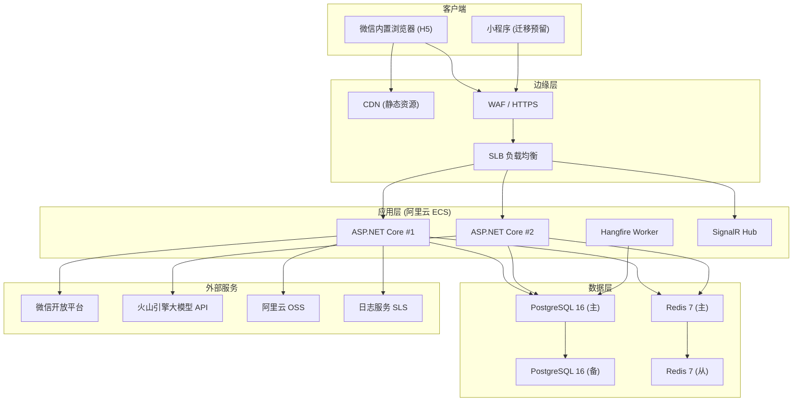

# 部署架构与运维设计（D04）

> 本文档定义小书童的**技术栈明细、部署拓扑、环境划分、CI/CD、监控运维、成本模型**——是 D01（框架）、D02（数据）、D03（API）的最终落地形态。
> 关联文档：`docs/D01-统一题库与多学科学习平台设计.md`（框架）、`docs/D02-学习数据与记忆跟踪设计.md`（数据）、`docs/D03-API契约设计.md`（接口）、`docs/1-需求分析/V1/“小书童（背书搭子）”产品需求分析和设计-V3.md`（需求）

---

## 一、技术栈总览

| 层 | 选型 | 版本 | 说明 |
|----|------|------|------|
| 前端框架 | **Vue3 + Uni-app** | Vue 3.4+ | H5 为主，小程序迁移预留（D01 决策） |
| 构建工具 | Vite | 5.x | H5 构建 |
| 前端状态 | Pinia | 2.x | 学习会话/记忆状态缓存 |
| 后端框架 | **ASP.NET Core** | .NET 8 LTS | Web API + SignalR |
| ORM | EF Core | 8.x | PostgreSQL 驱动 |
| 数据库 | **PostgreSQL** | 16.x | JSONB + RLS + 分区 |
| 缓存 | **Redis** | 7.x | 会话/复习队列/限流/热数据 |
| AI 判题 | 火山引擎大模型 API | - | 判题/提示/点评三 Prompt 域 |
| 任务调度 | Hangfire | - | 复习提醒/过期任务/周报生成 |
| 微信集成 | 微信开放平台 H5 | - | 授权登录/分享 |
| 对象存储 | 阿里云 OSS | - | 题库音频/图片/导出文件 |
| 日志 | Serilog + 阿里云 SLS | - | 结构化日志 |
| 监控 | Prometheus + Grafana | - | 指标采集与看板 |

---

## 二、部署拓扑（Mermaid）



---

## 三、环境划分

| 环境 | 用途 | 资源规格 | 数据库 |
|------|------|---------|--------|
| **dev** | 本地开发 | 本机 Docker Compose | PG + Redis 容器 |
| **test** | 联调/测试 | 1 台 2C4G ECS | 独立 PG，可重置 |
| **staging** | 预发布（生产镜像） | 同生产减半 | 独立 PG，近生产数据脱敏 |
| **prod** | 生产 | 2 台 4C8G + 备库 | 主备 + 每日备份 |

**配置管理**：`appsettings.{Environment}.json` + 环境变量；密钥走阿里云 KMS / 环境变量注入，**不入 git**。

---

## 四、前端部署（微信 H5）

### 4.1 构建与发布

```
Uni-app → Vite build → dist/build/h5/（静态文件）
```

| 项 | 配置 |
|----|------|
| 静态托管 | 阿里云 OSS + CDN（全国加速） |
| 入口 | 微信公众号菜单/分享链接 → H5 URL |
| 微信 JS-SDK | 域名白名单配置（JS 接口安全域名） |
| 首屏优化 | 骨架屏 + 路由懒加载 + 资源 CDN 前缀（D01 非功能：首屏 ≤5s） |
| PWA | 微信内禁用 Service Worker（X5 限制），LocalStorage 暂存离线数据（V3 决策） |

### 4.2 域名规划

| 域名 | 用途 |
|------|------|
| `https://xst.example.com` | H5 主站（微信授权回调域名） |
| `https://api.xst.example.com` | API（跨域 CORS 白名单） |
| `https://cdn.xst.example.com` | 静态资源 |

---

## 五、后端部署（ASP.NET Core）

### 5.1 服务拆分（单体 + 模块化）

> 初始阶段**单体部署**（模块化边界清晰，避免微服务运维负担），按需拆分。

```
XiaoShuTong.Api          # Web API + SignalR（对外）
├── /Modules/Auth        # 认证
├── /Modules/Bank        # 题库
├── /Modules/Study       # 学习/判题
├── /Modules/Stats       # 统计
├── /Modules/Pk          # PK 竞技
└── /Modules/UserData    # 用户数据
XiaoShuTong.Worker       # Hangfire 后台任务（独立进程）
XiaoShuTong.Domain       # 领域层（实体/状态机/判题接口）
XiaoShuTong.Infrastructure # EF Core/Redis/火山引擎客户端
```

### 5.2 部署方式

| 项 | 配置 |
|----|------|
| 服务器 | 阿里云 ECS（2 台 4C8G，可用区 A/B 双机） |
| 运行方式 | Docker 容器 + docker-compose / K8s（后期） |
| 反向代理 | SLB（HTTPS 终止）+ Nginx（可选） |
| 健康检查 | `/healthz`（含 PG/Redis 依赖探活） |
| 无状态 | 会话 JWT 无状态；SignalR 用 Redis backplane 支撑多实例 |

### 5.3 关键配置

```json
{
  "ConnectionStrings": {
    "Postgres": "Host=pg-main;Port=5432;Database=xst;User=app;Password=${PG_PWD}",
    "Redis": "redis-master:6379"
  },
  "WeChat": { "AppId": "${WX_APPID}", "AppSecret": "${WX_SECRET}" },
  "VolcEngine": { "ApiKey": "${VOLC_KEY}", "Endpoint": "https://ark.cn-beijing.volces.com" },
  "Judge": {
    "KeywordThresholdCorrect": 0.85,
    "KeywordThresholdPartial": 0.60,
    "LlmTimeoutMs": 3000,
    "RatePerMinute": 60
  }
}
```

---

## 六、数据层部署

### 6.1 PostgreSQL 16

| 项 | 配置 |
|----|------|
| 版本 | PostgreSQL 16.x |
| 高可用 | 主备流复制（同步模式），故障自动切换 |
| 备份 | 每日全量（pg_dump）+ WAL 归档（PITR 到分钟级） |
| 保留 | 全量 30 天 + WAL 7 天 |
| 扩展 | `pgcrypto`（gen_random_uuid）、`pg_trgm`（模糊搜索，可选） |
| 分区 | attempts 按月分区（D02 设计） |
| RLS | 每表启用行级安全（D02 九节） |

### 6.2 Redis 7

| 项 | 配置 |
|----|------|
| 主从 | 1 主 1 从 + 哨兵（或云 Redis 高可用版） |
| 数据策略 | 缓存数据允许丢失（可从 PG 重建） |
| 核心用途 | 复习队列缓存、会话状态、限流计数、判题结果缓存、SignalR backplane |

### 6.3 数据一致性

- 写路径：`attempts + memory_states + daily_stats` 用**应用层事务**（EF Core TransactionScope）保证原子性
- Redis 缓存采用 **Cache-Aside**，失效策略：判题写入后删除对应 memory_states 缓存键

---

## 七、AI 服务接入（火山引擎）

### 7.1 调用架构

```
判题请求 → 本地关键词引擎（≥85% 直接返回，零成本）
        → 未命中 → 火山引擎大模型 API（带对应 Prompt）
        → 超时(3s)/失败 → 降级本地规则引擎 + 提示用户（D01 9.1）
```

### 7.2 成本控制

| 措施 | 说明 |
|------|------|
| 本地关键词前置 | 拦截 60-70% 请求（V3 成本模型前提） |
| 判题结果缓存 | 高频题目（同一用户答 2 次以上）结果缓存到 Redis |
| 单用户上限 | 60 次/分限流 + 每日 LLM 调用配额 |
| Prompt 压缩 | 题型专用 Prompt 精简 few-shot，控制 token |
| 模型分级 | 简单判题用轻量模型；点评/论述用强模型 |

### 7.3 成本模型（V3 修正版）

| 项 | 估算 |
|----|------|
| 日活 × 日均题量 | 500 × 30 = 15,000 题/日 |
| 本地关键词拦截率 | 65%（→ LLM 约 5,250 次/日） |
| 单次 LLM 成本 | ¥0.005/题（含 prompt token） |
| **月 LLM 成本** | **≈ ¥800-1,200/月**（V3 原估算 100-300 元偏低，此为修正值） |

---

## 八、CI/CD 流水线

```
Git push (main) → GitHub Actions
    ├── Lint + Unit Test（判题路由/状态机/接口契约）
    ├── Build（前端 Vite + 后端 dotnet publish）
    ├── 集成测试（test 环境：staging 库跑 schema 校验 + API 冒烟）
    ├── Docker Build & Push（registry）
    └── 部署
        ├── staging：手动触发
        └── prod：审批后发布（蓝绿切换）
```

| 环节 | 工具 |
|------|------|
| 代码托管 | GitHub（或 Gitee） |
| CI/CD | GitHub Actions |
| 镜像仓库 | 阿里云 ACR |
| 部署 | 蓝绿：SLB 权重切换（新版本先验证再切流） |
| 回滚 | 保留上一版本镜像，一键回切 |
| 数据库迁移 | EF Core Migrations + 迁移脚本审核（`dotnet ef migrations` + SQL 人工 review） |

---

## 九、监控与告警

### 9.1 指标（Prometheus + Grafana）

| 指标 | 采集对象 |
|------|---------|
| QPS / P95 延迟 | API / SignalR |
| 判题准确率 | attempts.result 聚合（业务指标） |
| LLM 调用量 / 成本 / 超时率 | 火山引擎客户端 |
| 缓存命中率 | Redis |
| 数据库连接 / 慢查询 | PostgreSQL |
| DAU / 留存 / 答题量 / ★ 点亮数 | 业务埋点 → 看板（V3 监控要求） |

### 9.2 告警规则

| 告警 | 阈值 | 通知 |
|------|------|------|
| API P95 > 500ms | 持续 5 分钟 | 钉钉/企业微信 |
| 判题降级率 > 10% | 持续 10 分钟 | 紧急 |
| PG 连接数 > 80% | 即时 | 紧急 |
| LLM 超时率 > 20% | 持续 5 分钟 | 高 |
| 5xx 错误率 > 1% | 持续 5 分钟 | 高 |

### 9.3 日志

- Serilog 结构化日志 → 阿里云 SLS
- 关键链路追踪：`request_id` 贯穿（Web API → 判题 → DB），用 Correlation ID
- 审计日志：作答/状态迁移/数据导出/注销操作独立留存

---

## 十、容量与扩展

### 10.1 初始容量（500 DAU 规模）

| 资源 | 规格 | 月成本估算 |
|------|------|-----------|
| ECS × 2 | 4C8G | ¥500-800 |
| PostgreSQL 主备 | 云 RDS 4C16G 100G | ¥600-900 |
| Redis | 云 Redis 1G | ¥100-200 |
| CDN + OSS | 按量 | ¥50-100 |
| LLM API | 按量 | ¥800-1,200 |
| **月合计** | | **≈ ¥2,050-3,200** |

### 10.2 扩容路径

| 阶段 | 触发条件 | 动作 |
|------|---------|------|
| 1000 DAU | 达 80% 容量 | ECS 升配 + Redis 从库扩容 |
| 5000 DAU | 持续增长 | API 拆模块独立部署（Study/Pk 分离） |
| 1 万+ DAU | 稳态 | 上 K8s + 读写分离（PG 只读副本） |

---

## 十一、容灾与恢复

| 场景 | RTO | RPO | 措施 |
|------|-----|-----|------|
| 单 ECS 故障 | ≤5 min | 0 | SLB 自动摘除 + 另一实例接管 |
| PG 主库故障 | ≤10 min | ≤1 min | 主备自动切换 |
| 整地域故障 | ≤4 h | ≤30 min | 跨可用区备份恢复演练 |
| 误操作数据 | ≤30 min | 分钟级 | PITR 恢复 |

**恢复演练**：每季度一次 PG 恢复演练 + 每年一次全流程容灾演练。

---

## 十二、落地阶段

| 阶段 | 内容 |
|------|------|
| D4-P1 | dev 环境 Docker Compose 全栈（PG+Redis+API+H5） |
| D4-P2 | 后端项目骨架（模块化 + EF Core + 健康检查）+ GitHub Actions CI |
| D4-P3 | 测试环境部署 + 微信授权联调 |
| D4-P4 | 生产部署（SLB + 主备 + 备份）+ 监控看板 |
| D4-P5 | 火山引擎接入 + LLM 成本监控 + 告警全量 |

---

## 变更记录

| 日期 | 版本 | 变更内容 | 关联ADR |
|------|------|---------|---------|
| 2026-09-04 | V1.0 | 初始版：技术栈/拓扑/环境/CI-CD/监控/成本/容灾 | - |
| 2026-09-04 | V1.1 | 四文档自审修复：成本模型引用修正（V3 原估算 100-300 元偏低，标注为修正值 800-1,200/月） | - |
