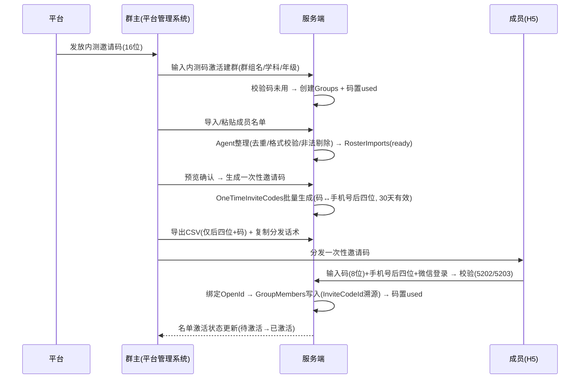
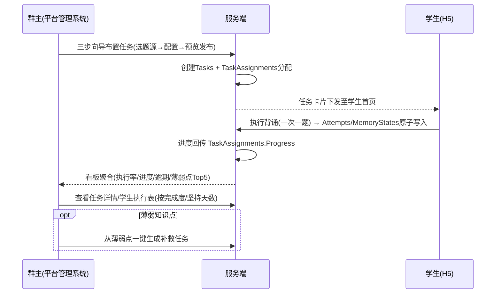

# 小书童 - 平台管理系统需求方案

## 一、文档定位与背景

### 1.1 定位

本文档定义**平台管理系统（AdminWasm，群主 PC 教研端）**的需求规格，作为平台管理系统功能设计（R/S/DS/U 系列）与前端开发（AntDesign Blazor Pro）的需求基线。

- **用户**：群主（原老师/班主任，UI 一律显示"群主"淡化"老师"称谓）
- **形态**：PC Web 端（信息密度高、表格化设计），与 H5（学生/家长端）共用同一后端 WebApi
- **技术栈**：XiaoShuTong.AdminWasm（.NET 10 WASM + AntDesign Blazor Pro + TKWF ApiClient/GraphQL）

### 1.2 核心业务闭环

```
平台发放内测码 → 群主激活建群 → 导入名单 → 生成一次性码 → CSV 分发
→ 成员凭码+微信激活入组 → 群主布置任务 → 学生执行背诵 → 群主看板督学 → 周报（P1）
```

平台管理系统覆盖闭环的**前段（建群/邀请/入组）与后段（布置/督学）**；学生执行背诵（M04）在 H5 端。

### 1.3 设计原则

| 原则 | 说明 |
|------|------|
| 角色称谓统一 | UI 文案一律"群主"，不出现"老师/班主任" |
| 信息密度高 | 表格化呈现（群组/成员/任务/学情），操作路径短 |
| 合规优先 | 看板/榜单只呈现努力度指标（完成度/坚持天数/★数），**禁止正确率排名对外暴露** |
| DRM 防护 | 题目内容按授权边界；群主仅可见任务相关统计汇总，题目原文按 DRM |
| 私域数据隔离 | 默认所有题库/背诵记录私有，仅本人可见；群主仅见所带群组数据 |

## 二、角色与权限模型

### 2.1 角色

| 角色 | 枚举（内部） | 端 | 职责 |
|------|:---:|------|------|
| 群主 | `owner` | AdminWasm（PC）+ H5 | 建群/邀请/布置任务/督学/题库管理 |
| 学生 | `student` | H5 | 执行任务/自由背诵/搭子社交/PK |
| 家长 | `parent` | H5 | 查看成长报告/订阅付费 |

> 用户角色本质是老师/家长，界面文案统一显示"群主"。

### 2.2 平台管理系统权限矩阵

| 功能域 | 群主权限 | 说明 |
|--------|---------|------|
| 内测邀请 | 凭平台发放码激活建群；导入名单；生成一次性码；导出 CSV | 群主**无自行生成内测码**入口（BR-17） |
| 群组管理 | 维护群组信息/成员；配置排名开关；移除成员（不删学习数据） | 群主仅可见所带群组统计汇总（BR-15） |
| 任务管理 | 三步向导布置任务；从薄弱知识点一键生成补救任务；查看任务详情 | 任务名默认"背诵《XXX》"；截止快捷项 |
| 题库管理 | 多学科选择/导入录入/单题增删改/AI 预处理（人工校验后入库）/分类标签 | 私域题库，默认私有；DRM 防护 |
| 学情看板 | 今日执行率/平均进度/逾期任务/薄弱点 Top5/学生执行表 | 按完成度/坚持天数，不按正确率（BR-15） |

### 2.3 数据权限（RLS 对齐）

- 群主：仅看**所带群组**的任务相关统计汇总；题目内容按 DRM（引用不复制、撤回后下线）
- 学生：仅看自己数据
- 家长：仅看自己授权孩子数据
- 全局：看板/榜单一律不暴露答题明细

## 三、功能范围总览（平台管理系统页面路由）

| 页面路由 | 页面名 | 对应模块 | 优先级 |
|---------|--------|---------|:---:|
| `/owner/dashboard` | 群主群组看板 | M02-F04 | ★ 核心 |
| `/owner/groups/list` | 群组管理 | M02-F01 | ★ 核心 |
| `/owner/groups/beta-invite` | 内测邀请码领取 | M01-F02 | ★ 核心 |
| `/owner/groups/roster-import` | 名单导入 | M01-F03 | ★ 核心 |
| `/owner/groups/roster-export` | CSV 导出 | M01-F04 | ★ 核心 |
| `/owner/tasks/create` | 群组任务创建 | M02-F02 | ★ 核心 |
| `/owner/tasks/detail` | 群组任务详情 | M02-F04（下钻） | ★ 核心 |
| 题库管理（侧边栏"内容/资料库"） | 多学科/导入录入/AI 预处理/分类标签 | M03 | 高（P0/P1） |
| 我的资料库 | 私域题库视图（布置任务选题源） | M03-F02 | 高 |

## 四、功能需求详述

### 4.1 内测邀请与账户（M01）

#### F0 群主登录（平台管理系统入口）

- **需求**：群主登录平台管理系统。内测期走**密码/会话骨架**（脚手架现状 AdminWasm-V0.1.0 密码单 Tab），后续目标为**微信授权登录**（R00 M01-F01）。
- **角色判断**：登录后识别角色（owner/student/parent）→ 群主进入平台管理系统；学生/家长进入 H5 对应首页。
- **首次登录**：须同意隐私协议（对齐 R00 M01-F01 约束 / UI `/auth/privacy`）；未成年人（<14 岁）须监护人同意流程（BR-16）。
- **前置**：微信授权通过（后续版本）；隐私协议已同意。
- **错误码**：5205（平台内测开关未开启时返回）。

#### F1 内测邀请码领取（/owner/groups/beta-invite）

- **需求**：群主输入平台发放的 16 位内测邀请码 → 激活建群资格（一码一群组）。
- **前置**：平台已发放 `BetaInviteCodes`；**平台内测开关已开启（否则返回 5205）**；群主已登录。
- **后置**：`Groups` 创建（群组名/学科/年级）；码置 `used`。
- **页面状态**：未领取 / 已激活（显示已激活群组名 + "进入群组"）/ 已过期（灰置）。
- **错误码**：5201（码无效/已使用/已过期）。
- **约束**：群主无自行生成入口（BR-17）。

#### F2 名单导入（/owner/groups/roster-import）

- **需求**：群主批量粘贴（textarea 每行一个手机号）或文件上传（拖拽 CSV/TXT）成员名单 → **Agent 整理**（去重/手机号格式校验/非法剔除，可后台化完成后通知）→ 整理预览统计（有效数/去重数/非法数，非法行可展开查看剔除明细及原因）→ "确认生成一次性邀请码"按钮 → 批量生成（码↔手机号后四位绑定，同一名单内唯一）。
- **后置**：`RosterImports` 批次（Source/Cleaned/Duplicate/Invalid 四计数；状态 `ready`）。
- **页面状态枚举**：
  | 状态 | 表现 |
  |------|------|
  | 导入中 | 粘贴/上传进度提示，可取消 |
  | 整理中 | Agent 整理状态（去重/格式校验），可后台化，完成后通知 |
  | 预览确认 | 展示有效/去重/非法统计，"确认生成"按钮可点 |
  | 生成中 | 按钮 loading"生成中…"，防重复提交 |
  | 生成完成 | 成功 Toast + "去导出 CSV"入口 |
  | 空名单 | 空态"名单是空的"+ "没有可导入的手机号"+ 重新粘贴/上传入口 |
  | 全部非法 | 警示"名单中无有效手机号"+ 展示剔除明细 + 修改后重试 |
- **约束**：CSV 仅含手机号后四位 + 码（BR-17）；OSS 7 天过期；**导入名单须声明已获成员同意（个保法告知同意，对齐 D02 §4.18/D06）**；同一群组可多次导入，各批次独立（同手机号跨批次生成不同码）。
- **错误码**：5204（名单批次不存在/未就绪）。

#### F3 生成一次性邀请码与 CSV 导出（/owner/groups/roster-export）

- **需求**：已生成名单批次列表（批次时间/有效数/待激活数/已激活数）→ 点批次看明细表（手机号后四位 + 一次性邀请码）→ "导出 CSV"按钮（标注"7 天有效"）+ 下载链接（OSS，7 天过期）。
- **CSV 内容**：**仅含手机号后四位 + 一次性邀请码**（不含 openid/完整手机号/学习数据，对齐 D02 §4.18 CSV 导出隐私规则 + §4.17 OneTimeInviteCodes 结构）。
- **分发话术模板（复制框）**："【小书童内测】@手机号后四位 XXXX，你已被邀请加入群组，请用一次性邀请码 XXXX-XXXX 激活（7 天内有效），激活即绑定微信。"
- **页面状态枚举**：
  | 状态 | 表现 |
  |------|------|
  | 生成完成 | "导出 CSV"按钮可点，标注"7 天有效" |
  | 导出中 | 按钮 loading"导出中…"，防重复提交 |
  | 导出成功 | 成功 Toast + 下载链接（OSS，7 天过期）|
  | 名单待激活 | 状态徽章"N 人待激活"，已激活成员归入"已激活"分组 |
  | CSV 过期 | 下载链接灰置"已过期"+ 重新导出入口 |
  | 无批次 | 空态"还没有生成的名单"+ 引导去导入名单 |
- **约束**：默认 30 天失效（BR-17）；**码全局唯一（跨批次），碰撞自动重试；并发激活同一码幂等返回原结果（对齐 D03）**。

> **F2/F3 交互链**：名单导入 → 生成一次性邀请码 → 导出 CSV 分发（群组管理页内嵌流程）。

#### F4 成员激活状态（并入群组管理）

- 成员凭一次性码 + 微信授权激活入组后，群主在成员名单看到激活状态（待激活 N 人徽章/已激活分组）。
- 约束：账户级手机号补绑留后续；内测期手机号仅作名单定向凭证。

> **F4 配套说明（跨端交互，非本系统功能）**：成员激活页 `/auth/activate` 属学生/成员 H5 端，本系统仅消费其激活结果。激活流程：成员输入一次性邀请码（8 位）+ 手机号后四位（4 位）→ "微信一键登录并激活" → 校验码未用/未过期（5202）+ 后四位与名单一致（5203）→ 微信授权绑定 OpenId → 写入 `GroupMembers`（InviteCodeId 溯源）→ 码置 used。本系统关注点：激活状态直接反映在名单激活统计（待激活 → 已激活）；错误提示需向成员传达（码无效 / 码已使用"请联系群主" / 码已过期"请联系群主重新生成" / 后四位不匹配"手机号后四位与名单不符"）。

### 4.2 群组与家校任务闭环（M02）

#### F5 群组管理（/owner/groups/list）

- **需求**：群组卡片列表（群组名/学科/人数/执行率）+ 群组信息维护 + 成员名单管理。
- **成员名单管理**：激活状态展示；移除成员需二次确认，**不删学习数据**。
- **排名开关**：群组级 `Groups.RankEnabled`（默认 true）配置；关闭后该群组战绩榜入口隐藏、榜单不展示（战力榜不受影响）（BR-11）。
- **空态**：无群组 → 引导"输入内测码激活建群"；群组无学生 → 引导导入名单。
- **内嵌流程**：名单导入 → 生成一次性邀请码 → 导出 CSV 分发（即 F2/F3）。

#### F6 布置任务三步向导（/owner/tasks/create）

- **Step1 选题源**：官方题库 / 我的资料库 / 自由编排。
- **Step2 配置**：任务名（默认"背诵《XXX》"）+ 截止时间（快捷项：明天/周末/自定义）+ 是否允许重做。
- **Step3 预览发布**：预览题目示例（**不含答案**）→ 发布。
- **支持**：从薄弱知识点一键生成补救任务。
- **后置**：`Tasks` + `TaskAssignments` 分配记录，任务卡片下发至学生首页。
- **约束**：截止后学生端显示红色"已截止"。

#### F7 群主进度看板（/owner/dashboard）

- **需求**：群组选择器（多群组切换，切换后全页数据刷新）+ 指标卡组 + 任务执行列表 + 学生执行表。
- **指标卡**：今日执行率、平均进度、逾期任务数、薄弱知识点 Top5。
- **任务执行列表**：任务名 + 完成率横向条 + 截止状态（红标"已截止"置顶）。
- **学生执行表**：按完成度/坚持天数排序，**不按正确率**（BR-15 合规）。
- **状态枚举**：
  | 状态 | 表现 |
  |------|------|
  | 多群组切换 | 顶栏下拉，切换后全页数据刷新（保留侧边栏选中态） |
  | 无任务 | 任务列表空态"还没有布置任务"+【布置一个任务】主按钮 |
  | 执行率低组 | 指标卡警示色，但文案用"加油"不说"落后" |
  | 逾期任务 | 列表红标"已截止"，置顶 |
  | 无学生 | 空态"群组还没有学生加入"+ 引导导入名单发放一次性邀请码 |

#### F8 群组任务详情（/owner/tasks/detail）

- **需求**：任务详情 + 全组执行进度（每成员完成状态/用时/正确率）+ 卡壳知识点聚合。
- **约束**：正确率仅任务级内部查看，不作为排名对外指标。

#### F9 群组执行周报导出（P1 延后）

- **需求**：全群组背诵进度周报一键导出。
- **范围**：标记 P1，**不在 v1.0 MVP**；MVP 内先以页面查看为主。

### 4.3 题库管理（M03）

#### F10 多学科体系（侧边栏"内容"）

- **需求**：学科卡片网格（语文/数学/英语/物理/化学/生物/历史/地理/政治），按学科筛选题库范围。
- **约束**：未解锁学科（小三科）标注"群主布置后开启"。

#### F11 题库导入与录入

- **需求**：
  - `.txt` 结构化文本（`问题###答案` 格式）上传，单文件 ≤10M；
  - 批量粘贴；
  - 单题手动录入/修改/删除；
  - 单元章节管理（合并入 `Questions.Topic`）。
- **后置**：`Banks`/`Questions` 写入（导入时自动提取关键词供判题一层使用）。
- **约束**：默认所有题库私有，仅本人可见。

#### F12 AI 预处理工具链（生产端）

- **需求**：群主上传 PDF/Word/文本 → AI 预处理生成背诵点草稿 → **人工校验后**入库（不可直接入库）。
- **约束**：内容准确性把关由人工完成（BR-18）。

#### F13 分类标签

- **需求**：按主题、难度分类 + 自定义标签（如"高频考点""易错点"）。
- **后置**：`Banks.Tags(JSONB)` 更新。
- **约束**：MVP 不单独建 Tags 表，合并入 Banks（BR-18）。

#### F14 题库 DRM 与隐私保护

- **需求**：默认私有；组员仅获访问引用、不可导出/转发；群主撤回题库后历史学习记录保留但原文不可见（显示"题目已下线"）；防爬"背一题取一题"不返回明文列表（BR-15/18）。

### 4.4 学情与合规（横切）

- 看板/任务详情一律**不暴露答题明细**、不出现正确率排名（BR-15/16）。
- 执行率低群组用鼓励式文案（"加油"），禁用"落后/倒数"表述。

## 五、平台管理系统相关业务规则（BR 提取）

| 编号 | 规则 | 归属 |
|:----:|------|:---:|
| BR-11 | 战绩榜受 `Groups.RankEnabled`（默认 true）控制，群主可关闭；关闭后战绩榜入口隐藏、榜单不展示；战力榜不受影响 | M02/M07 |
| BR-15 | 群主仅可见任务相关统计汇总；题库 DRM：组员引用不复制、不可导出转发；撤回后原文下线、历史保留；接口背一题取一题 | M02/M03 |
| BR-16 | 未成年人（<14 岁）须监护人同意；数据最小化收集；报告只呈现相对进步；账号注销后 30 天删除全部数据 | M01/M09 |
| BR-17 | 内测邀请码由平台发放、一码一群组（群主无生成入口）；一次性邀请码默认 30 天失效；CSV 仅含手机号后四位 + 码（OSS 7 天过期） | M01 |
| BR-18 | AI 预处理内容须人工校验后入库；MVP 不单建 Tags 表（合并入 Banks） | M03 |
| 备注 | **BR-18 为本方案衍生编号**：内容源自 R00 复测版 M03-F03 约束（"必须人工校验后才入库"）+ M03-F04 约束（"MVP 不单独建 Tags 表"），**R00 BR 表仅至 BR-17，无 BR-18**。下游 tkwf-business 物化时以此备注为准。 | - |

## 六、关键业务流程时序

### 流程 1：内测激活闭环（平台管理系统 + 成员侧）



### 流程 2：任务布置与督学闭环



### 流程 3：成员激活错误分支（异常处理）

| 错误场景 | 服务端校验 | 提示文案 | 错误码 |
|---------|-----------|---------|:---:|
| 内测码无效/已使用/已过期 | 码状态校验 | "邀请码无效，请核对后重试" | 5201 |
| 平台内测未开放 | 平台开关 | "内测暂未开放" | 5205 |
| 一次性码无效 | 码不存在 | "邀请码无效，请检查后重新输入" | 5202 |
| 一次性码已使用 | 码状态=used | "该邀请码已被使用，请联系群主" | 5202 |
| 一次性码已过期 | 超过 30 天 | "该邀请码已过期，请联系群主重新生成" | 5202 |
| 后四位不匹配 | 与名单不符 | "手机号后四位与名单不符，请核对" | 5203 |
| 名单批次未就绪 | RosterImports 状态非 ready | "名单尚未就绪，请稍后重试" | 5204 |

## 七、数据与合规

### 7.1 关键数据实体（平台管理系统相关）

| 实体 | 关键字段（草案） | 平台管理系统操作 |
|------|-----------------|-----------|
| `Users` | OpenId(微信) / Role(owner/student/parent) / Phone(脱敏) | 群主登录/角色判断 |
| `BetaInviteCodes` | Code(16位) / Status(used/expired) / GroupId / ExpiresAt | 领取激活（只读使用） |
| `Groups` | Name / Subject / Grade / OwnerId / RankEnabled(默认true) / Status | 创建/维护 |
| `RosterImports` | GroupId / Source / Cleaned / Duplicate / Invalid / Status(importing→ready) / OSSKey | 导入/预览确认 |
| `OneTimeInviteCodes` | Code(8位) / RosterImportId / PhoneLast4 / Status(active→used/expired) / ExpiresAt(30天) / UserId(激活后) | 批量生成/CSV |
| `GroupMembers` | GroupId / UserId / InviteCodeId(溯源) / Status(active/removed) / JoinedAt | 名单管理/移除 |
| `Tasks` / `TaskAssignments` | TaskName / BankId / DueAt / AllowRedo / Progress / AssignmentStatus | 创建/查看 |
| `Banks` / `Questions` | Subject / Tags(JSONB) / Topic(章节) / DRM 状态 / 校验状态 | 增删改/导入/校验 |
| `JudgmentFeedback` | QuestionId / UserId / Status(pending→reviewed→resolved) / 判题质量统计 | 复核（后续） |

> 字段为需求草案，最终以 tkwf-entity 实体设计为准。

### 7.2 文件上传（平台管理系统）

- 群主上传 PDF/Word/文本资料 → AI 预处理生成背诵点 → **人工校验后入库**（不可直接入库，BR-18）
- 名单导入支持批量粘贴/文件上传，Agent 整理后生成一次性邀请码
- OSS 存储：CSV 7 天过期；导入源文件随批次管理

### 7.3 合规红线（平台管理系统必须遵守）

- 排名只指向努力度（坚持天数/★数/完成度/PK 胜场），**禁止**正确率排名、优秀率、及格率、平均分对比、"团队倒数第 N"对外暴露
- 看板/榜单一律不暴露答题明细（Checklist：学生执行表按完成度/坚持天数，不按正确率）
- 数据最小化收集；手机号脱敏（138****1234）；存储 AES-256 + TLS1.3
- **名单导入须声明已获成员同意（个保法告知同意，对齐 D02 §4.18/D06）**
- 群主撤回题库 → 学生端题目下线（"题目已下线"），历史学习记录保留
- **数据留存：RosterImports/OneTimeInviteCodes 记录随群组生命周期保留；群组解散后 30 天清理**

## 八、非功能需求

| 类别 | 需求 |
|------|------|
| 性能 | 看板聚合查询 < 3s（万级成员群组）；名单导入 ≤10M 文件处理不阻塞 UI；Agent 整理超时阈值 60s（超时转失败提示，可重试） |
| 安全 | 认证走微信授权 + Session（TKWF UseWasmAuth）；RLS 行级数据权限 |
| 可用性 | 关键操作（导入/发布）需反馈进度与结果；破坏性操作（移除成员/撤回题库）二次确认 |
| 兼容 | PC 现代浏览器（Chrome/Edge）；信息密度高、表格化布局（AntDesign Pro） |
| 审计 | 名单导入批次、任务发布、判错反馈均留状态机与记录 |

## 九、异常与边界情况（平台管理系统）

| 场景 | 处理方式 |
|------|----------|
| 内测邀请码无效/已使用/已过期 | 对应提示 + 联系平台入口 |
| 名单为空 | 空态"名单是空的"+ 重新粘贴/上传入口 |
| 名单全部非法 | 警示"名单中无有效手机号"+ 展示剔除明细 + 修改后重试 |
| 一次性码已使用 | 提示"该邀请码已被使用，请联系群主" |
| 一次性码已过期 | 提示"该邀请码已过期，请联系群主重新生成" |
| 手机号后四位不匹配 | 提示"手机号后四位与名单不符，请核对" |
| CSV 链接过期 | 提示重新导出 |
| 导入中取消 | 粘贴/上传进度可取消，已导入数据不落库 |
| 无群组/无学生 | 对应空态引导（激活建群 / 导入名单） |
| 群组无任务 | 任务列表空态 +【布置一个任务】主按钮 |
| Agent 整理失败/超时 | 提示"整理失败，请重试"+ 保留原始名单可重新提交（异步后台，超时阈值见非功能） |
| 题目内容被撤回 | 学生端显示"题目已下线"，平台管理系统题库列表标注撤回状态 |
| 移除成员 | 二次确认，**不删学习数据**（历史记录保留） |

## 十、优先级与阶段划分

| 阶段 | 平台管理系统范围 | 目标 |
|:----:|-----------|------|
| **第零批（内测前置）** | 内测码领取 / 名单导入 / CSV 导出 / 成员激活 | 成员入组必经，先于常规用户增长 |
| **v1.0 MVP（阶段 1）** | 群组管理 / 任务三步向导 / 群主进度看板 / 任务详情 / 题库管理（私域简化+多学科） | 跑通"群主布置 → 学生背诵 → 家长看报告"闭环 |
| **v1.1+ / P1** | 群组执行周报导出、学生端数据导出、判错纠错复核入口 | 补齐运营与合规能力 |
| **v2.0（阶段 2）** | 群主特权模式深化、群动态激励日志、群组成就汇总一键导出、群内分享题库/心得 | 私域社交与群体激励 |
| **v3.0（阶段 3）** | AI 智能助手（PDF/图片转题库）、题库市集与版权保护、高级 AI 功能 | 内容源与生态变现 |

## 十一、验收标准

| 验收项 | 验收条件 | 验收方式 |
|--------|---------|---------|
| 内测码激活 | 群主可凭平台发放的内测邀请码激活建群资格（一码一群组，状态未领取/已激活/已过期/码无效） | 人工验证 |
| 名单导入 | 群主可导入/批量粘贴成员名单，经 Agent 整理（去重/格式校验）预览确认后生成一次性邀请码 | 人工验证 |
| CSV 导出 | 群主可导出 CSV（手机号后四位 + 一次性邀请码，标注 7 天过期）并查看分发话术 | 人工验证 |
| 成员激活 | 成员凭一次性邀请码 + 手机号后四位 + 微信登录激活，成功加入群组并绑定微信 ID | 人工验证 |
| 内测闭环 | 激活建群 → 导入名单 → 生成一次性码 → CSV 导出 → 成员激活 → 名单状态更新全链路可用 | 人工验证 |
| 任务闭环 | 三步向导发布任务 → 学生端可见 → 看板进度实时呈现 | 人工验证 + 契约测试 |
| 看板合规 | 学生执行表/榜单不含正确率排名指标；执行率低组用鼓励文案 | 人工核验 + Checklist |
| DRM | 撤回题库后学生端显示"题目已下线"，历史记录保留 | 人工验证 |
| 权限隔离 | 群主 A 仅见所带群组数据；学生仅见自己数据 | 契约测试 |
| 异常边界 | 码无效/已使用/已过期/后四位不匹配/名单空/全部非法/CSV 过期均按 §九 处理 | 人工验证 |
| 看板性能 | 看板聚合查询 < 3s（万级成员群组） | 自动化压测 |
| 导入性能 | 名单导入 ≤10M 文件处理不阻塞 UI | 自动化 |
| 编译与构建 | AdminWasm `dotnet build` 0 错误 | 自动化 |

## 十二、本期不实现（v1.0 MVP 范围外）

- 群组执行周报 Excel 导出（P1）
- 判错纠错的人工复核后台界面（JudgmentFeedback 数据模型先行）
- 题库市集/版权保护/账号绑定+水印+服务端分段渲染（v3.0）
- 群主特权的群动态激励日志/成就汇总导出（v2.0）
- 多场景认证扩展（短信/扫码/SecurePassword）——本期仅密码登录骨架

## 十三、与 AdminWasm 脚手架现状的映射

| 脚手架现状（AdminWasm-V0.1.0） | 需求方案对应 |
|-------------------------------|-------------|
| 登录页（密码单 Tab） | 群主登录 F0：内测期走密码/会话骨架（现状），微信授权登录为 v1.0+ 目标（消解方式：成员侧 H5 全程微信授权；本系统内测期先密码，后续切换） |
| Home 欢迎页 | `/owner/dashboard` 群主群组看板（待建设） |
| menu.json（工作台/学习/设置占位） | 侧边栏：看板 / 群组 / 任务 / 内容（题库）/ 设置 |
| TKWF ApiClient（GraphQL）+ UseWasmAuth | 全部平台管理系统数据访问通道（GroupService/TaskService/BankService 等） |

> 平台管理系统功能落地时按 TKWF 流程：`tkwf-business` 物化群组/任务/题库域业务规则 → `tkwf-entity` 定义实体 → `tkwf-service` 编写 Service → `tkwf-test` 契约测试 → 前端对接。

## 变更记录

| 日期 | 版本 | 变更内容 |
|------|------|---------|
| 2026-09-10 | v0.1 | 初始版本（基于 R00-功能全景复测版 + UI设计文档-v2 提取平台管理系统需求规格） |
| 2026-09-10 | v0.2 | 细化：补充核心页面状态枚举（名单导入/CSV导出/看板）、成员激活流程 F4b、3 条业务时序（mermaid）、数据实体字段规格、文件上传、异常边界表、验收标准扩展至 11 项 |
| 2026-09-10 | v0.3 | Oracle 审阅落地：术语归一（管理端→平台管理系统，24 处 + mermaid 标签）；章节连续编号（五·b→六、七·b→九，后续顺延，7.x 小节同步）；补 F0 群主登录（隐私协议/5205）；F4b 降格为 F4 配套说明；错误码全量（5201/5202/5203/5204/5205）；BR-18 标注衍生规则；补 Users 实体/名单同意声明/数据留存/码唯一性/Agent 失败边界；验收补定量指标；登录方式矛盾消解 |