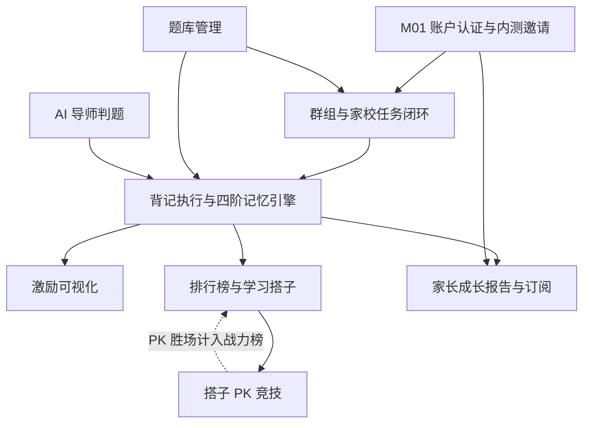

# 小书童（背书搭子）· 功能全景

> **版本**：v1.0（单句调用复测版）
> **编制日期**：2026-09-06
> **本文定位**：tkwf-design 设计阶段的输入文档。产出后，Agent 据此启动 R/S/DS/U 全流程。
> **生成方式**：DG-00 模式 B（文档处理）。输入 `docs/1-需求分析/V1/“小书童（背书搭子）”产品需求分析和设计-V3.md`（PRD V3.1.3），6 项质检全达标后独立映射。本文件为复测产物，与上一轮 `R00-小书童（背书搭子）-功能全景.md` 相互独立，不覆盖旧文件。
> **输入文档状态**：活跃（V3.1 基线，权责以 PRD 为准）

## 一、项目背景与范围

面向 **6-15 岁学生、群主（授课教师）和家长**的家校互动背书应用，核心解决"背了就忘、难以坚持、内容泄露"三大痛点。核心理念是**提升背书执行力**：群主布置任务 → 学生执行背诵 → 家长查看成长。

与传统"对即对、错即错"的机械判题工具不同，本产品以**"引导容错"**为核心，AI 从"评判者"转为"陪伴式导师"（语义容错 / 求助引导 / 二次确认），并基于**艾宾浩斯记忆原理**实现记忆曲线调度，通过四阶记忆状态、进度可视化、鼓励式反馈、搭子社交与 PK 竞技建立自我激励 + 同伴激励双体系。

商业闭环：学生留存数据 → 家长成长报告价值 → 订阅转化（家长为"知情权"付费：试用 7 天 → 10 元/月 或 100 元/年，多孩子独立计费）。

范围：首期 **微信 H5**（学生/家长）+ **PC 教研端**（群主），技术栈 React + shadcn/ui + Vite（ADR-007，前端 H5 先行），后端 ASP.NET Core Web API + PostgreSQL + Redis，AI 判题接 OpenAI 兼容 LLM（供应商可插拔）。

## 二、模块划分

| 模块编号 | 模块名称 | 职责 | 是否有 UI | 备注 |
|---------|---------|------|:--------:|------|
| M01 | 账户认证与内测邀请 | 微信授权登录、角色体系、内测邀请码激活建群、名单导入/一次性码/CSV 导出、成员激活入组 | 是 | V3.1.3 新增；内含 Agent 后台整理环节 |
| M02 | 群组与家校任务闭环 | 群组管理（含排名开关）、任务发布三步向导、学生任务执行、群主进度看板、周报导出 | 是 | 核心场景，V3.1 新增 |
| M03 | 题库管理 | 多学科体系、导入录入（txt/批量/单题）、AI 预处理工具链、分类标签、DRM 防护 | 是 | 私域题库，默认私有 |
| M04 | 背记执行与四阶记忆引擎 | 答题 Session、四阶记忆状态机（✕△○★）、复习队列调度、离线暂存同步 | 是 | 全产品核心引擎 |
| M05 | AI 导师判题 | 两层判题架构（本地关键词 + LLM 语义）、判错纠错反馈队列、引导提示 | 否 | 服务层，无独立 UI |
| M06 | 激励可视化 | 记忆热力图、错题本、学习路线图（简化版）、分享战报 | 是 | V3.1 新增 |
| M07 | 排行榜与学习搭子 | 战力榜/战绩榜、排名快照每日冻结、搭子双向同意邀请、搭子排名互看 | 是 | 战绩榜受群组开关控制 |
| M08 | 搭子 PK 竞技 | PK 发起（选对手/对战码）、实时对战（同题同序 30s）、胜负判定与 AI 点评、掉线处理 | 是 | V3.1 纳入 MVP；仅 accepted 搭子可参与 |
| M09 | 家长成长报告与订阅 | 成长总览/进度趋势/薄弱知识点、订阅计费与到期锁定 | 是 | 付费产品；报告只呈现相对进步 |

## 三、功能点总览

### M01 账户认证与内测邀请

- **M01-F01 微信授权登录**：首次登录微信授权，须同意隐私协议，生成/识别 Users 记录并绑定 OpenId。
  - 前置条件：微信授权通过
  - 后置产出：Users 记录（OpenId 唯一；Role=owner/student/parent）
  - 约束：不满 14 岁用户须监护人同意（BR-16）
- **M01-F02 内测邀请码激活建群**：群主凭平台发放的内测码激活建群（群组名/学科/年级）。
  - 前置条件：平台已发放 BetaInviteCodes
  - 后置产出：Groups 创建；码置 used（一码一群组）
  - 约束：群主无自行生成入口（BR-17）
- **M01-F03 名单导入与整理**：群主粘贴/文件导入名单 → Agent 清洗去重 → 预览确认生成一次性码。
  - 前置条件：已激活建群
  - 后置产出：RosterImports 批次（Source/Cleaned/Duplicate/Invalid 四计数；状态 ready）
  - 约束：CSV 仅含手机号后四位 + 码，OSS 7 天过期（BR-17）
- **M01-F04 生成一次性邀请码与导出 CSV**：按名单批量生成每人一码（码↔手机号后四位）→ 导出 CSV。
  - 前置条件：RosterImports 状态 = ready
  - 后置产出：OneTimeInviteCodes 批量生成；CSV 落 OSS
  - 约束：默认 30 天失效（BR-17）
- **M01-F05 成员凭码 + 微信激活入组**：成员输入一次性码 + 微信授权 → 绑微信 ID → 写入 GroupMembers。
  - 前置条件：未使用的一次性码；微信授权
  - 后置产出：GroupMembers 记录（InviteCodeId 溯源）；码置 used
  - 约束：账户级手机号补绑留后续；内测期手机号仅作名单定向凭证

### M02 群组与家校任务闭环

- **M02-F01 群组管理**：群主维护群组信息与成员、配置群组排名开关。
  - 前置条件：OwnerId（群主身份）
  - 后置产出：Groups 及 Groups.RankEnabled（默认 true）
  - 约束：群主仅可见所带群组统计汇总，题目内容按 DRM（BR-15）
- **M02-F02 布置任务（三步向导）**：选题源（官方题库/我的资料库/自由编排）→ 配置（任务名/截止时间/是否允许重做）→ 预览发布。
  - 前置条件：群组已建，题库可用
  - 后置产出：Tasks + TaskAssignments 分配记录
  - 约束：任务名默认"背诵《XXX》"；截止快捷项 明天/周末/自定义
- **M02-F03 学生任务执行**：首页任务卡片（最醒目）→ 任务执行页一次一题 → 进度点阵 → 完成庆祝页。
  - 前置条件：存在分配给该学生的任务
  - 后置产出：作答原子写入 + 进度回传（TaskAssignments.Progress）
  - 约束：任务已截止显示红色"已截止"；首页无任务显示引导卡直达自由背诵
- **M02-F04 群主进度看板**：实时呈现今日执行率、平均进度、逾期任务数、薄弱知识点 Top5。
  - 前置条件：有任务分配且已有作答数据
  - 后置产出：统计聚合视图（只读）
  - 约束：群主仅可见任务相关数据统计汇总（BR-15）
- **M02-F05 群组执行周报导出**：全群组背诵进度周报一键导出。
  - 前置条件：P1 优先级；MVP 内先以页面查看为主
  - 后置产出：导出文件（MVP 阶段暂不实现导出）
  - 约束：标记 P1，不在 v1.0 MVP 范围

### M03 题库管理

- **M03-F01 多学科体系选择**：学科卡片网格（语文/数学/英语/物理/化学/生物/历史/地理/政治）。
  - 前置条件：学科体系注册
  - 后置产出：按学科筛选题库范围
  - 约束：未解锁学科需群主布置后开启
- **M03-F02 题库导入与录入**：`问题###答案` 格式 .txt 上传（单文件 ≤10M）、批量粘贴、单题手动录入/修改/删除、单元章节管理。
  - 前置条件：登录用户
  - 后置产出：Banks/Questions 写入（章节合并入 Questions.Topic）
  - 约束：默认所有题库/背诵记录私有，仅本人可见
- **M03-F03 群主 AI 预处理工具链**：群主上传 PDF/Word/文本 → AI 预处理生成背诵点 → 人工校验后入库。
  - 前置条件：群主身份
  - 后置产出：Questions 待校验记录 → 校验后正式入库
  - 约束：必须人工校验后才入库
- **M03-F04 分类标签**：主题/难度分类 + 自定义标签（如"高频考点""易错点"）。
  - 前置条件：题库存在
  - 后置产出：Banks.Tags(JSONB) 更新
  - 约束：MVP 不单独建 Tags 表，合并入 Banks
- **M03-F05 DRM 防护**：组员仅获访问引用不可导出/转发；群主撤回题库后历史学习记录保留但原文不可见；按题接口防爬。
  - 前置条件：题库可见性授权
  - 后置产出：访问控制生效
  - 约束：撤回后显示"题目已下线"；题库接口"背一题取一题"，不返回明文列表（BR-15）

### M04 背记执行与四阶记忆引擎

- **M04-F01 答题 Session**：一次一题、强制系统语音输入法文字输入、判题反馈（正确/部分/错误 + 记忆状态变化）、"想不起来？"求助（S1 首字→S2 意象→S3 逻辑逐级加深）、完成页展示"背对了哪几句、哪句还卡着"。
  - 前置条件：任务入口或自由背诵入口
  - 后置产出：Attempts 事务内原子写入 + MemoryStates 更新
  - 约束：Session 默认 20 题（10/20/30/50）、30% 新题 + 70% 复习、跳过不改变记忆状态、中途退出自动保存、禁用浏览器 MediaRecorder ASR（BR-08）
- **M04-F02 四阶记忆状态机**：✕未掌握/△模糊/○掌握/★熟练的状态转移与间隔递增（✕12h、△1→2 天、○3→7 天、★7→30 天，间隔 = 基础间隔 × 历史正确率系数 0.5~1.5）。
  - 前置条件：作答事件发生
  - 后置产出：MemoryStates 更新 + 复习队列重新调度
  - 约束：转移矩阵四规则（作答结果×当前状态）；连续 2 次独立答对跨 Session 累计不清零、间隔 ≥7 天复习答对也计入；首次背诵新题答错 30 分钟复习（BR-04/05/06/07）
- **M04-F03 复习队列调度**：到期复习优先 → 未掌握优先 → 新题。
  - 前置条件：MemoryStates 存在到期项
  - 后置产出：复习任务排序输出
  - 约束：无到期复习时区块隐藏，不占位
- **M04-F04 离线暂存与同步**：弱网/无网本地 LocalStorage 暂存继续答题，联网后同步。
  - 前置条件：网络异常
  - 后置产出：本地暂存 → 服务端同步
  - 约束：网络断开 Toast"网络开小差了" + 重试

### M05 AI 导师判题

- **M05-F01 本地关键词匹配（第一层判题）**：用户答案含 ≥80% 题目预置关键词 → 直接判"正确"。
  - 前置条件：题目预置关键词（导入时自动提取/人工补充）
  - 后置产出：判题结果"正确" + 置信度
  - 约束：拦截约 60-70% 判题请求（成本模型基准）（BR-01）
- **M05-F02 LLM 语义判题（第二层判题）**：命中率 <80% 进入 LLM（OpenAI 兼容，Volcano/DeepSeek/智谱等），返回 result/confidence/matched/missing/hint。
  - 前置条件：第一层未直接判正确
  - 后置产出：判题结果（正确/部分正确/错误）+ 置信度 + 线索提示
  - 约束：置信度 <0.5 错误、0.5~0.85 部分正确、≥0.85 正确；超时 >3s 或失败 → 降级本地规则引擎；AI 只判题不给新知识点解释；严禁直接给答案，提示 ≤20 字（BR-02/03）
- **M05-F03 判错纠错反馈**：用户一键"判错了" → 进入人工复核队列。
  - 前置条件：用户对判题结果不认可
  - 后置产出：JudgmentFeedback（pending→reviewed→resolved）
  - 约束：计入判题质量统计

### M06 激励可视化

- **M06-F01 记忆热力图**：GitHub 风格全年图 + 本周横条，颜色深浅 = 每日点亮 ★ 数；时间范围切换。
  - 前置条件：DailyStats/MemoryStates 数据
  - 后置产出：热力图渲染
  - 约束：切换范围 本周/本月/本季度/今年/学习天数
- **M06-F02 错题本**：错题列表（知识点/错因）→ 重练入口 → 连续答对 2 次转"已掌握"分组。
  - 前置条件：存在 WrongQuestions 记录
  - 后置产出：错题分组状态迁移（可移回错题本）
  - 约束：空态"没有错题，记得很牢！"
- **M06-F03 学习路线图（简化版）**：单元列表 + 完成率进度条 + 解锁状态。
  - 前置条件：单元/章节数据
  - 后置产出：进度与解锁状态展示
  - 约束：不做 Canvas 动画
- **M06-F04 分享战报**：热力图底部"分享战报"→ 4 种风格（简约/活力/清新/优雅）切换 → 保存/复制/分享链路。
  - 前置条件：热力图数据
  - 后置产出：战报图片/文字/链接
  - 约束：MVP 为模拟分享（无真实社交分享）；分享失败 Toast + 重试

### M07 排行榜与学习搭子

- **M07-F01 排行榜**：范围（群组/年级互斥）+ 学科筛选 + 战力榜/战绩榜 + 排名列表（前三特殊样式 + 趋势箭头）。
  - 前置条件：RankSnapshots 最新冻结快照存在
  - 后置产出：榜单列表（序号/头像昵称/数值/趋势 ↑绿↓红→灰）
  - 约束：战力榜 = 坚持天数 + 背诵量 + PK 胜场；战绩榜 = 正确率 + 掌握度，受 Groups.RankEnabled 群组开关控制，关闭后战绩榜入口隐藏、榜单不展示（BR-10/11）
- **M07-F02 排名快照每日冻结**：Hangfire 每日 0:00(UTC+8) 批量计算冻结 RankSnapshots。
  - 前置条件：每日定时触发
  - 后置产出：RankSnapshots（今日快照）+ 趋势箭头（今日 vs 昨日）
  - 约束：不实时写、Rank 不回溯漂移；ScopeType=group/grade；Subject 维度筛选（BR-10）
- **M07-F03 学习搭子邀请**：A 发起邀请（海报二维码/链接）→ B 收到确认页"XX 邀请你成为学习搭子"→ 同意/拒绝/忽略。
  - 前置条件：A/B 登录；邀请对象限同群组/同年级（防陌生人社交）
  - 后置产出：StudyBuddies（pending→accepted/rejected/expired/removed）
  - 约束：accepted 双向 ≤5 人；邀请 7 天未响应 expired；单日发出邀请 ≤10 次（Redis 计数器）；任一方可解除、PK/答题历史保留（BR-09）
- **M07-F04 搭子排名互看**：搭子间互看对方在群组/年级范围的当前排名 + 趋势箭头。
  - 前置条件：互为 accepted 搭子
  - 后置产出：搭子排名卡片展示
  - 约束：仅排名与数值，不暴露答题明细（BR-13 最小化暴露）

### M08 搭子 PK 竞技

- **M08-F01 PK 发起（方式 A 选对手）**：搭子列表选对手 → 选学科/题库范围 + 题量（默认 10 题）→ 对手确认 → 双方就绪开局。
  - 前置条件：互为 accepted 搭子
  - 后置产出：PkMatches 创建（含范围与题量）
  - 约束：仅搭子可发起 PK，非搭子拦截提示（BR-12）
- **M08-F02 PK 发起（方式 B 对战码）**：生成 4 位对战码 → 搭子输入加入。
  - 前置条件：互为 accepted 搭子
  - 后置产出：PkMatches.InviteCode 生成并加入
  - 约束：InviteCode varchar(4)
- **M08-F03 PK 对战**：双方同题同序，每题 30s 倒计时（视觉红条），答对 +10 即时反馈 + 自动下一题；同分比用时。
  - 前置条件：双方就绪
  - 后置产出：PkAttempts 记录 + WinnerId + FinishReason
  - 约束：SignalR 实时同步，微信 H5 降级 30s 轮询；PK 答题不入 Attempts（场景隔离，对齐 D02）（BR-12）
- **M08-F04 结果页与 AI 点评**：胜/负/平 + 双方得分 + AI 趣味点评（个性亮点/薄弱点/知识彩蛋）。
  - 前置条件：PkMatches 结束
  - 后置产出：胜场经 PkPlayerStats 视图聚合 → 计入战力榜
  - 约束：PK 结果只展示 ★数/用时，不出现正确率对比榜（BR-13）
- **M08-F05 掉线处理**：对手离线 30s → 判弃权，己方获胜；己方断线重连进度保留。
  - 前置条件：PK 进行中一方离线/断网
  - 后置产出：FinishReason=forfeit/timeout（或重连恢复）
  - 约束：重连失败按离线处理

### M09 家长成长报告与订阅

- **M09-F01 成长总览 Dashboard**：孩子信息 + 多孩子切换 + 今日任务完成状态 + 坚持天数 + 本周进度 + 各学科掌握度概览。
  - 前置条件：ParentStudentRelations 授权链存在
  - 后置产出：报告聚合数据展示
  - 约束：家长只能看到自己孩子数据（BR-16）
- **M09-F02 进度趋势**：正确率/背诵量时间曲线（周/月切换）。
  - 前置条件：历史答题数据（试用期/订阅期全量）
  - 后置产出：趋势曲线图
  - 约束：只呈现相对进步（本周 vs 上周），不显示群组正确率排名（BR-16）
- **M09-F03 薄弱知识点**：知识点-掌握度矩阵，可下钻到具体篇目。
  - 前置条件：KnowledgeMastery（批量每小时或按需计算）
  - 后置产出：掌握度矩阵视图
  - 约束：仅显示相对进步口径（BR-16）
- **M09-F04 订阅付费**：试用 7 天 → 10 元/月或 100 元/年，多孩子独立计费，到期锁定。
  - 前置条件：ParentStudentRelation 授权；微信支付
  - 后置产出：Subscriptions（trial 7 天→active/expired/cancelled）
  - 约束：UNIQUE(ParentId, StudentId) 独立计费；到期报告区锁定置灰 + "解锁完整报告"；已订阅隐藏付费入口提供"管理订阅/取消续费"；StudentId 须在授权链内（BR-14）

## 四、横切关注点

| 关注点 | 策略 | 说明 |
|--------|------|------|
| 认证鉴权 | 微信授权登录（OpenId 激活即绑）；首次登录须同意隐私协议；未成年人（<14 岁）须监护人同意 | Users.Role 枚举（owner/student/parent，内部），UI 统一显示"群主"淡化"老师"称谓 |
| 权限矩阵 | 学生：自有数据 + 任务执行 + 搭子社交/PK；群主：所带群组管理/布置任务/看板/排名开关配置权；家长：授权孩子数据 + 付费报告 | 群主仅可见任务相关统计汇总；成员凭一次性码 + 微信激活入组 |
| 数据权限 | PostgreSQL RLS 行级安全；学生仅看自己；群主仅看所带群组统计汇总（题目内容受 DRM）；家长仅看自己孩子；付费报告须订阅后才可看完整内容 | Checklist：看板/榜单一律不暴露答题明细 |
| 审计与纠错 | 答题记录 Attempts 原子落库；判错纠错队列 JudgmentFeedback（人工复核 + 判题质量统计）；搭子邀请超时/名单导入批次均有状态机 | Hangfire 定时任务（复习推送、过期任务提醒、搭子邀请失效、排名快照冻结） |
| 合规红线 | 排名只指向努力度（坚持天数/★数/完成度/PK 胜场），**禁止**正确率排名、优秀率、及格率、平均分对比、"团队倒数第 N"对外暴露；战绩榜由群主全局开关（RankEnabled）决定；广告不对未成年人个性化推送 | 数据最小化收集（openid+昵称+答题数据）；账号注销后 30 天删除全部数据；存储 AES-256 + TLS1.3；手机号脱敏（138****1234） |

## 五、业务规则速览

| 编号 | 规则 | 归属模块 | 类型 |
|:----:|------|:--------:|:----:|
| BR-01 | 本地关键词命中率 ≥80% → 直接判"正确"，否则进入 LLM | M05 | 计算 |
| BR-02 | LLM 置信度阈值：<0.5 错误 / 0.5~0.85 部分正确 / ≥0.85 正确；超时 >3s 或失败 → 降级本地规则引擎 + 提示用户 | M05 | 计算/异常 |
| BR-03 | AI 严禁直接给答案；提示 ≤20 字，仅首字/意象/逻辑线索；AI 只判题、不给新知识点解释（防幻觉污染） | M05 | 校验 |
| BR-04 | 四阶记忆状态转移矩阵：✕→△；△求助停留/答错降 ✕；○连续 2 次独立答对升 ★；★答错降 ○（降一级） | M04 | 状态 |
| BR-05 | "连续 2 次独立答对"跨 Session 累计不清零；间隔 ≥7 天的复习答对也计入 | M04 | 计算 |
| BR-06 | 首次背诵新题答错 → 30 分钟复习（科学间隔，非 12 小时）；跨天连续按自然日（UTC+8） | M04 | 计算 |
| BR-07 | 复习间隔 = 状态基础间隔 × 历史正确率系数（0.5~1.5）；正确率取近 20 次答题（部分正确计 0.5） | M04 | 计算 |
| BR-08 | Session 默认 20 题、30% 新题 + 70% 复习；跳过不改变记忆状态；中途退出自动保存；禁用浏览器 MediaRecorder ASR | M04 | 校验 |
| BR-09 | 学习搭子双向同意；accepted ≤5 人双向约束；邀请 7 天未响应过期；单日发出 ≤10 次（Redis 计数器）；解除后历史保留 | M07 | 状态/校验 |
| BR-10 | 排名快照不实时写，Hangfire 每日 0:00(UTC+8) 冻结至 RankSnapshots，排名不回溯漂移；趋势箭头 = 今日 vs 昨日 | M07 | 计算 |
| BR-11 | 战绩榜受 Groups.RankEnabled（默认 true）控制，群主可关闭；关闭后该群组战绩榜入口隐藏、榜单不展示；战力榜不受影响 | M07 | 权限 |
| BR-12 | PK 仅限互为 accepted 搭子；同题同序、每题 30s、答对 +10、同分比用时；对手离线 30s 判弃权 | M08 | 校验/状态 |
| BR-13 | PK 结果只展示 ★数/用时，不出现正确率对比榜；PK 胜场经 PkPlayerStats 视图计入战力榜（PK 答题不入 Attempts） | M08 | 合规 |
| BR-14 | 家长订阅：试用 7 天 → 10 元/月或 100 元/年；按 (Parent, Student) 对独立计费/独立授权；到期锁定置灰 | M09 | 校验 |
| BR-15 | 群主仅可见任务相关统计汇总；题库 DRM：组员引用不复制、不可导出转发；群主撤回题库后原文下线、历史保留；接口背一题取一题 | M02/M03 | 权限 |
| BR-16 | 未成年人（<14 岁）须监护人同意；数据最小化收集；报告只呈现相对进步（本周 vs 上周），不显示群组正确率排名；账号注销后 30 天删除全部数据 | M01/M09 | 合规 |
| BR-17 | 内测邀请码由平台发放、一码一群组（群主无生成入口）；一次性邀请码默认 30 天失效；CSV 仅含手机号后四位 + 码（OSS 7 天过期） | M01 | 校验 |

## 六、模块依赖关系

依赖说明：M01 为群组（M02）与家长授权链（M09）的地基；M02/M03 供任务与题库；M04 是全产品核心引擎，向上供给 M06/M07/M09；M05 判题为 M04 的服务侧支撑；M08 依赖 M07 的搭子关系作为 PK 前置资格，胜场反哺 M07 战力榜。

## 七、阶段划分

| 阶段 | 范围 | 目标 |
|:----:|------|------|
| v1.0 MVP（阶段 1：家校互动背书闭环） | 账户认证 + 内测邀请机制；群组与家校任务闭环；题库管理（私域简化 + 多学科）；四阶记忆引擎 + 答题 Session；AI 导师判题（两层架构）；可视化激励（热力图/错题本/路线图/分享战报）；排行榜 + 学习搭子 + 搭子 PK；家长成长报告 + 订阅付费 | 跑通"群主布置 → 学生背诵 → 家长看报告"闭环，叠加搭子社交 + PK 激励，验证核心背书功能与付费模型（核心功能 3-4 个月交付）；上限内测渠道推广 |
| v1.1+ / P1 补项 | 群组执行周报导出、学生端数据导出、账号注销功能（合规预留 30 天删除机制）、真实图片/真实社交分享 | 按 P1 优先级补齐运营与合规能力 |
| v2.0（阶段 2：群组社交版） | 群主特权模式深化、群动态激励日志、群组成就汇总一键导出、群内分享题库/心得 | 引入私域社交，用同伴压力与群体激励提升粘性，解决"坚持住" |
| v3.0（阶段 3：生态扩展版） | AI 智能助手（PDF/图片转题库）、题库市集与版权保护（账号绑定+水印+服务端分段渲染）、高级 AI 功能（个性化提示/AI 错题分析/复习建议）、商业化拓展（会员服务/合规广告） | 解决"内容源"，扩展生态与商业变现 |

> **交付说明**：v1.0 为可独立交付的最小可行功能集（MVP 成功指标见 PRD §七：7 天留存 ≥40%、判题准确率 ≥95%、家长订阅转化 ≥20%、任务当日执行率 ≥70% 等）。后续每阶段以独立增量交付，不阻塞主链路。