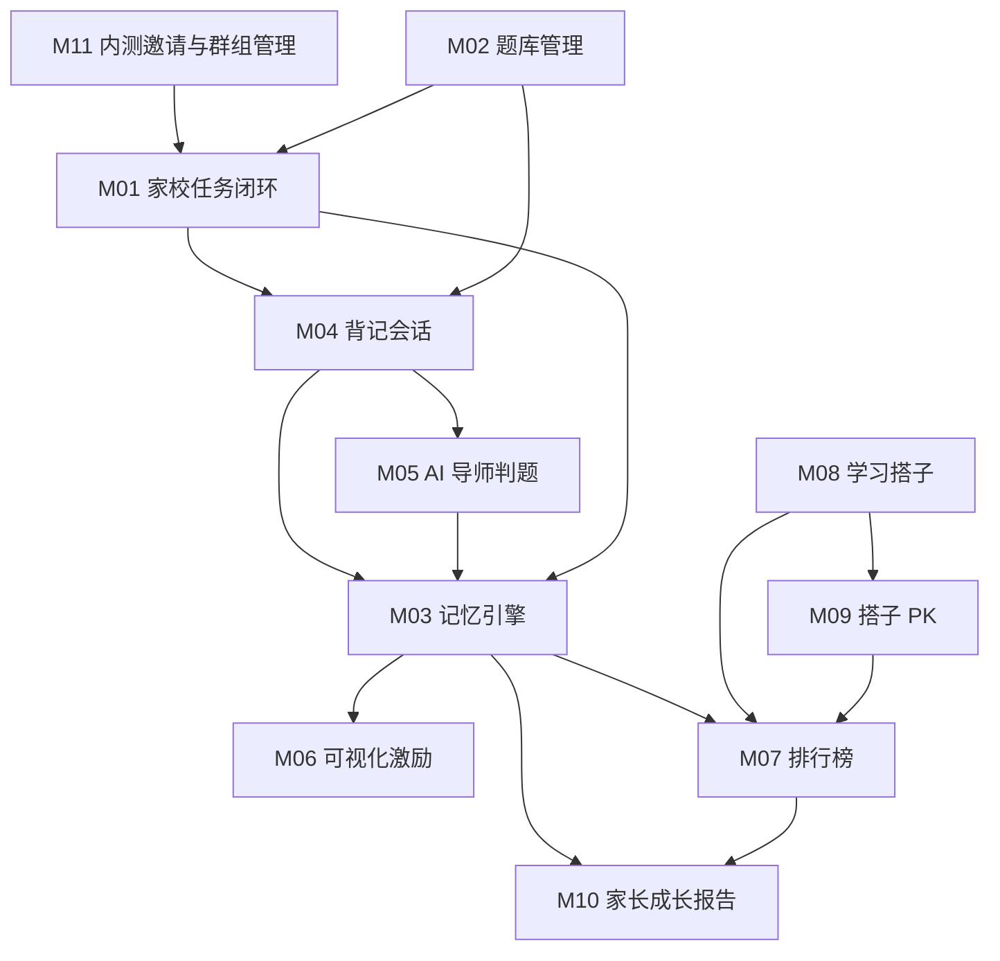

# 小书童（背书搭子）· 功能全景

> **版本**：v1.0
> **编制日期**：2026-09-06
> **本文定位**：tkwf-design 设计阶段的输入文档。产出后，Agent 据此启动 R/S/DS/U 全流程。
> **来源**：模式 B（文档处理）质检达标映射，输入文档 = `docs/1-需求分析/V1/“小书童（背书搭子）”产品需求分析和设计-V3.md`（PRD V3.1.3）
> **状态**：验证用草稿，不进入正式文档体系

## 一、项目背景与范围

“小书童”是一款面向 **6-15 岁学生、群主（教师）和家长**的家校互动背书应用，核心理念是**“提升背书执行力”**：**群主布置任务 → 学生执行背诵 → 家长查看成长**。基于 **AI 导师引导**（从“评判者”转为“陪伴式导师”：语义容错、求助引导、二次确认）与**艾宾浩斯记忆原理**（四阶记忆状态 + 记忆曲线调度），通过进度可视化（★/进度条/热力图）、搭子社交与 PK 激励帮助学生坚持背诵，家长付费查看成长报告。

- **解决的业务问题**：背了就忘、难以坚持、内容泄露、机械判题挫伤积极性
- **技术形态**：微信 H5（首期，React + shadcn/ui + Vite）+ 群主 PC 教研端；ASP.NET Core (.NET 10) Web API + PostgreSQL（RLS）+ Redis + Hangfire；AI 判题走 OpenAI 兼容接口（供应商可插拔）
- **合规红线**：排名只指向努力度（坚持天数/★数/完成度/PK 胜场），不对外暴露正确率排名；未成年人数据最小化收集；题库 DRM

## 二、模块划分

| 模块编号 | 模块名称 | 职责 | 是否有 UI | 备注 |
|---------|---------|------|:--------:|------|
| M01 | 家校任务闭环 | 群主建群/布置任务/执行看板/周报，学生首页任务入口，进度回传 | 是 | 群主 PC + 学生 H5 |
| M02 | 题库管理 | 多学科题库、导入录入、AI 预处理、分类标签、DRM | 是 | 群主 PC |
| M03 | 记忆引擎 | 四阶记忆状态、间隔计算、复习队列调度、掌握度 | 否 | 引擎，驱动 M04/M05/M06/M10 |
| M04 | 背记会话 | 一次一题 Session、求助引导、判题反馈、多模态输入输出 | 是 | 学生 H5 |
| M05 | AI 导师判题 | 两层判题架构（关键词 + LLM）、置信度、判错反馈队列 | 否 | 服务层，M04 调用 |
| M06 | 可视化激励 | 记忆热力图、错题本、学习路线图、分享战报 | 是 | 学生 H5 |
| M07 | 排行榜 | 战力榜/战绩榜、排名快照与趋势、群组开关、范围/学科筛选 | 是 | 学生 H5 |
| M08 | 学习搭子 | 双向同意关系、搭子列表、排名互看、解除 | 是 | 学生 H5 |
| M09 | 搭子 PK | PK 大厅/对战/结果、SignalR 实时同步、胜场反哺排名 | 是 | 学生 H5 |
| M10 | 家长成长报告 | 成长总览/趋势/薄弱点、付费订阅（多孩子独立计费） | 是 | 家长 H5 |
| M11 | 内测邀请与群组管理 | 内测码激活建群、名单导入、一次性码、CSV 导出、成员激活 | 是 | 群主 PC（激活建群） |

## 三、功能点总览

### M01 家校任务闭环
- **M01-F01** 群主创建任务（选题源 → 配置 → 预览发布三步向导）
  - 前置条件：群主已凭内测码激活建群；题库已就绪（官方题库/我的资料库/自由编排）
  - 后置产出：生成 `Tasks` + `TaskAssignments`，任务卡片下发至学生首页
  - 约束：任务名默认“背诵《XXX》”；截止时间快捷项（明天/周末/自定义）；是否允许重做可配置（BR-19）
- **M01-F02** 学生任务执行入口（首页任务卡片最醒目）
  - 前置条件：群主已发布任务
  - 后置产出：进入任务执行页，进度点阵实时反映完成度
  - 约束：任务已截止 → 红色“已截止”标 + 进度条半透明；无任务 → 引导卡直达自由背诵（异常场景）
- **M01-F03** 进度回传与群主看板
  - 前置条件：学生完成作答（Attempts 等同步写入）
  - 后置产出：看板实时呈现今日执行率、平均进度、逾期任务数、薄弱知识点 Top5
  - 约束：群主仅可见任务相关统计汇总，题目内容按 DRM 规则（授权边界）
- **M01-F04** 群组执行周报导出（P1 延后）
  - 前置条件：—（MVP 内先以页面查看为主）
  - 后置产出：周报数据可看
  - 约束：Excel 导出列 P1 本期不实现

### M02 题库管理
- **M02-F01** 多学科体系：语文/数学/英语/物理/化学/生物/历史/地理/政治，学科卡片网格
  - 前置条件：官方题库冷启动（语文 + 趣味免费引流）
  - 后置产出：学科维度题库分类
  - 约束：小三科为群主上传主战场
- **M02-F02** 导入与录入：`.txt` 结构化文本（`问题###答案`，单文件 ≤10M）、批量粘贴、单题录入/修改/删除、单元章节管理
  - 前置条件：文件格式合规、大小合规
  - 后置产出：题目写入 `Banks/Questions`
  - 约束：导入时自动提取关键词（供判题一层使用）
- **M02-F03** AI 预处理生成背诵点（生产端工具链）
  - 前置条件：群主上传 PDF/Word/文本
  - 后置产出：AI 生成背诵点草稿 → **人工校验后**入库（不可直接入库）
  - 约束：内容准确性把关由人工完成（BR-18）
- **M02-F04** 基础分类标签：按主题、难度分类 + 自定义标签（如“高频考点”“易错点”）
  - 后置产出：Banks.Tags(JSONB)
  - 约束：MVP 不单建 Tags/Chapters 表（合并入 Questions.Topic、Banks.Tags）
- **M02-F05** 题库 DRM 与隐私保护
  - 前置条件：—（默认规则）
  - 后置产出：无（机制性约束）
  - 约束：默认所有题库/背诵记录私有；引用而非复制、群主撤回后题目原文不可见（“题目已下线”）、防爬“背一题取一题”不返回明文列表（BR-18）

### M03 记忆引擎
- **M03-F01** 四阶记忆状态追踪（✕未掌握/△模糊/○掌握/★熟练）
  - 前置条件：答题判题结果（Attempts）
  - 后置产出：`MemoryStates` 状态更新（作答事务内原子写入）
  - 约束：状态转移矩阵 BR-03、BR-04；配色全端统一（✕灰-再背背/△橙-快熟了/○绿-很棒/★金-点亮了）
- **M03-F02** 复习间隔计算
  - 前置条件：当前状态 + 历史正确率（近 20 次，部分正确计 0.5）
  - 后置产出：`Next_Interval = 状态基础间隔 × 正确率系数（0.5~1.5）`
  - 约束：初始间隔/最大间隔按状态表（12h/1d/3d/7d 基础）；首次新题答错 30 分钟复习（BR-05、BR-06）
- **M03-F03** 复习队列调度
  - 前置条件：到期复习项存在
  - 后置产出：复习队列（Redis 缓存，TTL 1h，MemoryStates 更新失效）
  - 约束：排序 = 到期复习优先 → 未掌握优先 → 新题；无到期复习时区块隐藏不占位（异常场景）
- **M03-F04** 掌握度聚合（KnowledgeMastery）
  - 前置条件：答题数据
  - 后置产出：知识掌握度（批量 Hangfire 每小时 或 按需家长报告触发）
  - 约束：数据来源 D02 既定

### M04 背记会话
- **M04-F01** 会话配置（Session）
  - 前置条件：任务/自由背诵入口
  - 后置产出：StudySessions 记录
  - 约束：题数默认 20（可选 10/20/30/50）；新题/复习混合比默认 30%新+70%复习；结束条件 = 做完任务/主动退出（进度保存）；跳过允许且不改变记忆状态；中途退出自动保存已答记录
- **M04-F02** 一次一题交互流程
  - 前置条件：会话已创建
  - 后置产出：展示题目 → 用户输入 → 提交判题 → 结果反馈 →（可选求助）→ 记录结果
  - 约束：输入强制系统语音输入法（**禁用浏览器 MediaRecorder ASR**）；输出浏览器内置 TTS（Web Speech API）
- **M04-F03** 求助引导（“想不起来？”）
  - 前置条件：用户卡壳主动触发
  - 后置产出：≤20 字线索（S1 首字 → S2 意象 → S3 逻辑逐级加深）
  - 约束：严禁直接给答案（BR-02）
- **M04-F04** 判题即时反馈
  - 前置条件：判题结果返回
  - 后置产出：正确（绿色+★点亮动画）/错误（红色+正确句+“再看一遍/下一题”）/部分（黄色△徽章）；记忆状态变化视觉反馈
  - 约束：完成任务 ≠ 打卡成功，必须展示“背对了哪几句、哪句还卡着”（BR-19）

### M05 AI 导师判题
- **M05-F01** 本地关键词一层判题
  - 前置条件：题目预置关键词（导入自动提取/人工补充）
  - 后置产出：命中率 ≥80% 直接判“正确”，否则进入第二层
  - 约束：零成本拦截约 60-70% 请求（成本模型）
- **M05-F02** LLM 语义判题（OpenAI API 兼容，供应商可插拔：火山引擎/DeepSeek/智谱）
  - 前置条件：一层未命中
  - 后置产出：`result / confidence / matched / missing / hint` 契约返回
  - 约束：超时（>3s）或失败 → 降级本地规则引擎 + 提示用户；置信度 <0.5 判错误 / 0.5-0.85 部分正确 / ≥0.85 正确（BR-01）；置信度阈值上线前 500 题测试集校准
- **M05-F03** 判错反馈（“判错了”）
  - 前置条件：用户对判题结果有异议
  - 后置产出：写入 `JudgmentFeedback`（pending → reviewed → resolved），计入判题质量统计
  - 约束：AI 只判题不给新知识点解释，避免幻觉污染（BR-02 边界）

### M06 可视化激励
- **M06-F01** 记忆热力图
  - 前置条件：每日 ★ 点亮数据
  - 后置产出：GitHub 风格全年图 + 本周横条；时间范围切换（本周/本月/本季度/今年/学习天数）
  - 约束：颜色深浅代表每日点亮 ★ 数量
- **M06-F02** 错题本
  - 前置条件：答错记录（WrongQuestions）
  - 后置产出：错题列表（知识点/错因）→ 重练入口 → **连续答对 2 次转“已掌握”分组**（可移回）
  - 约束：空态“没有错题，记得很牢！”（BR-04 复用跨 Session 累计）
- **M06-F03** 学习路线图（简化版）
  - 后置产出：单元列表 + 完成率进度条 + 解锁状态
  - 约束：不做 Canvas 动画
- **M06-F04** 分享战报
  - 前置条件：热力图数据
  - 后置产出：弹窗 4 种风格切换（简约/活力/清新/优雅）→ 保存图片/复制文字/复制链接/朋友圈/微信群
  - 约束：MVP 为模拟分享（真实分享本期不实现）；分享失败 Toast+重试（异常场景）

### M07 排行榜
- **M07-F01** 战力榜（坚持天数 + 背诵量 + PK 胜场）
  - 前置条件：DailyStats / RankSnapshots 数据
  - 后置产出：榜单列表（排名序号+前三特殊样式+头像昵称+数值+趋势箭头）
  - 约束：排名合规红线——只指向努力度，不按正确率排名（BR-07）
- **M07-F02** 战绩榜（正确率 + 掌握度）
  - 前置条件：RankSnapshots 数据 + 群组开关开启
  - 后置产出：榜单展示
  - 约束：受 `Groups.RankEnabled` 全局开关控制（默认 true，群主可关闭）；关闭后该群组学生端**战绩榜入口隐藏、榜单不展示**（战力榜不受影响）（BR-08）
- **M07-F03** 排名快照与趋势箭头
  - 前置条件：Hangfire 每日 0:00(UTC+8) 批量冻结
  - 后置产出：`RankSnapshots` 快照；趋势箭头 = 今日 vs 昨日快照（↑绿/↓红/→灰）
  - 约束：**不实时写 Rank**，避免回溯漂移（BR-09）
- **M07-F04** 范围与学科筛选
  - 前置条件：用户所在群组/年级
  - 后置产出：群组/年级互斥按钮 + 学科下拉（全部/9 学科）
  - 约束：年级范围 MVP 无 Schools 表时为平台同年级（GradeKey）

### M08 学习搭子
- **M08-F01** 双向同意关系建立
  - 前置条件：同群组/同年级用户（防陌生人社交）
  - 后置产出：A 发邀请（海报二维码/链接）→ B 确认页“XX 邀请你成为学习搭子”→ 同意 → `StudyBuddies` 状态 accepted；B 可拒绝/忽略
  - 约束：状态机 pending → accepted/rejected/removed/expired（7 天未响应过期，Hangfire 清理）（BR-10、BR-11）
- **M08-F02** 搭子列表
  - 前置条件：存在 accepted 关系
  - 后置产出：搭子头像昵称（4-5 个一行）+ 空位“+”按钮 → 邀请弹窗 → 海报/链接
  - 约束：accepted 状态 ≤5 个/人（双向约束，超出需先解除）；可查看搭子连续打卡天数（BR-10）
- **M08-F03** 排名互看
  - 前置条件：互为 accepted 搭子
  - 后置产出：互看对方在群组/年级范围**当前排名 + 趋势箭头**（学习搭子区域）
  - 约束：仅排名与数值，不暴露答题明细（最小化暴露）
- **M08-F04** 解除关系
  - 前置条件：任一方主动操作
  - 后置产出：状态 → removed；PK/答题历史保留，不影响学习数据
  - 约束：单日发出邀请 ≤10 次（Redis 计数器 `buddy_invite_quota:{UserId}:{date}`）（BR-11）

### M09 搭子 PK
- **M09-F01** 发起 PK（方式 A：搭子列表选对手 → 选学科/题库范围 + 题量默认 10 → 对手确认 → 就绪开局；方式 B：4 位对战码加入）
  - 前置条件：**互为 accepted 搭子**（搭子 = PK 资格）；非搭子发起 → 拦截提示（BR-12）
  - 后置产出：`PkMatches` 记录（InviteCode 4 位、FinishReason）
  - 约束：方式 B 需分享对战码给搭子输入加入
- **M09-F02** 对战规则
  - 前置条件：双方就绪
  - 后置产出：双方同题同序，每题 30s 倒计时（视觉红条），答对 +10 即时反馈，自动下一题
  - 约束：同分比用时（BR-12）
- **M09-F03** 实时同步
  - 前置条件：对战进行中
  - 后置产出：SignalR 实时同步；微信 H5 降级 30s 轮询
  - 约束：PK 同步 P95 ≤1s；PK 中网络断开 → 断线重连进度保留，重连失败按离线处理（异常场景）
- **M09-F04** 结果页与数据反哺
  - 前置条件：对战结束（WinnerId 判定）
  - 后置产出：胜/负/平 + 双方得分 + AI 趣味点评（个性亮点/薄弱点/知识彩蛋）；胜场经 `PkPlayerStats` 视图计入战力榜（不落表）
  - 约束：PK 结果只展示 ★数/用时，**不出现正确率对比榜**（BR-13）；对手离线 30s → 判弃权，己方获胜；PK 答题不入 Attempts（场景隔离）

### M10 家长成长报告
- **M10-F01** 成长总览 dashboard
  - 前置条件：孩子有学习数据 + 家长在 `ParentStudentRelations` 有授权
  - 后置产出：孩子信息 + 多孩子切换 + 今日任务完成状态 + 坚持天数 + 本周进度 + 各学科掌握度概览
  - 约束：家长无数据 → 引导空态“让孩子背第一首诗吧”（异常场景）
- **M10-F02** 进度趋势
  - 前置条件：历史学习数据
  - 后置产出：正确率/背诵量时间曲线（周/月切换）
  - 约束：只呈现**相对进步**（本周 vs 上周），**不显示群组正确率排名**（BR-15）
- **M10-F03** 薄弱知识点矩阵
  - 前置条件：KnowledgeMastery 数据
  - 后置产出：知识点-掌握度矩阵（可下钻到具体篇目）
  - 约束：数据按需触发计算
- **M10-F04** 付费订阅
  - 前置条件：微信支付
  - 后置产出：`Subscriptions`（UNIQUE(ParentId, StudentId)）；试用 7 天 → 10 元/月或 100 元/年；多孩子独立计费
  - 约束：试用中黄条倒计时；未付费报告区预览前 2 项 + 模糊遮罩 + “开通”CTA；到期锁定置灰；已订阅隐藏付费入口 + “管理订阅/取消续费”；StudentId 须在 ParentStudentRelations 有授权（应用层校验）（BR-14）

### M11 内测邀请与群组管理
- **M11-F01** 内测码激活建群
  - 前置条件：平台后台生成发放内测码（`BetaInviteCodes`，varchar(16) UNIQUE；**群主无生成入口**）
  - 后置产出：群主凭码激活建群（群组名/学科/年级）→ 码 used → 一码一群组
  - 约束：码状态 pending/used/expired（BR-16）
- **M11-F02** 名单导入与整理
  - 前置条件：群主已建群
  - 后置产出：`RosterImports`（paste/file）→ **Agent 清洗去重** → 预览确认（SourceCount/CleanedCount/DuplicateCount/InvalidCount）
  - 约束：导入状态 processing/ready/exported/failed
- **M11-F03** 一次性邀请码生成与 CSV 导出
  - 前置条件：名单清洗完成（ready）
  - 后置产出：`OneTimeInviteCodes`（varchar(8) UNIQUE，每人一码，码↔手机号后四位）；CSV 导出（仅手机号后四位 + 码）
  - 约束：CSV 文件 OSS 7 天过期；码默认 30 天过期（BR-17）
- **M11-F04** 成员凭码 + 微信激活
  - 前置条件：成员收到码 + 微信授权
  - 后置产出：绑微信 ID（`Users.OpenId`）→ `GroupMembers` 写入（InviteCodeId 溯源）→ 码 used
  - 约束：**手机号补绑账户留后续**（内测期手机号仅作名单定向凭证）；码↔手机号后四位匹配校验

## 四、横切关注点

| 关注点 | 策略 | 说明 |
|--------|------|------|
| 认证鉴权 | 微信授权登录为主；首次登录同意隐私协议；不满 14 周岁须监护人同意（注册弹窗） | OpenId 激活即绑；账号注销后 30 天删除全部数据 |
| 权限矩阵 | 角色枚举 owner/student/parent（内部），UI 一律显示“群主” | student：仅自己数据；owner：所带群组学生统计 + 排名开关配置权；parent：仅自己孩子数据（授权链校验） |
| 审计 | 判错反馈落库 + 人工复核队列（JudgmentFeedback） | 计入判题质量统计（判题准确率 ≥95% 目标） |
| 数据权限 | PostgreSQL RLS 行级安全 | 学生只能看到自己的学习数据；群主仅可见任务相关统计汇总（题目内容按 DRM）；家长仅可见授权孩子数据 |
| 合规红线 | 排名只指向努力度 + 群组全局开关 + 搭子最小化暴露 | 禁止正确率排名对外暴露/优秀率/及格率/平均分对比/“倒数第 N”；付费报告不显示群组正确率排名 |
| 限流与安全 | 单用户 60 次/分 + 单 IP 限流；AES-256 + TLS1.3；手机号脱敏存储 | 搭子单日邀请 ≤10 次（Redis 计数器防骚扰） |
| 内容安全 | 内容审核 API + 举报入口 | 未成年人社交防陌生人：搭子邀请限同群组/同年级 |

## 五、业务规则速览

| 编号 | 规则 | 归属模块 | 类型 |
|:----:|------|:--------:|:----:|
| BR-01 | 判题置信度阈值：<0.5 错误 / 0.5-0.85 部分正确 / ≥0.85 正确（上线前 500 题校准） | M05 | 校验 |
| BR-02 | AI 导师边界：求助提示 ≤20 字，仅首字/意象/逻辑线索，严禁直接给答案；AI 只判题不解释新知识点 | M05 | 约束 |
| BR-03 | 四阶记忆状态转移矩阵：✕ 答错重置间隔；△ 求助后答对留 △；○ 独立答对留 ○，答错降 △；★ 答错降一级 → ○ | M03 | 状态 |
| BR-04 | “连续 2 次”跨 Session 累计不清零，间隔 ≥7 天的复习答对也计入（错题本转已掌握同规则） | M03 | 状态 |
| BR-05 | 间隔计算 `Next_Interval = 状态基础间隔 × 历史正确率系数（0.5~1.5）`；历史正确率 = 近 20 次答题（部分正确计 0.5） | M03 | 计算 |
| BR-06 | 首次背诵新题答错后 30 分钟复习（非 12 小时）；连续背诵天数按自然日，时区 UTC+8 | M03 | 状态 |
| BR-07 | 排名合规红线：不按正确率排名；排名 = 坚持天数/★数/完成度/PK 胜场（努力度维度） | M07 | 约束 |
| BR-08 | 战绩榜群组全局开关 `Groups.RankEnabled` 默认 true；群主可关闭 → 该群组战绩榜入口隐藏、榜单不展示（战力榜不受影响） | M07 | 状态 |
| BR-09 | 排名快照 Hangfire 每日 0:00(UTC+8) 冻结至 RankSnapshots，不实时写 Rank；趋势箭头 = 今日 vs 昨日快照 | M07 | 状态 |
| BR-10 | 搭子双向同意制；accepted 状态每用户 ≤5 个（双向约束）；状态机 pending/accepted/rejected/removed/expired | M08 | 状态 |
| BR-11 | 搭子邀请 7 天未响应过期（ExpiresAt + Hangfire 清理）；单日发出邀请 ≤10 次（Redis 计数器）；邀请限定同群组/同年级 | M08 | 校验 |
| BR-12 | PK 参与资格 = 互为 accepted 搭子；双方同题同序，每题 30s，答对 +10，同分比用时 | M09 | 校验 |
| BR-13 | PK 掉线处理：对手离线 30s 判弃权；PK 结果只展示 ★数/用时，不出现正确率对比榜 | M09 | 状态 |
| BR-14 | 家长订阅：试用 7 天 → 10 元/月或 100 元/年；多孩子独立计费；UNIQUE(ParentId, StudentId)；到期锁定置灰 | M10 | 状态 |
| BR-15 | 家长报告内容红线：只呈现相对进步（多背 N 篇/薄弱点迁移/坚持天数），不显示群组正确率排名 | M10 | 约束 |
| BR-16 | 内测码：平台后台生成发放（群主无生成入口）；一码一群组；激活后码 used | M11 | 状态 |
| BR-17 | 一次性邀请码：每人一码（码↔手机号后四位匹配）；CSV 仅含手机号后四位+码，OSS 7 天过期；码默认 30 天过期 | M11 | 状态 |
| BR-18 | 题库 DRM：默认私有；引用而非复制、群主撤回后题目原文不可见、防爬“背一题取一题”不返回明文列表 | M02 | 约束 |
| BR-19 | 完成任务 ≠ 打卡成功：必须展示“背对了哪几句、哪句还卡着”；判题后必有记忆状态变化视觉反馈 | M04 | 校验 |
| BR-20 | 数据权限（RLS）：学生仅自己数据；群主仅所带群组统计汇总；家长仅授权孩子数据；付费报告需订阅后查看 | 横切 | 约束 |

## 六、模块依赖关系

## 七、阶段划分

| 阶段 | 范围 | 目标 |
|:----:|------|------|
| v1.0（MVP） | M01~M11 全部（阶段 1：家校任务闭环 + 题库 + 记忆引擎 + 背记会话 + AI 判题 + 可视化激励 + 排行榜 + 学习搭子 + 搭子 PK + 家长付费报告 + 内测邀请机制） | 跑通“群主布置 → 学生背诵 → 家长看报告”闭环 + 搭子社交与 PK 激励；3-4 个月交付；验证付费模型 |
| v2.0（群组社交版） | 阶段 2：群主特权深化（动态激励日志、群组成就汇总、群内分享/好友互看复用搭子关系） | 引入私域社交（群组/家委会），同伴压力 + 群体激励提升粘性 |
| v3.0（生态扩展版） | 阶段 3：AI 智能助手（PDF/图片转题库）、题库市集与版权保护（作者收益 + DRM 组合）、高级 AI 功能、商业化拓展（会员/合规广告） | 解决“内容源”，商业化放大 |

> **本期不实现**（明确边界）：PGC 工具链、群主端 Excel 导出（P1）、学生端数据导出（P1）、账号注销（P1 合规预留 30 天删除机制）、真实图片生成（模拟）、真实社交分享（模拟）、Taro 小程序迁移（触发条件达成后启动）。
