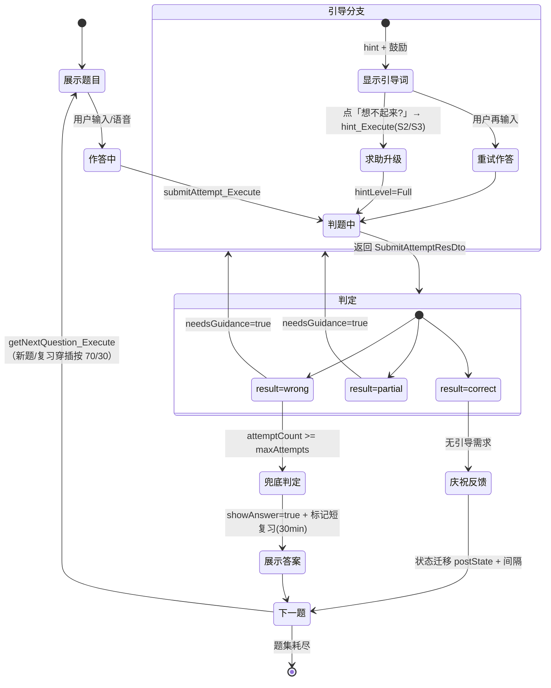

# 判题契约扩展方案：前端作答流全分支驱动

## 一、背景与目标

以历史（唐/宋）背记交互走查为触发，梳理"提问 → 学生作答 → AI 判题 → 引导/重试/兜底 → 下一题"全链路后发现：**后端判题契约已具备 JEV（Judge-Encourage-Verify）全部环节的数据，但缺 4 个"决策字段"透出**，导致前端被迫自行推断引导/兜底逻辑，存在前后端不一致风险。

**目标**：扩展 `SubmitAttemptResDto` 5 个字段，使前端作答流完全由服务端契约驱动，前端退化为纯渲染 + 分支消费。

## 二、现状契约（真实源码审计）

### 2.1 前端可见契约

`SubmitAttemptResDto`（ts-client.g.ts 已同步）：

```
success errorCode result confidence matchedKeywords missingKeywords hint preState postState nextReviewAt
```

| 字段 | 类型 | 含义 |
|------|------|------|
| `result` | string | Correct / Partial / Wrong（三元判题，BR-35 阈值 0.85/0.5） |
| `confidence` | double? | 置信度 |
| `matchedKeywords` / `missingKeywords` | string[] | 命中/缺失关键词组 |
| `hint` | string | 引导线索（≤20 字，BR-29 严禁答案） |
| `preState` / `postState` | string | 四阶记忆状态迁移（✕△○★，BR-11~20） |
| `nextReviewAt` | DateTime | 艾宾浩斯下次复习调度（BR-17/18/19） |

### 2.2 请求契约

`SubmitAttemptReqDto`：`sessionUid / questionId / userAnswer / hintLevel(None|Partial|Full) / timeCostMs`——引导轮次由服务端统计，前端不传计数。

### 2.3 判题引擎（内部）

`JudgingVerdictDto`（`JudgingEngineService`，Callee）：`result / confidence / matchedKeywords / missingKeywords / hint / isDegraded`——**五键契约 + 降级标记**已就绪（BR-32~36）。

> ⚠️ **重要发现**：`SubmitAttemptService` 当前直接调 `LocalJudgmentEngine`（本地桩），`JudgingEngineService`（含 LLM 统一网关）**尚未接入**——注释明示"生产为判题服务五键契约"。接入为独立前置项（见 §六 步骤 0）。

## 三、缺口分析

| # | 缺口 | 现状 | 影响 |
|:-:|------|------|------|
| G1 | 无 `needsGuidance` | 前端靠 `result==partial/wrong` 推断 | 引导逻辑散落前端；服务端无法表达"已看答案不再引导" |
| G2 | 无 `attemptCount` / `maxAttempts` | 前端自己数重试次数 | 兜底时机（2 次后展示答案）前后端可能不一致 |
| G3 | 无 `showAnswer` | 前端无法从响应明确"该展示答案了" | 需前端额外判断，易死循环或提前透题 |
| G4 | `isDegraded` 未透出 | 判题引擎有但 ResDto 未暴露 | 前端不知判题是否 LLM 降级（UI 应提示"判题可能不精确"） |

## 四、前端作答流状态机（交付物 1）

### 4.1 状态图（Mermaid）



### 4.2 决策表（correct/partial/wrong × 轮次 → 前端动作）

| # | result | attemptCount | hintLevel | needsGuidance | 前端动作 | 进下一题? |
|:-:|:---:|:---:|:---:|:---:|------|:---:|
| 1 | `correct` | 任意 | None/Partial | `false` | 绿色庆祝 + ★动画 + 状态徽章更新（preState→postState） | ✅ 立即 |
| 2 | `partial` | 1 | None | `true` | 橙色△ + 显示 `hint` + 鼓励，提供「再试一次」 | ❌ 待重试 |
| 3 | `partial` | 1 | Partial | `true` | 同上，hint 更明确（S2 逻辑线索） | ❌ |
| 4 | `partial` | ≥2 | 任意 | `false` | 展示正确答案要点 + 标记薄弱 | ✅ 放行 |
| 5 | `wrong` | 1 | None | `true` | 红色 + 显示 `hint`（S1 首字/意象） | ❌ |
| 6 | `wrong` | 1 | Partial | `true` | 显示更强 hint（S3 分步） | ❌ |
| 7 | `wrong` | 1 | Full（看过答案） | `false` | 已看答案，标记 30min 短复习 | ✅ |
| 8 | `wrong` | ≥2 | 任意 | `false` | **展示标准答案** + 标记短复习（首错 30min / 重置 12h） | ✅ 必进 |

> **关键规则**：`needsGuidance` 由**服务端**基于 `result + attemptCount + hintLevel` 决策，前端不猜。`showAnswer=true` 时前端展示答案后**必进下一题**（防死循环）。

### 4.3 前端决策代码（React/ts-client 伪代码）

```tsx
const res = await Tkwf.User.Use<SubmitAttempt_ExecuteService>()
  .submitAttempt_Execute({ request: { sessionUid, questionId, userAnswer, hintLevel } });

setMemoryState(res.postState);   // 更新四阶记忆状态徽章

if (res.showAnswer) {
  showAnswerSheet(res.missingKeywords, res.nextReviewAt);  // 兜底：展示答案 + 短复习标记
  await delay(2500); nextQuestion(); return;               // 必进下一题
}
if (res.needsGuidance) {
  showGuidance(res.hint, res.attemptCount, res.maxAttempts); // 引导：停当前题，提供重试/求助升级
  setAnswering(false); return;
}
celebrate(res.result, res.postState, res.matchedKeywords);  // correct：庆祝 → 下一题
nextQuestion();
```

## 五、DTO 扩展设计（交付物 2a）

### 5.1 SubmitAttemptResDto（新增 5 字段）

```csharp
public sealed record SubmitAttemptResDto
{
    // —— 既有字段（不变）——
    public bool Success { get; init; }
    public string? ErrorCode { get; init; }
    public string Result { get; init; } = string.Empty;
    public double? Confidence { get; init; }
    public string[] MatchedKeywords { get; init; } = [];
    public string[] MissingKeywords { get; init; } = [];
    public string Hint { get; init; } = string.Empty;
    public string PreState { get; init; } = string.Empty;
    public string PostState { get; init; } = string.Empty;
    public DateTime NextReviewAt { get; init; }

    // —— 新增（本次）——
    /// <summary>是否应提供引导（result=Partial/Wrong 且未达上限）——前端据此决定是否给"再试一次"</summary>
    public bool NeedsGuidance { get; init; }

    /// <summary>本题本会话累计作答次数（含本次）</summary>
    public int AttemptCount { get; init; }

    /// <summary>引导/重试上限（达上限后 showAnswer=true，防死循环）</summary>
    public int MaxAttempts { get; init; } = 2;

    /// <summary>是否应展示标准答案（达上限或已看答案）——前端展示后必进下一题</summary>
    public bool ShowAnswer { get; init; }

    /// <summary>判题是否降级（LLM 失败→本地规则，UI 提示"判题可能不精确"）</summary>
    public bool IsDegraded { get; init; }
}
```

### 5.2 SubmitAttemptReqDto（不变）

`sessionUid / questionId / userAnswer / hintLevel / timeCostMs`——引导轮次由服务端从 Attempts 统计，前端无需传计数。

## 六、后端改动点（交付物 2b）

```csharp
// 步骤 0（前置/独立）：接入 JudgingEngineService 替换 LocalJudgmentEngine
//   var verdict = await User.Use<JudgingEngineService>().JudgeAsync(
//       new JudgingRequestDto { QuestionId, QType, Keywords, UserAnswer, HintLevel, PreferLlm = true }, ct);
//   result = verdict.Result; degraded = verdict.IsDegraded;

// 步骤 1：统计本题本会话累计作答次数（幂等检查之前）
var prevAttempts = await AttemptsDs.EntitySelectAsync(
    x => x.SessionId == session.Id && x.QuestionId == request.QuestionId, ct);
var attemptCount = prevAttempts.Count + 1;   // 含本次（幂等命中时走 BuildFromExisting 分支）

// 步骤 2：决策引导/兜底（状态迁移后、返回前）
var isWrong = result is JudgmentResult.Wrong;
var isPartial = result is JudgmentResult.Partial;
var showAnswer = (isWrong && attemptCount >= MaxAttempts)   // 达上限
                 || hintLevel == HintLevel.Full;             // 已看答案（对齐 BR-16）
var needsGuidance = (isPartial || isWrong) && !showAnswer;

// 步骤 3：返回扩展字段
return new SubmitAttemptResDto
{
    // …既有字段…
    NeedsGuidance = needsGuidance,
    AttemptCount = attemptCount,
    MaxAttempts = MaxAttempts,
    ShowAnswer = showAnswer,
    IsDegraded = degraded,
};
```

> **常量**：`MaxAttempts = 2` 建议置于 `SubmitAttemptService` 内 `private const int MaxAttempts = 2`（与 BR-29 引导纪律同源）；如未来多题型差异化可入 `题型注册表.json` 扩展。

## 七、ts-client 类型更新链路（交付物 2c）

前端**禁止手改** `ts-client.g.ts`（生成物）。更新链路：

```bash
# 1. 后端 DTO 改完 → dotnet build（xCodeGen/SG1 重生成契约）
dotnet build src/XiaoShuTong.Domain/XiaoShuTong.Domain.csproj

# 2. 导出 GraphQL schema + 重新生成 ts-client
.\buildSchema.ps1
cd src/XiaoShuTong.WebH5
pnpm gen-ts-client      # 生成 src/gql/ts-client.g.ts
```

生成后 `SubmitAttemptResDto` 预期形状（自动生成，勿手改）：

```ts
export interface SubmitAttemptResDto {
  success: boolean;
  errorCode?: string | null;
  result: string;
  confidence?: number | null;
  matchedKeywords: string[];
  missingKeywords: string[];
  hint: string;
  preState: string;
  postState: string;
  nextReviewAt: string;
  // ↓ 新增（后端 DTO 加字段后 codegen 自动带出）
  needsGuidance: boolean;
  attemptCount: number;
  maxAttempts: number;
  showAnswer: boolean;
  isDegraded: boolean;
}
// 字段选择字符串同步变为：
// 'success errorCode result confidence matchedKeywords missingKeywords hint preState postState nextReviewAt needsGuidance attemptCount maxAttempts showAnswer isDegraded'
```

**消费端配套**（WebH5）：新建 `hooks/useAttemptFlow.ts` 按 §4.3 决策逻辑消费新字段；`SubmitAttempt_ExecuteService` 类型由 `SubmitAttemptResDto` 自动继承，无需手改 service 接口。

## 八、测试计划

| 用例 | 场景 | 断言 |
|------|------|------|
| T1 | correct 无引导 | needsGuidance=false, showAnswer=false, postState 升级 |
| T2 | partial 第 1 次 | needsGuidance=true, showAnswer=false |
| T3 | partial 达上限 | needsGuidance=false, showAnswer=true |
| T4 | wrong 第 1 次 | needsGuidance=true, hint 非空 |
| T5 | wrong 达上限 | showAnswer=true, nextReviewAt≈30min（首错短复习） |
| T6 | hintLevel=Full | showAnswer=true（对齐 BR-16 不迁移状态） |
| T7 | 幂等命中 | attemptCount 不重复累加 |
| T8 | LLM 降级 | isDegraded=true 透出 |

> 新增测试走 `tkwf-test` skill（Contract 测试，Tier 1.5），放置于 `tests/XiaoShuTong.Tests/Learning/SubmitAttemptServiceTests`。

## 九、JEV（TypeSafe Jev）适配性评估与决策

> **勘误说明**：v0.1 初稿将"JEV"误读为 Judge-Encourage-Verify 交互模型。经澄清，用户所指 **JEV = TypeSafe AI 的 Jev（System One Model，系统一模型）**——不做文本生成，仅输出 3 种结构化类型：**Noul**（Yes/No 概率 0~1）、**Choice**（预置候选单选）、**Score**（分级打分）。本节重新评估并记录决策。

### 9.1 评估：Jev 不适合判题核心链路

| 维度 | 判题链路需求 | Jev 能力 | 结论 |
|------|------------|---------|:---:|
| 输出契约 | 五键契约：`result + confidence + matchedKeywords + missingKeywords + hint` | 仅 Noul/Choice/Score——可表达 result/confidence，**无法输出关键词清单与引导线索** | ❌ 不满足 |
| 调用频率 | LLM 仅**低频兜底**（`PreferLlm && 本地命中率<0.6` 才调，本地规则先行 0 成本） | 面向**高频小判断**（TPM/RPM 缓解场景） | 判题不构成 TPM 瓶颈，无需替换 |
| 语义容错粒度 | 同义词组命中（BR-33）、required 强制 partial（BR-32）、"李世民/唐太宗"同义放行 | Choice 单选无法表达"命中 N 个要点中 M 个"的部分粒度 | ❌ 粒度不足 |
| 降级链 | BR-34 已有 LLM 超时/失败 → 本地规则降级 | 引入新外部依赖无降级收益 | 不必要 |

### 9.2 决策记录（用户，2026-09-23）

> **不使用 Jev，继续「合并（本地规则）→ 交 LLM（统一 AI 网关）」方案。**

维持现有架构不变：
- **第一层（0 成本）**：本地关键词加权——`JudgingEngineService` / `LocalJudgmentEngine`（BR-32/33/35，含 required 强制 partial、同义词组）
- **第二层（低频兜底）**：`PreferLlm && effectiveRatio < 0.6` 交 `LlmGateway`（统一 AI 网关，round-robin + 降级，平台-BR-02/03/04）→ 五键契约（BR-36）
- **结构化决策字段**（`needsGuidance` / `attemptCount` / `showAnswer` / `isDegraded`）仍按 §五 由**服务端自身计算**，不依赖任何外部判断模型

### 9.3 附：交互模型澄清（与 TypeSafe Jev 无关）

v0.1 的"Judge-Encourage-Verify 三环节映射"作为**产品交互模型**分析保留参考价值（描述契约对"判-励-验"交互的承载），但与 TypeSafe Jev 无关，不构成对其的采用评估。

## 十、实施待办清单（登记）

> 按 `Agents_Use_TKWF.md §3 进度同步纪律`：本方案**实施完成后**再向 `docs/变更记录.md` 追加正式条目（含关联 ADR）；本清单为实施前登记。

- [ ] **步骤 0（独立前置）**：`SubmitAttemptService` 接入 `JudgingEngineService`（替换 LocalJudgmentEngine 桩）——LLM 统一网关真正生效
- [ ] **步骤 1**：`SubmitAttemptResDto` 新增 5 字段（§5.1）
- [ ] **步骤 2**：`ExecuteAsync` 统计 attemptCount + 决策 needsGuidance/showAnswer（§六）
- [ ] **步骤 3**：tkwf-test 补 8 个分支用例（§八）
- [ ] **步骤 4**：`buildSchema.ps1` + `pnpm gen-ts-client` 刷新 ts-client.g.ts
- [ ] **步骤 5**：WebH5 新建 `hooks/useAttemptFlow.ts` 消费新字段
- [ ] **步骤 6**：审核报告 + 变更记录登记（走进度同步纪律）

## 变更记录（本文件）

| 日期 | 版本 | 变更内容 |
|------|------|---------|
| 2026-09-23 | v0.1 | 初始创建：基于历史背记交互走查 + 源码审计，提出判题契约 5 字段扩展 + 前端作答流状态机 + JEV 适配性结论 |
| 2026-09-23 | v0.1（勘误） | **§九 修正**：JEV 澄清为 TypeSafe AI 的 Jev（System One Model，非"Judge-Encourage-Verify"）；评估结论——**不使用 Jev**（输出类型无法承载五键契约 / 判题 LLM 低频不构成 TPM 瓶颈 / 语义粒度不足），继续「合并（本地规则）→ 交 LLM（统一网关）」方案；原"判-励-验"映射降级为交互模型参考（§9.3） |
